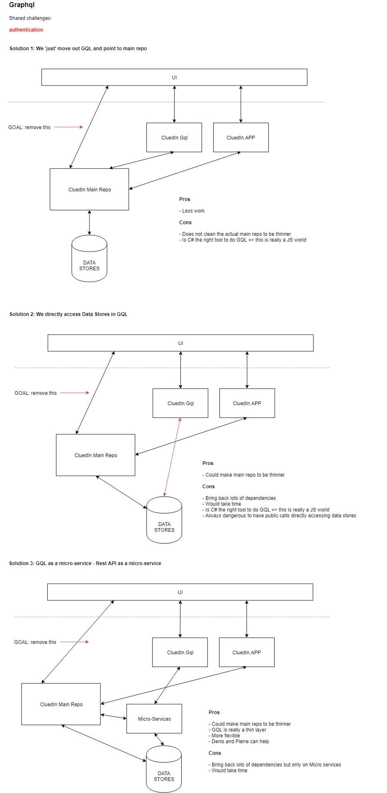
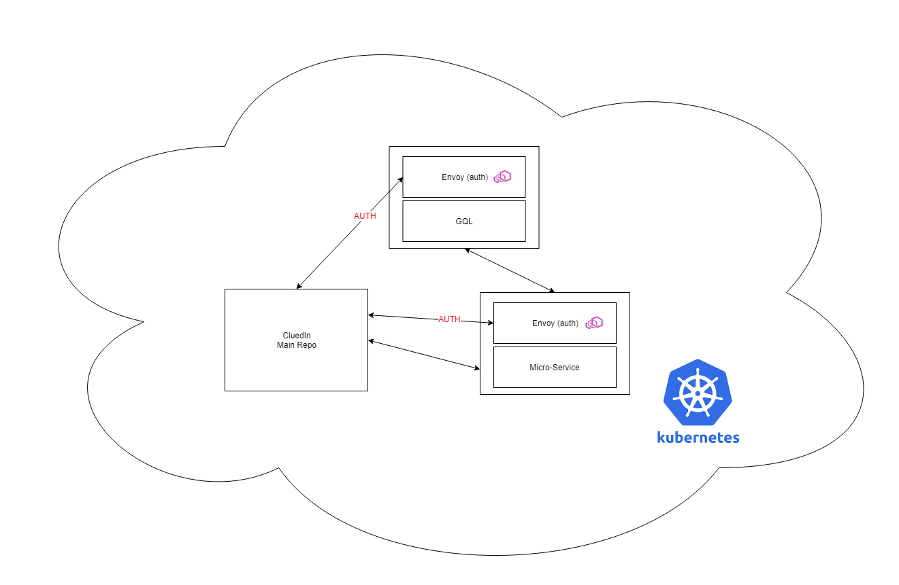

# Plan to GQL first (and remove or mitigate REST APIs)

## Some comments

```
…Another detail we have found important and highly successful: Our GraphQL layer IS NOT implemented or operated by the teams building RESTful services. The UI teams build that layer and Howard’s team provides the platform and runs the service.
```

## Micro services

- GQL should be GQL and that's it.
- I think it would be preferable to have internal REST Apis called by the GQL ( and not having direct access in GQL)

Why? It could be re-used internally. It would mean we could add in the REST APIs internal code that are NOT exposed to the public as only the GQL would be "public".

## Milestones

### Move out at least 1 GQL calls

currentUser? (seem a simple one)

### Tasks

1. Secure the API to be accessible only 'internal' so we avoid opening too much.

- How to authenticated ?
- How to make it secure ?
- How to include to current K8S ?
- What technologies to use?

### Move out 1-to-1 replacement GQL calls

- Search calls (see schema)
- Entity calls (see schema)

### Move out ALL current Rest API calls

Multiple cases:

- Can be moved (as quite simple)

Find simple solution when the API 

- Cannot be moved (as too much impact)

Find a solution when the API cannot be moved easily (way too many dependencies)can be easily replaced

### Some plans

**Gql Service**



**Envoy (auth) with Gql**




### Some References

- https://itnext.io/istio-service-mesh-apollo-server-for-graphql-7e7421fce5d0
- https://blog.jayway.com/2018/10/22/understanding-istio-ingress-gateway-in-kubernetes/
- https://www.linkedin.com/pulse/using-graphql-bff-pattern-implementation-rafael-rocha/
- https://www.envoyproxy.io/docs/envoy/latest/configuration/http_filters/jwt_authn_filter.html?highlight=authentication