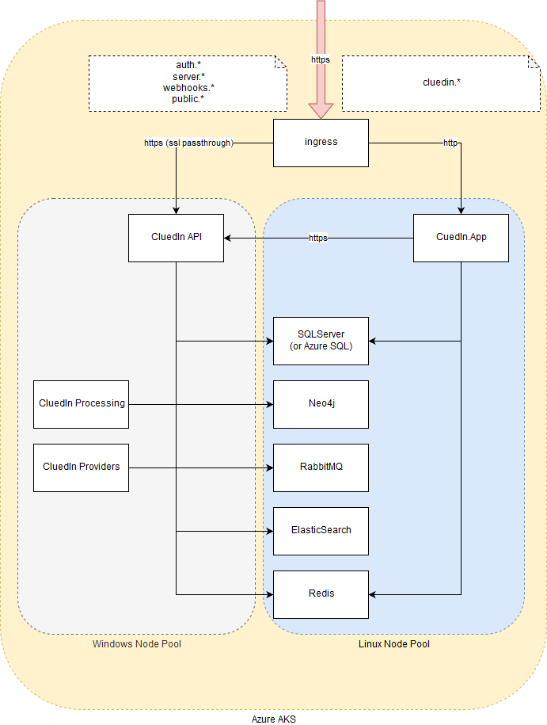

# Getting started

The following diagram depicts the main components of a CluedIn application. 

## CluedIn architecture

You can distinguish two type of components.

### CluedIn code

- CluedIn.App, a .net Core application hosting the application.
- CluedIn API, CluedIn Processing and CluedIn Providers. These are Windows applications in .net 4.5, and therefore can only run in **Windows**. All three can be combined into one and run in the same container (for example during development/testing).

#### Dependencies

- Neo4j, a graph database, written in Java. You can either use the open source version, limited a single server, or the commercial version (if you required a cluster for extra resilience or performance).
- SqlServer, relational database storage. Free developer editions are sufficient. It can run in Windows or Linux. Alternatively a SAAS option (like SQL Azure) can be used.
- ElasticSearch, search index. It requires version 1.7.
- RabbitMQ, a queueing service.
- Redis, cache table storage.

The diagram shows the different communication paths within the application.

Notice all the communication from the browser into the application comes through a set of ingress definitions (i.e. only a single public IP is required). The communication will typically be all over SSL. The traffic for the CluedIn.App component will have the SSL terminated at the ingress (so you could use CertManager, for example, to roll the certificates automatically). Traffic for the CluedIn API must be SSL and is terminated on the API (passing through the ingress). This means the correct certificates need to be managed manually and assigned to the CluedIn API component.

### Installation

- For development and evaluation purposes [using Docker](/docs/0-gettingStarted/docker-local.html)
- For testing and production environments [using Kubernetes](/docs/0-gettingStarted/kubernetes.html)

### Integration

- [Build my first crawler](/docs/1-integration/index.html)
