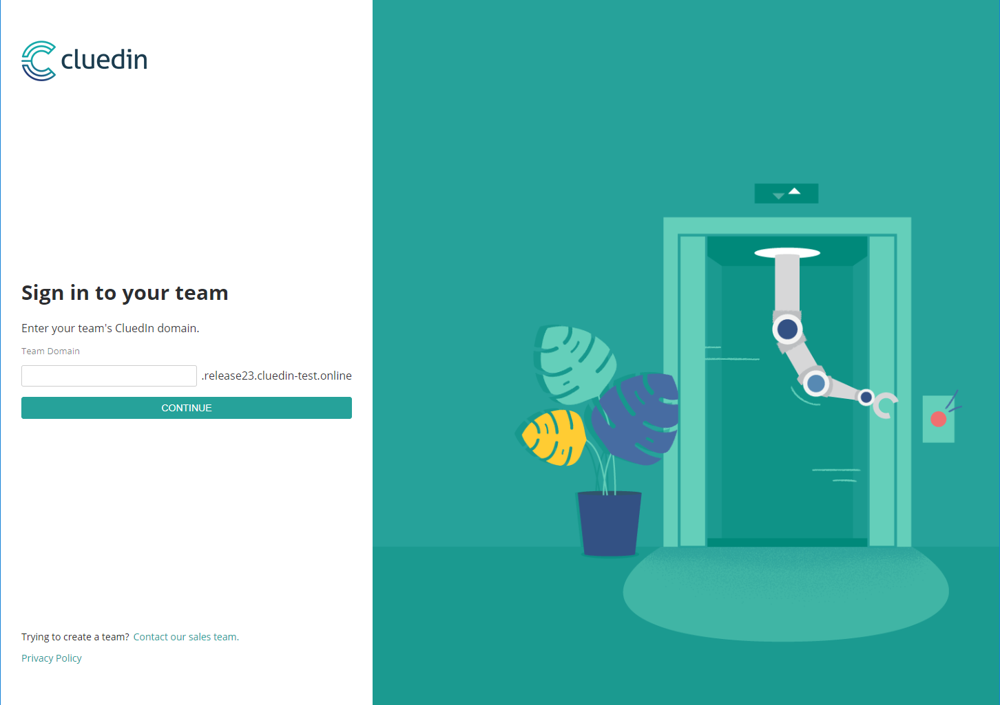

### Introduction

For production environment, you probably want to run your CluedIn installation into something more scalable and manageable.

As Kubernetes became the default choice for orchestration system in our industry, CluedIn provides you a quick way to create a Kubernetes clusters.

#### Pre-requisites

- A hybrid kubernetes cluster (i.e. with at least one worker running Linux and one running Windows).
- Local install of [`kubectl`](https://kubernetes.io/docs/tasks/tools/install-kubectl/#install-kubectl) configured to talk to the cluster
- Local install of the cli for [helm](https://helm.sh/)
- [Nginx ingress controller](https://github.com/kubernetes/ingress-nginx) installed (see [below](#install-ingress) for instructions)

##### Installation

To facilitate the installation, CluedIn is using helm (package manager for Kubernetes)


- 1. Add reference to Heml

```bash
> helm repo add cluedin https://cluedin-io.github.io/CluedIn.Helm
> helm repo update
```

- 2. Create a secret with your docker hub login credentials:

```bash
> kubectl create secret docker-registry docker-registry-key --docker-server='<repository-url>' --docker-username='<your username>' --docker-password='<your password>' --docker-email='<your email>'
```
For Docker Hub, the *repository-url* is ```docker.io```.

1. Execute ```helm inspect values cluedin/cluedin > values.yml``` 
1. Override/change values as required in the ```values.yml``` file. See more info in the [Helm documentation page](https://docs.helm.sh/using_helm/#customizing-the-chart-before-installing)
1. Install the CluedIn app: ```helm install --name <name-of-your-release> -f values.yml cluedin/cluedin```

- 3. CluedIn is now running

The app should be available under http://app.cluedin.test.



#### Advanced guide 

Please refer to our detailed Kubernetes installation.

