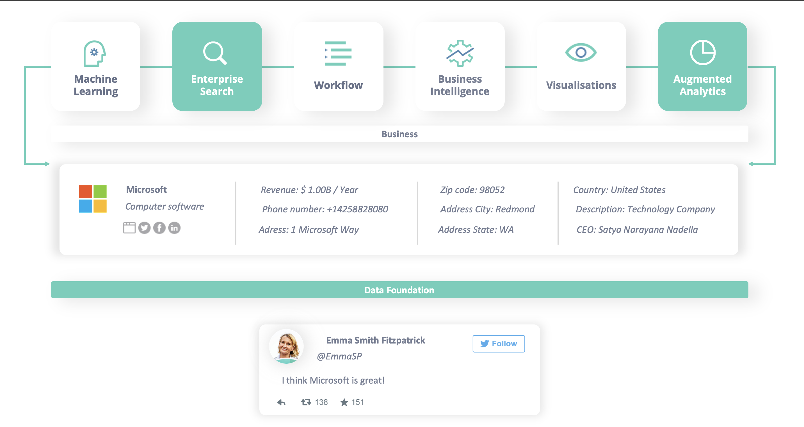

# Why do you need CluedIn?

To understand the value of CluedIn, it is important to talk about why the platform exists first. We can all agree that nowadays all enterprise companies have many processes which are _fueled_ by data. This data is typically not in a ready-to-use state and hence it has to flow through some processes in order to make it ready for consumption. Whether the use-case is running advanced analytics, machine learning, business intelligence, anti-money laundering, obtaining a single view of your customer or for data privacy - it turns out that all of these use-cases end up requiring very similar data preparation processes and attention. 

## Data management pillars

It all starts with data *discovery*. There is always a need to know where your data is and in what systems it lies. After this, there is typically a stage of data *integration*, where you need to bring multiple data sources together into a unified or connected set of data. During this phase, you need to make sure that you are not putting too much pressure on the source systems, but at the same time would like the data available to the business as soon as possible.

After this integration has been done, often the next step is to *normalise*, *standardise* and *clean* the data so that it can be processed by machines in a uniform, consistent and high-fidelity manner. While this is occurring, you need to make sure you have control over the data by ensuring there is a clear owner, responsible for its maintenance. This leads into the need for full traceabilty and audit trail of where this data is coming from, what is happening to it in this process of preparation and where it is being used. With privacy being a mandated concern, you also need to make sure you have control over personal data and how it is used within the business. Finally, this data needs to be easily and readily available for the business to consume to fuel it operational needs. 

Whether your use case is Machine Learning or Business Intelligence, you will need to apply the same core pillars of data management detailed above. You might have extra steps in each use case, but these are at least the common pillars for any use-case involving data. CluedIn is this layer of foundation that encapsulates everything we mentioned above into a coherent, consistent end to end data hub of source to target data processing. 

## Why did we create CluedIn? 

So the reason why CluedIn exists, is because our team saw project after project failing, because large enterprises were buying platforms that tackled each part of the journey - but failed in stitching these different pillars together into a platform. CluedIn was born with the stitching, meaning that our different pillars were designed to work well with each other - in fact, they really complement each other. 

Our documentation will help you understand more about the different components of CluedIn and how it all fits together. This will give you the insights you need to work with and extend the platform with your own needs. CluedIn is designed to be extended and hence we offer easy and intuitive ways to inject your own functionality or to make our data available to other services to do what they do best. 

At a high level, you can conceptualise CluedIn as a streaming platform. We essential handle the constant flow of data and are designed to work in environments where systems don't stand still and data is never static. 

CluedIn is an application that runs in Docker containers and uses Kubernetes as the way to host and orchestrate the different pieces of the application. Because of this, CluedIn is designed to work well in elastic environments and can automatically scale to the sizes and infrastructure you need to handle your data workloads. CluedIn runs large customers with 100's of TB's of data, and smaller customers with just a few TB's. Whether you have TB's of PB's of data to process - CluedIn can and will process your workloads.

It is important to mention that CluedIn is a persistence layer. Unlike Data Virtualisation, CluedIn ingests parts of your source data into its platform. You have full control over what parts of your source data are ingested. The goal of CluedIn is to create the highest fidelity version of your data you will have in your business. This is not only the data itself, but the structure of the data as well. With CluedIn having the highest fidelity version of your data, it means that any business request for data, in any format, in any modelling can be served out of the CluedIn Data Hub. This will allow you to project data out exactly how the target systems would like as we contain the highest fidelity version of it. 

We hope you enjoy and get value out of your CluedIn solution. 
