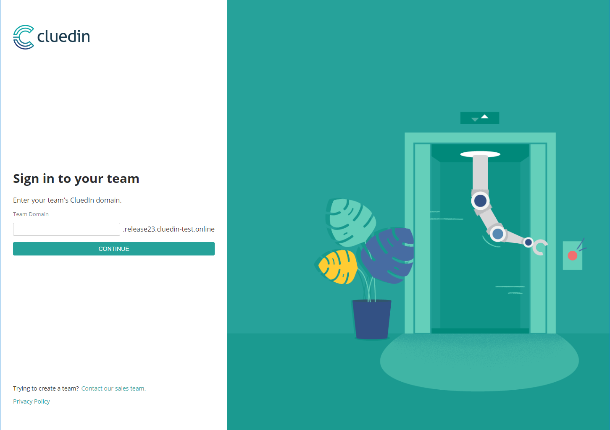

## Introduction

This will show you how to install CluedIn on your local machine by running it inside Docker. CluedIn is an application with many services, so you will need to ensure you have adequate resources on the machine you intend to run it on.

### Requirements

- At least 16Gb of free memory (It is preferable to run on a machine with 32Gb of RAM)
- Latest version of [Docker](https://docs.docker.com/get-docker/) for your operating system  (Engine: > 19.03)
- [Powershell 7](https://github.com/PowerShell/PowerShell) for your operating system - This is to run helper scripts
- Access to the private repositories inside the [cluedin](https://hub.docker.com/u/cluedin/) DockerHub organization. You will require a Docker Hub account and request access from CluedIn; then use this account to do a ```docker login```.
    NOTE: **Only CluedIn certified developers** have access to the CluedIn DockerHub.

### Running CluedIn

#### First time preparation

CluedIn provides a helper script to streamline the process of getting started.

1. Clone the helper script from the CluedIn Home repo
    ```shell
    git clone https://github.com/CluedIn-io/Home
    ```

1. Open a powershell console on Windows - ( or `pwsh` on Mac & Linux ) and run:
    ```shell
    ./cluedin.ps1 check
    ```
    This will check a few things:
    * That you have the needed software installed
    * That you have the ports needed to run CluedIn available
    * That you have logged into docker hub

    If all these checks are green you are ready to proceed. If ports are in use then you may need to stop any programs locally that may be using them and re-run `check` again.

1. Pull the latest cluedin images to your local machine
    ```shell
    ./cluedin.ps1 pull
    ```
    You can use this command to refresh/update any images at a later date.

#### Starting the application

To start up the application use:

```shell
./cluedin.ps1 up
```
This will start up the various containers in Docker and begin initializing CluedIn for the first time.

#### Checking application status

Depending on the speed of the machine it is being installed onto CluedIn can take a moment to start up.

You can check the status of this by using:
```shell
./cluedin.ps1 status
```

CluedIn is ready when all the status checks are green.

Open your browser and CluedIn will be available under [http://app.127.0.0.1.xip.io](http://app.127.0.0.1.xip.io).



#### Creating an organization

In order to use CluedIn you need to create an *organization*.
You can use the following command to create an account from the command line

```shell
./cluedin.ps1 createorg -name foobar -pass Foobar23!
```

#### Stopping the application

There are **two** ways to stop the application:

#### Stopping (without deletion of data)

To stop CluedIn but to preserve the data you created while running, use:

```shell
./cluedin.ps1 stop
```

To start CluedIn back up again, you can simply use `up` or :

```shell
./cluedin.ps1 start
```

#### Stopping (with removal/reset of data)

To completely remove CluedIn and all of the associated data use:

```shell
./cluedin.ps1 down
```

This is a destructive action but it is useful for resetting data in CluedIn.

#### Running CluedIn locally with the dependencies in Docker and the CluedIn server running in the local enviornment - testing purposes

1. First you need to have CluedIn build artifacts in the local environment. Also make sure the 9000-9007 ports are open on the machine where CluedIn needs to run.
2. Remove the Agent folder from the CluedIn artifacts.
3. [optional]: if you wish to access the enviornment from outside, make sure the previous ports are accessible from the machines where they are supposed to be accessible from. Then, you need to update the following URL variables (in ServerComponent/container.config) with the machine's IP address, followed by xip.io (e.g. 172.27.200.105.xip.io):

* ServerUrl                  
* ServerBlobUrl              
* AgentServerUrl             
* JobServerDashboardUrl      
* ServerReturnUrl            
* AuthServerUrl              
* AuthReturnUrl              
* WebhookServerUrl           
* WebhookReturnUrl           
* ServerPublicApiUrl         
* PublicServerUrl            
* ServerStatusUrl            
* ServerLoggingUrl           
* Domain                     

Instead of changing these keys in `container.config`, you can also add environment variables like this: CLUEDIN_appSettings__[key name] (e.g. `CLUEDIN_appSettings__ServerUrl=http://172.27.200.105.xip.io`).

*** Please note that this type of install is only meant for testing purposes. In a production environment the deployment is different and it relies on SSL/TLS certificate to encrypt the traffic: http://documentation.cluedin.net/docs/00-gettingStarted/ssl.html.

4. Next, add any crawlers and their .dll dependencies in ServerComponent.
5. Follow the steps from "First time preparation" section above.
6. [if step 3 was done]: The same IP address must be put in the `env/default/.env` file in the following keys: `CLUEDIN_DOMAIN=172.27.200.105.xip.io` (with xip.io) and `CLUEDIN_SERVER_HOST=172.27.200.105` (without xip.io).
7. cd into the Home repository and start the CluedIn dependencies: 
```shell
./cluedin.ps1 up -disable server
```
8. cd into the CluedIn folder and run the server:

```shell
dotnet CluedIn.Server.Host.dll
```

<!--
### Adding extra components

You can add extra providers or enrichers in two different ways:

1. Via Nuget packages
    1. Add a a file named `Packages.txt` in the `./components` folder with the names of the nuget packages for the components you want to install.
    1. If the Nuget packages are not available publicly add a `nuget.config` file in the `./components` folder. Either pass the password token to the `nuget.config` or create a `KEY` environment variable with it.
1. Copy the relevant DLLs for the components in the `./components` folder.
-->
