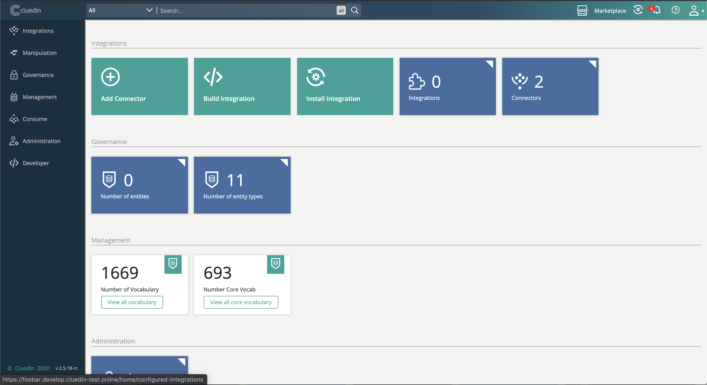
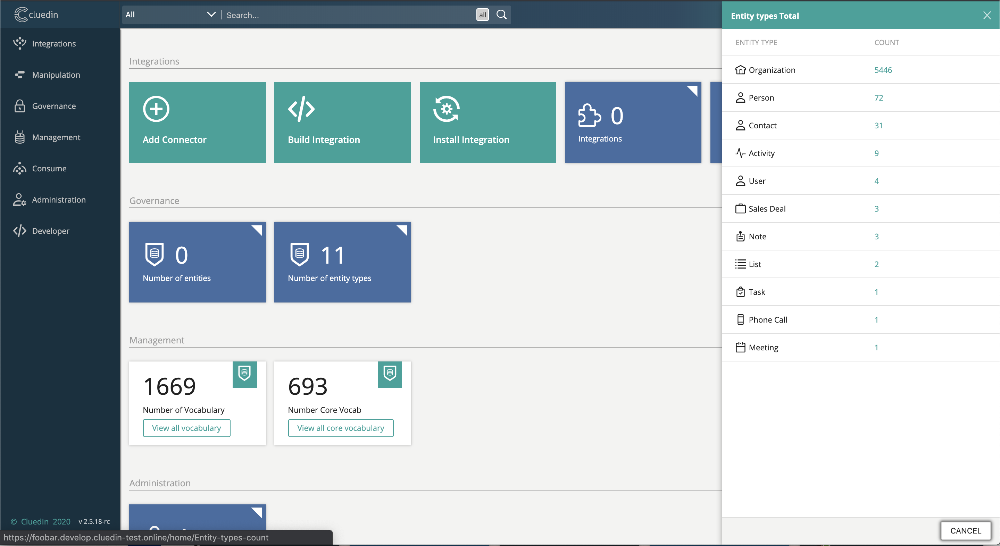

## Navigating the Home Dashboard

Your home screen will show you notifications and high-level actions that span your entire CluedIn account. For each major pillar of CluedIn (e.g. Integration, Governance), you will have the most important notifications and actions on your home screen and you can drill into your respective menu options to explore more notifications and actions specific to that part of the application. 

You can click on the notifications to see more details. The main concept of the home screen and the notifications is to direct you towards actioning a task that needs actioning. 

Such actions include:

 - Integrations that have lost connectivity due to authentication issues.
 - Number of Entity Types
 - Number of broken data policies
 - Number of Possible Duplicate Records

 If you have an empty dashboard, it is simply that you don't have anything that needs actioning. As you use more and more parts of the platform, you will see more and more notifications show in your home screen. The goal of CluedIn is to make sure you have a robust flow of data from data sources through to consuming applications. The goal of your home screen is to alert you to anything that is stopping that happening. The home screen is filtered by what type of authorization you have within CluedIn. You will only see actions and notifications that need to be addressed by you or others in your role.

 Also available on your home screen is quick links to view notifications, statistics on performance, your help screens and to expore the different parts of the applications that you have access to. You will also have your search bar available at all times as you browse throughout the application. This will allow you to filter and search for the data you would like to view and action.