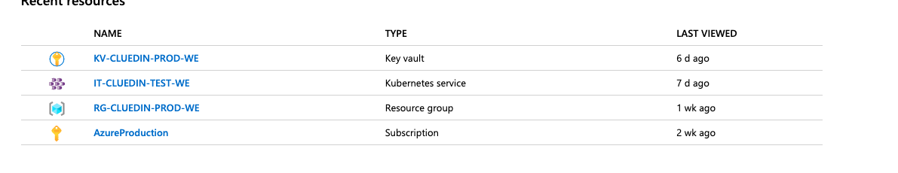

### Example pre-requisite configuration

Creating the Kubernetes cluster is outside the scope of this guide. 

Refer to: [Microsoft Azure AKS documentation](https://docs.microsoft.com/en-us/azure/aks/windows-container-cli).
*The ability of creating AKS clusters with Windows support is currently in Preview. If you have multiple accounts in Azure then you will need to use the `az account set -s <AccountName>` so that you can set the right context for the deployment.*

You must have:
- a local install of [`kubectl`](https://kubernetes.io/docs/tasks/tools/install-kubectl/#install-kubectl) configured to talk to the cluster
- a local install of the CLI for [helm](https://helm.sh/).

1. Taint the Windows nodes of your cluster. This will avoid Linux pods to be scheduled on the Windows nodes. It's important to do this first, as it could affect the installation of Helm, or other components later.

    ```powershell
    kubectl taint node -l beta.kubernetes.io/os=windows windows=true:NoSchedule
    ```

    You can also apply a default taint to all the nodes in a node pool. This way if you scale the pool up or down the nodes will automatically be tainted. This can be done with the `az` cli but only when creating the node pool. See the [documentation for the Azure CLI](https://docs.microsoft.com/en-us/cli/azure/ext/aks-preview/aks/nodepool?view=azure-cli-latest#ext-aks-preview-az-aks-nodepool-add).

1. Create a service account. If you are using RBAC in your Kubernetes cluster you will need to grant permissions to *Tiller* for it to be able to create resources in the cluster. Check [Helm's documentation](https://helm.sh/docs/using_helm/#rbac). In test environments, you may consider just granting Tiller cluster admin permissions:

    - Create a file with the following content

        ```yaml
        apiVersion: v1
        kind: ServiceAccount
        metadata:
            name: tiller
            namespace: kube-system
        ---
        apiVersion: rbac.authorization.k8s.io/v1
        kind: ClusterRoleBinding
        metadata:
            name: tiller
        roleRef:
            apiGroup: rbac.authorization.k8s.io
            kind: ClusterRole
            name: cluster-admin
        subjects:
        -   kind: ServiceAccount
            name: tiller
            namespace: kube-system
        ```
        _In production scenarios you will have to be more restrictive with the permissions. See [Helm's documentation](https://helm.sh/docs/using_helm/#securing-your-helm-installation) for advice on security for production environments_
    
    - Run `kubectl apply -f <path-of-file>` to create the role binding
    
    
    If not using RBAC, you will need to run the following
    
    ```powershell
    kubectl create serviceaccount --namespace kube-system tiller
    
    kubectl create clusterrolebinding tiller-cluster-rule --clusterrole=cluster-admin --serviceaccount=kube-system:tiller
    
    kubectl patch deploy --namespace kube-system tiller-deploy -p '{"spec":{"template":{"spec":{"serviceAccount":"tiller"}}}}
    ```


1. If using RBAC, execute `helm init --service-account tiller`. This will install *Tiller* in the cluster, so you can install helm charts directly. If not using RBAC, do not use the service account parameter.

1. Install the ingress controller:
    ```powershell
    helm install stable/nginx-ingress \
        --namespace ingress \
        --name ingress  \
        --set rbac.create="true" \
        --set controller.extraArgs.enable-ssl-passthrough="true"\
        --set controller.nodeSelector."beta\.kubernetes\.io/os"="linux" \
        --set defaultBackend.nodeSelector."beta\.kubernetes\.io/os"="linux"
    ```

    After a while the ingress controller will have a public IP that can be used to access the cluster. If you don't want a public IP (because you have something else, like an application gateway in front of it), you can modify the installation of the ingress controller in the step above - see Helm chart [documentation](controller.service.loadBalancerIP).

1. To retrieve the public IP:

    ```powershell
    kubectl get svc -n ingress -o wide -l 'component=controller'
    ```
    In your own DNS, configure that IP to whatever host you want to use for CluedIn. You could map it to a wildcard record; alternatively you can use [more specific entries](/docs/00-gettingStarted/kubernetes.html#hostnames-and-addresses).

1. Create a secret with your docker hub login credentials:

    ```powershell
    kubectl create secret docker-registry  docker-registry-key \
        --docker-server='<repository-url>' \
        --docker-username='<your username>' \
        --docker-password='<your password>' \
        --docker-email='<your email>'
    ```
    For Docker Hub, the *repository-url* is ```docker.io```.
    You should request access to the CluedIn Docker Hub repository for those credentials so you can pull the private Docker images with the application.

1. Register the CluedIn helm chart

    ```powershell
    helm repo add cluedin https://cluedin-io.github.io/CluedIn.Helm
    helm repo update
    ```

NOTE: You can also place secrets into a Vault or Key Vault from your cloud provider of choice.


