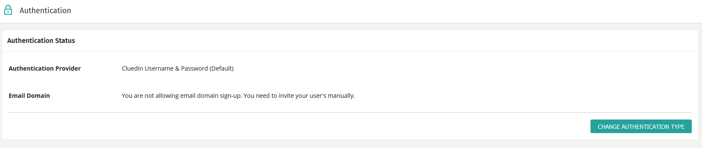
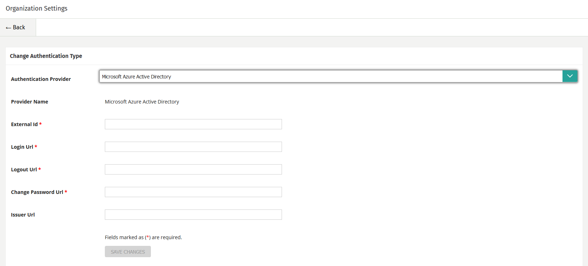

# TODO
* Hide this for v3.0

---
category: Administration
title: Authentication
--- 

## Single Sign On / LDAP Provider

CluedIn supports Open Id for Single Sign On and hence we support all providers listed here: https://openid.net/developers/certified/

You can choose your provider from the _Administration_ menu and then click on _Authentication_. After this, choose the _Change Authentication Type_ button and choose the provider you would like to use. 

Follow the instructions listed in the user interface to insert the configuration necessary to enable the Single Sign On provider of your choice. 

## Enable Email Domain

From this screen you can also enable the _Use Domain Sign Up_ feature. This is useful if you are not using the LDAP provider support of CluedIn and if you would like anyone in your organisation to sign up and access your CluedIn account.

## Setting up Azure Active Directory

If you want to use Azure Active Directory, just select it from the list.

You will be prompted to fill in 4 values that you can get from your Azure Portal. Click Save, once you have entered the data and click "Sign Out" in the top right hand corner. On the CluedIn login page, it will now automatically redirect to your Single Sign On provider to authorize and login with your Azure Active Directory credentials. 

