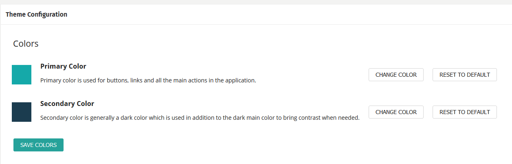

## Changing the style of the UI

You can change your theme of the user interface in CluedIn. You may do this to align the UI more closely with the branding of your company. You can change the colours of the user interface by navigating to the _Administration_ and then the _Theme_ menu option. 

Remember to click the _Save Colours_ button after you have made your changes. This change affects every user in the account, not just yourself.