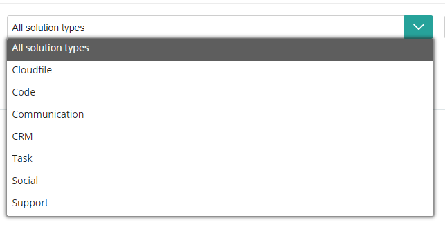

### Introduction

To be able to let someone adding and managing an Integration from the user interface, you need to add some information in your crawler.

If you don't, the crawler will be valid but you will deteriorate the User experience of the product.

### IExtendedProviderMetadata interface

To provide the information to the CluedIn.UI, you will need to implement the IExtendedProviderMetadata interface.

Please read the sections below to understand what each property of that interface is used for.

A concrete example:

- [HelloWorldProvider.cs](https://github.com/CluedIn-io/CluedIn.Crawling.HelloWorld/blob/master/src/HelloWorld.Provider/HelloWorldProvider.cs)


The code:

```csharp
    public interface IExtendedProviderMetadata
    {
        string Icon { get; }            // see notes below

        string Domain { get; }          // The Url to your application

        string About { get; }           // A sentence describing the purpose of your application

        string AuthMethods { get; }     // A serialised JSON array of Authentication Methods supports (TODO Obtain list of )

        string Properties { get; }      // TODO find out how this is used by UI

        string ServiceType { get; }     // IE CRMType etc (TODO get full list)

        string Aliases { get; }         // TODO find out how used in the UI

        Guide Guide { get; set; }       // Instructions on how to configure your Provider in the UI

        string Details { get; set; }    // Details of how this provider/crawler will interact with your application

        string Category { get; set; }   // The category your provider fall under to allow filtering in the UI

        string Type { get; set; }       // Available options [cloud, on-premise]
    }
```

### Icon

The Icon is used by the CluedIn.UI to quickly show to all users what the provider is. The 'ideal' size of the image is 128x128px.

* For your icon to be found, you must add it as an Embedded Resource via the Build Action property in your Provider project. See [Build actions](https://docs.microsoft.com/en-us/visualstudio/ide/build-actions?view=vs-2019). The convention we are using is to place the icon image file under a `Resources` folder. The `Icon` property above must point to this file using '.' notation rather than '\'. For example:

```
- Provider.HellowWorld.csproj
    \Resources
        \cluedin.png
```

would be represented as `Resources.cluedin.png`

Here is an example of how the Provider Icon is used in the application:


### Domain

This is the URL of your application. Leave it empty if the integration does not have a website.

The value is used by the CluedIn.UI to redirect to the integration's website if he needs more information.

Example:

-  if you build a Slack integration, you would have: `https://slack.com/` assigned to the Domain property.


### About

About is the description of Integration.

Example:

- For a Zendesk integration, you would write: `Zendesk makes better experiences for agents, admins, and customers. As employees, we encourage each other to grow and innovate.`

### AuthMethods

The authentication methods is a JSON object used to explain to the CluedIn.UI how the user needs to authenticate towards the integration.

#### Oauth

CluedIn provides you a mechanism to get permission on the integration that requires an 'Oauth' dance, never the less, you still need to add 'some' URL for the UI to know where he should redirect correctly.

Example: 

```JSON
"authMethods": {
  "oauth": {
    "oauthCallbackKey": "office365azureactivedirectory",
    "initial": "api/office365azureactivedirectory?authError=none",
    "callback": "api/office365azureactivedirectory?authError",
  },
},
```

NOTE: For future version, CluedIn will work to remove the needs of those value by creating a generic controllers, but due to some 'exceptions' we have encounter with some Oauth mechanism, it is still required to mention those values.

#### Credentials

Credentials is generally use for the system that requires a BASIC authentication. This will be used by the integration to pull the data.

Example:

```JSON
"credentials": [{
  "displayName": "User Name",
  "type": "input",
  "isRequired": true,
  "name": "username",
}, {
  "displayName": "Password",
  "name": "password",
  "type": "password",
  "isRequired": true,
}],
```

#### API Token

Some integrations require sometimes an API token to be passed along the request.

Example:

```JSON
"token": [{
  "displayName": "Api Token",
  "type": "input",
  "isRequired": true,
  "name": "apiToken",
}],
```

#### Custom

If you need a 'custom' field to be sent to your Integration, you can use the Credentials object with extra fields.

```JSON
"credentials": [{
    "type": "subdomain",
    "name": "websiteName",
    "displayName": "Website Name",
    "protocol": "https://",
    "domain": "zendesk.com",
    "isRequired": true,
  }, {
    "type": "input",
    "name": "username",
    "displayName": "Username",
    "isRequired": true,
  }, {
    "type": "password",
    "name": "password",
    "displayName": "Password",
    "isRequired": true,
}],
```

#### Properties

The properties used to setup more precisely what you want to crawl from that integration.

If you want the integration to get ALL data, leave it empty but from time to time, you want the User adding the integration to pick a specific 'project' or 'folder' or any other kind of segmentation that your integration might have.

Example: List of Projects

```JSON
[{
  "displayName": "Projects to include",
  "type": "list",
  "isRequired": true,
  "name": "projects",
  "options": {
    "key": "Id",
    "displayName": "Name",
    "stateField": "State",
    "states": ["ACTIVE", "INACTIVE"],
  }
}]
```

- displayName: the label that would be displayed in the UI once the integration is rendered.
- type: The type of data that would be returned `list` or `tree`.
- isRequired: mentioned if it is needed for the User to setup this information.
- name: The name of the field to setup (taken from the `HelperConfiguration`).
- options: The 'value' that should be set for each value selected by the user.

Example: Tree of folders

```JSON
[{
  "displayName": "Folders to include",
  "name": "folders",
  "type": "tree",
  "isRequired": true,
}]
```

NOTE: In the case you more options, please contact us.

#### Type

A list of type for the integration. Useful when you have hundreds of integration installed.

Values can be: 

- "Cloudfile"
- "Support"
- "CRM"
- "Social"
- "Code"
- "Task"
- "Communication"

Example:

```JSON
type: ["Task", "Support"]
```

In the UI:


