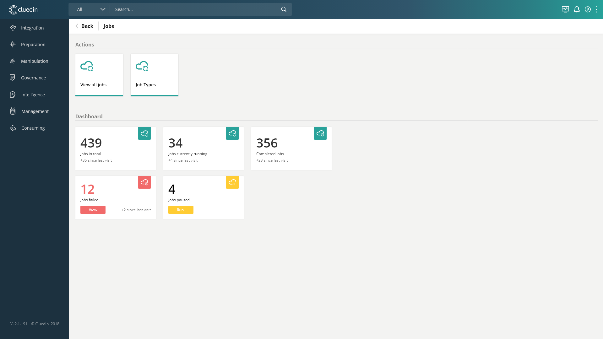
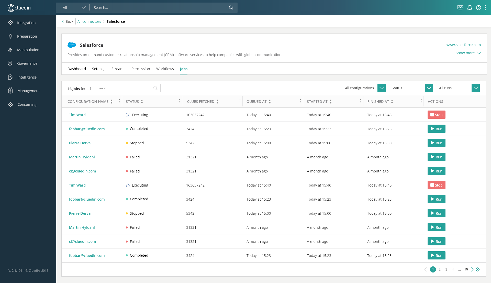

# Overview



In CluedIn, Data Ingestion happens through jobs that are handled by agents, and we provide a UI where you can view the status and result of these jobs, as well as manage them.

In this overview dashboard we have general info about the jobs, and there are 2 dashboards that you can access through the 2 action cards for additional details:
- Jobs
- Job Types

## Jobs


In this dashboard you can see a list of all the jobs previously run, all current jobs running, and important details about them.

You can also start a new job of a specific type, or abandon a currently running job.

## Job Types


Jobs are set to repeat at some point, such that the data in CluedIn is updated. Our crawl jobs are tipically set to repeat every 4 hours, but job cron schedules are changeable from the UI.

Here you can have an overview over all the Job Types that repeat, their cron schedule, and information on the last job run. 

You can trigger a job of the type you are interested in, or remove a schedule, if you would like for that job to not be run again in the future.

If you have accidentally deleted one of these schedules, you can just re-enable the integration that generated it in the first place and it will be back in place.

From here you can also access a table of all the jobs of the specific type you have chosen. All details and actions available in the overall jobs dashboard are available here as well.



# API

## Job Types

### GET api/v1/hangfire/jobs/crawling
Gets All Hangfire Jobs (In Hangfire Controller)

#### Array Data Object

| Property        | Type                  | Description   |
|-----------------|-----------------------|---------------|
| Id              | string                | job id |
| ConfigurationId | string                | configuration id |
| OrganizationId  | string                | organization id |
| UserId          | string                | organization id |
| Cron            | string                | cron schedule of hangfire job |
| Queue           | string                | the type of queue the hangfire job is using |
| Alarm           | string                | time when job state is checked, or else alarm is called |
| CreatedAt       | DateTime string       | time of creation |
| LastJobId       | string                | id of last job run |
| NextExecution   | DateTime string       | time of next execution of this job type |
| LastExecution   | DateTime string       | time of last execution of this job type |

Expected Response:
```json
[
    {
        "Id": "5b593555-7575-4a85-95f1-53b727ae061e|e4fa89de-a3e7-4d4a-b3b1-7e4f25c1ed97|add490b8-e387-42de-99cb-f6d7b82fc78f",
        "ConfigurationId": "5b593555-7575-4a85-95f1-53b727ae061e",
        "OrganizationId": "e4fa89de-a3e7-4d4a-b3b1-7e4f25c1ed97",
        "UserId": "eedd5056-0e1a-429e-9e3b-19104d63bd9a",
        "Cron": "47 0/4 * * *",
        "Queue": "default",
        "Alarm": "00:00:00",
        "CreatedAt": "2020-04-06T13:47:16.5096616Z",
        "LastJobId": "2020-03-06T13:47:16.5096616Z",
        "NextExecution": "2020-04-06T16:47:00Z",
        "LastExecution": "2020-03-06T13:47:16.5096616Z"
    }
]
```

### POST hangfire/recurring/trigger
Remove Hangfire Job

Call with form request, with jobIds array in body (jobIds[])

Expected Response:
200 OK

### POST hangfire/recurring/remove
Remove Hangfire Job

Call with form request, with jobIds array in body (jobIds[])

Expected Response:
200 OK

### PATCH api/v1/hangfire/jobs/crawling
Update Hangfire Job Cron Schedule

Call with json body:
- id - Guid string
- cron - string (needs valid cron schedule)

## Jobs

| Property        | Type                  | Description   |
|-----------------|-----------------------|---------------|
| completed       | int                   | number of completed jobs |
| executing       | int                   | number of executing jobs |
| failed          | int                   | number of failed jobs |
| queued          | int                   | number of queued jobs |
| cancelled       | int                   | number of failed jobs |

### GET api/v1/jobstatecount
Get count of jobs in each state

Expected Response:
```json
{
    "completed": 4,
    "executing": 2,
    "failed": 0,
    "queued": 0,
    "cancelled": 4
}
```

### GET api/v1/jobs (needs page, take, state=null, configurationId=null)
Get Jobs


- take - int - number of results per page
- state - filter on job status (optional or can be null)
- configurationId - filter on configuration id (optional or can be null)

#### Array Data Object

| Property          | Type                  | Description   |
|-------------------|-----------------------|---------------|
| Id                | string                | job id |
| JobRunId          | string                | jobrun id |
| Job               | string                | job name (crawl source) |
| ConfigurationName | string                | name of account who created integration and job |
| Progress          | int                   | number of clues completed by job |
| Status            | string                | job status |
| QueuedAt          | DateTime string       | time job was queued at |
| StartedAt         | DateTime string       | time job was started at |
| FinishedAt        | DateTime string       | time job was finished at |


Expected Response:
```json
[   
    {
        "Id": "469518a2-f63a-45ab-96c2-d97d08085fb8",
        "JobRunId": "57e8953f-a59f-4f72-b5bb-987d78a7f472",
        "Job": "Acceptance",
        "ConfigurationName": null,
        "Progress": 710,
        "Status": "Cancelled",
        "QueuedAt": "2020-03-18T17:06:20.1700908+00:00",
        "StartedAt": "2020-03-18T17:06:20.5362995+00:00",
        "FinishedAt": null
    },
    {
        "Id": "bcf99125-dcef-45fc-bfe9-944c5c7162e4",
        "JobRunId": "fec9a923-3bc5-4e96-939f-8b728308bd6a",
        "Job": "Acceptance",
        "ConfigurationName": null,
        "Progress": 1077,
        "Status": "Completed",
        "QueuedAt": "2020-03-18T14:13:03.5198911+00:00",
        "StartedAt": "2020-03-18T14:13:03.6768873+00:00",
        "FinishedAt": "2020-03-18T14:16:15.5670262+00:00"
    }
]
```

### PATCH api/v1/jobs/abandonwork
Update Hangfire Job Cron Schedule

Call with json body:
- jobRunId - Guid string
- jobId - Guid string

Expected Response:
200 OK