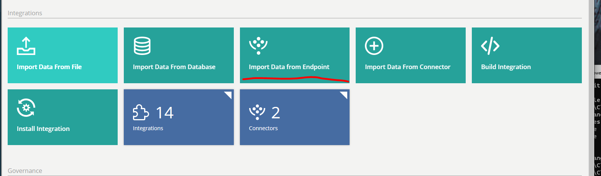
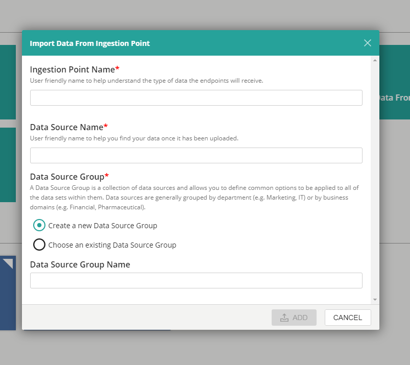
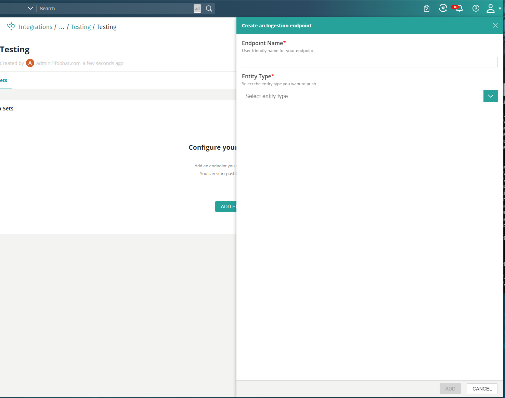
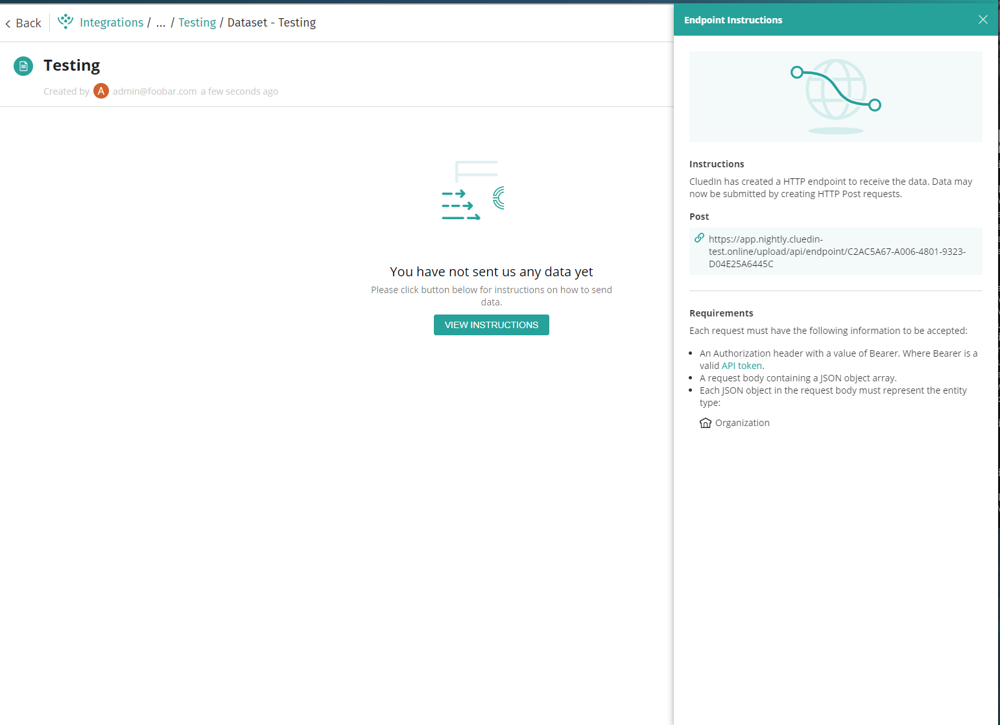

There are many ways to get data to CluedIn, including the prebuilt connectors, Change Data Capture (via our support for Debezium) and webhooks. CluedIn also supports data to be pushed to it via HTTP POSTS. To do this, you will need to create an "Ingestion Endpoint" in the user interface in which CluedIn will create a public route, sitting behind Bearer Authentication, that any third part system can push a JSON array of any object to. 

CluedIn will store all JSON pushed to this point in a sandbox until a user has mapped the data within the UI, in which it will then maintain a live stream of incoming data. 

For example, you can see push data to CluedIn for popular Data Integration services like Azure Data Factory and Apache NIFI. 

Apache NIFI: [View Video](https://www.cluedin.com/version.3.2)
Azure Data Factory: [View Video](https://vimeo.com/521322930/70deff99bd)