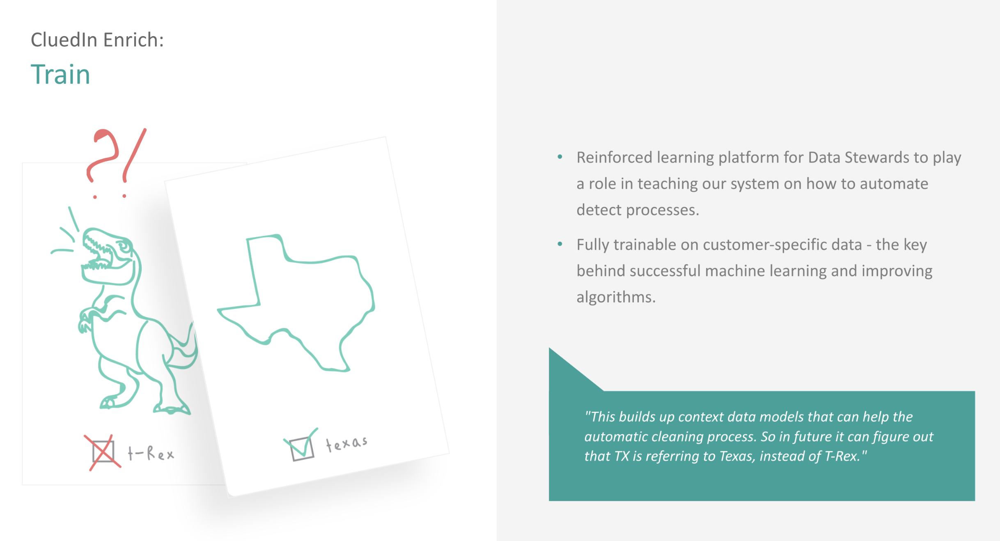

In data there are rules and then there is data that does not abide to any rules. These fuzzy pieces of data cannot be catalogued or solved with classic business rules. CluedIn Train is a reinforcement learning platform that allows you to train CluedIn to curate and steward data that does not abide by rules. 

Amongst other use cases, common use cases for CluedIn Train include: 

- Detecing objects in unstructured text (Named Entity Recognition)
- Detect Personal Identifiers that are not covered by business rules
- Detect Duplicates
- Categorise and Classify Data

How long do I need to train for before this system becomes useful?

This is a very valid question, but it also is not easy to answer. However, what is clear is that CluedIn Train will prompt you with a confidence level as to indicate if the system is getting more and more confident. You can use this confidence mechanism to help you understand when the system is ready to take over in making decisions on your behalf based off historical and present data.

The training studio is where you can train the CluedIn platform using a Supervised / Reinforcement Learning Technique.  

You don't need to do any training in the system if when you open the studio, it says "No Tasks Available". This essentially means that the system is well trained and is merging data to a very high precision. 

If you see tasks in your Training Studio, essentially you will be giving a yes, no or skip answer to labelling your data.  
Annotation is usually the part where projects stall. Instead of having an idea and trying it out, you start scheduling meetings, writing specifications and dealing with quality control. The Training Studio generates you a data model, so that it can actively participate in the training process and learn as you go. The model uses what it already knows to figure out what to ask you next and is updated with the answers you provide.  