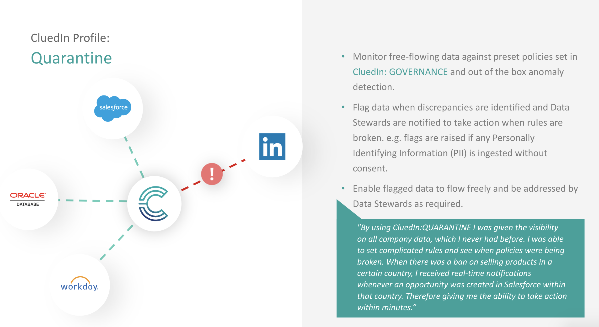

## Overview

CluedIn Clean is an application targeted towards cleaning data so that downstream consumers of CluedIn can have a much more ready to use set of data. This includes:

 - Normalising values to a common standard
 <!-- - Manually enriching entities from online and external data sets. 
 - Having a bulk way to clean data and generate Mesh commands back to the source systems. -->

CluedIn Clean is targeted at Data Engineers and Business Analysts. The closer to the context of the data the resource is, the better. CluedIn Clean currently only supports cleaning data in Core Vocabularies. This is on purpose, as the Core Vocabularies are typically what downstream consumers will want to use.

## Creating a CluedIn Clean project

A CluedIn Clean project is essentially the process of capturing some data; storing it in a dedicated and isolated environment; and using a set of tools which allow querying and modifying the data in bulk. Once this process is finished, the data can be pushed to a different system. 

At the moment CluedIn Clean only captures data that is already present in CluedIn, and will only push it back to CluedIn. When you _commit_ the project Clean will take every row of data in the project and create a Clue out of it, marking the source as _CluedIn Clean_. This will show itself in the history just like any other Clue that would have come from a source of data. This will provide you with the data lineage necessary to trace what clean operations have been made on the data as well. 

You can create a project in two different ways:

1. In the CluedIn Clean page, by selecting a name to your project and the entity type you want to clean. Because the Core vocabulary keys are totally different per entity type, it only makes sense populating the project with data of a single type. You can also specify the maximum number of entities to load, and select which properties you want to view. 

1. You can also create a project from the search results screen, _as long as your query includes a filter by a single entity type_. The project will include all the results from your search query.

## Filtering and querying data

### Selecting columns

Once loaded, the data is shown in a tabular fashion in a data grid. Each row represents an entity and each column is a vocabulary key. You can use the _View selected columns_ link at the top, to show a drawer where to select which columns to see. You can also drag and drop them to change the order.

### Querying data

By default all records are shown in the data grid. You can however click on the heading of one of the columns and choose from one of the following pre-built filters:

- Regular Match: you can input a string. The filter is not case-sensitive and if you input multiple words it will try to match any of them. Ex. filtering by 'united kingdom' will match records like 'United Kingdom', but also 'United States' or 'Kingdom of Tonga'
- Precise Match: this will match the precise casing and sequence of all the words. Ex. 'United Kingdom' will not match 'united kingdom' or 'united states', but it will match 'United Kingdom'.
- Regex Search: This accepts a [regular expression](https://en.wikipedia.org/wiki/Regular_expression) to match records. It is case-sensitive. Ex. `[a-z].*` will match any values which start with a lowercase letter.
- Is Empty: the corresponding column has no value (empty or null is the same thing)
- Has Value: there is a value in this column
- Multi Field Match: this creates a regular match but the text can appear in any of the selected columns.

All filters can be disabled temporarily, reversed (so they only show records that do NOT match the filter expression), or deleted.

[Filter example](./Filter-Example.png)

### Aggregations

### Transformations

You can use transformations to modify the underlying data. A transformation applies to all the records matching the currently configured filters. The usual workflow will be to create a filter or aggregation that matches all the records you want to modify and then apply the transformation.

### Clustering

CluedIn Clean should be used for the following reasons:

------------------------------

 - To normalise representations of values that are the same, but sometimes in different formats e.g. Addresses that are the same location, but the order of the different pieces of the address are different. 
 - To standardise representations of labels, geographical locations. Although not mandated, it is quite common to standardise on a language of data to downstream consumers e.g English, Danish, Italian. Hence CluedIn Clean can help with standardising this. 
 - To fix uniformity in casing of values e.g. First and Last Names of people.
 - To manually enrich data using online external services and to manually choose which records are matching the ones that you intend to enrich. 
 - To move values from one property to another. Sometimes you will find that you receive that where the intention was to have the city in the City column, but instead the Country was entered. CluedIn Clean can help with these types of issues. 
 - To detect outliers in values for a particular property. 

CluedIn Clean should not be used for the following reasons:

 - To correct data that requires business domain knowledge to fix e.g. First and Last Names spelt differently to how they are regularly spelt.
 - Add new fields.
 - Correct Entity Codes.

CluedIn Clean can handle transliteration, which is the ability to handle normalisation of text with accented and diacritic characters. 

One of the main use cases of CluedIn Clean is to clean erroneous Entity Code values before persisting them into the Datastores e.g. often you will find that we will mark certain properties as Entity Codes but then realise in the data that the values can have values like -1, N/A, Empty String etc. When you are adding an integration there is a simple flag that  can be set to ingest and process or ingest and place into a sandbox where only after the data has been cleaned will be then persist and create the proper entity codes. It is suggested that for the initial ingestion of data that it will go into CluedIn Clean in this sandbox environment and then for subsequent runs, we will accecpt that new types of anomaly data will have to be dealt with pro-rata. This will be handled by our Quarantine application that flags data that doesn't conform to what is expected. 

Try to keep your cleaning projects relatively small i.e. less than 50,000 records at a time. This means that your cleaning will go a lot smoother as it doesn't have to analyse (potentially) millions of records every time that you want to clean the data. 

Once you are finished with cleaning the data, you will have a commit button available on the main list of cleaning projects. This will then write the data back to CluedIn and will create any mesh commands that need to be created to write this clean data back to the source systems as well. 