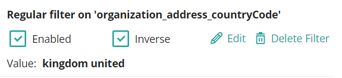

## Overview

CluedIn Clean is an application targeted towards cleaning data so that downstream consumers of CluedIn can have a much more ready to use set of data. It is targeted at Data Engineers and Business Analysts. The closer to the context of the data the resource is, the better. CluedIn Clean currently only supports cleaning data in Core Vocabularies. This is on purpose, as the Core Vocabularies are typically what downstream consumers will want to use.

CluedIn Clean can help with the following tasks:

- To normalise representations of values that are the same, but sometimes in different formats e.g. Addresses that are the same location, but the order of the different pieces of the address are different. 
- To standardise representations of labels, geographical locations. Although not mandated, it is quite common to standardise on a language of data to downstream consumers e.g English, Danish, Italian. Hence CluedIn Clean can help with standardising this. 
- To fix uniformity in casing of values e.g. First and Last Names of people.
- To move values from one property to another. Sometimes you will find that you receive that where the intention was to have the city in the City column, but instead the Country was entered. CluedIn Clean can help with these types of issues. 
- Perform transliteration, which is the ability to handle normalisation of text with accented and diacritic characters. 

## Creating a CluedIn Clean project

A CluedIn Clean project is essentially the process of capturing some data; storing it in a dedicated and isolated environment; and using a set of tools which allow querying and modifying the data in bulk. Once this process is finished, the data can be pushed to a different system. 


At the moment CluedIn Clean only captures data that is already present in CluedIn, and will only push it back to CluedIn. When you _commit_ the project Clean will take every row of data in the project and create a Clue out of it, marking the source as _CluedIn Clean_. This will show itself in the history just like any other Clue that would have come from a source of data. This will provide you with the data lineage necessary to trace what clean operations have been made on the data as well. 

You can create a project in two different ways:

1. In the CluedIn Clean page, by selecting a name to your project and the entity type you want to clean. Because the Core vocabulary keys are totally different per entity type, it only makes sense populating the project with data of a single type. You can also specify the maximum number of entities to load, and select which properties you want to view. 


1. You can also create a project from the search results screen, _as long as your query includes a filter by a single entity type_. The project will include all the results from your search query.


## Filtering and querying data

### Selecting columns

Once loaded, the data is shown in a tabular fashion in a data grid. Each row represents an entity and each column is a vocabulary key. You can use the _View selected columns_ link at the top, to show a drawer where to select which columns to see. You can also drag and drop them to change the order.

### Querying data

By default all records are shown in the data grid. You can however click on the heading of one of the columns and choose from one of the following pre-built filters:


- Regular Match: it is not case-sensitive and if you input multiple words it will try to match any of them. Ex. filtering by 'united kingdom' will match records like 'United Kingdom', but also 'United States' or 'Kingdom of Tonga'
- Precise Match: this will match the precise casing and sequence of all the words. Ex. 'United Kingdom' will not match 'united kingdom' or 'united states', but it will match 'United Kingdom'.
- Regex Search: This accepts a [regular expression](https://en.wikipedia.org/wiki/Regular_expression) to match records. It is case-sensitive. Ex. `[a-z].*` will match any values which start with a lowercase letter.
- Is Empty: the corresponding column has no value (empty or null is the same thing)
- Has Value: there is a value in this column
- Multi Field Match: this creates a regular match but the text can appear in any of the selected columns.

All filters can be disabled temporarily, reversed (so they only show records that do NOT match the filter expression), or deleted.



### Aggregations

This is another way of selecting the data you want to see. When you create an aggregation, Clean will show you the most common terms in that column, indicating how many times each appears in the dataset.


From this list you can select which values you want to display in the data grid.

### Transformations

You can use transformations to modify the underlying data. A transformation applies to all the records matching the currently configured filters. The usual workflow will be to create a filter or aggregation that matches all the records you want to modify and then apply the transformation.

To apply a transformation you can click on the header of the column and select one of the _Transform_ options:


Transformations can take a while to execute, particularly if you are applying them to a large set of values. They are executed in the background, you will see the spinning wheel beside the total row count whilst they are running. You will not be able to perform another transformation until the last one has finished. Transformations continue executing even if you close the browser.

#### Undo/redo

If you have don't like the result of the transformation you can easily undo/redo in the list of operations. The list in that tab shows you all the operations from the most recent to the oldest. You can only undo them in reverse chronological order. If after undoing an operation you try to apply a different transformation, the most recent operations are discarded. As an example, say you have done the transformations: C - B - A. If you undo once then you have (C) - B - A. The most recent transformation C, is still shown in the list but is greyed out as it has been undone. If you then perform a different operation, D, the operation C is lost and list will be D - B - A.

#### Pre-defined transformations

There are several pre-defined transformations:
- To upper case: Ex. dk => DK
- To lower case: Ex. TECHNOLOGY => technology
- To title case: Ex. John doe => John Doe
- Collapse consecutive whitespace: Ex. John   Doe => John Doe
- Blank out: Removes the value
- Set value: Shows a pop up that allows you to set a new value (like all transformations, it will apply to all the records filtered in the data grid).

#### CluedIn Refine Expression Language

All the above pre-defined transformations are translated into the CluedIn Refine Expression Language (CREL). Alternatively you can also write those expressions directly if you choose the option _Custom transformation_.

CREL is essentially JavaScript, you have some variables referencing the current entity and a collection of methods you can apply. The output of the expression will be the new value of the cell.

##### Variables

| variable | references                                                            |
|----------|---------------------------------------------------------------------|
| cell     | the current cell (column applying the transformation to)            |
| value    | the current cell's value. This is a shortcut for 'cell.value'       |
| row      | the current row. It has the index and cells                         |
| cells    | The cells of the current row. This is a shortcut for 'row.cells'. A particular cell can be retrieved with `cells.<columnName>` if the `<column name>` is a single word. or with `cells["<column name>]` otherwise. |

##### Operators

The operators are just like JavaScript's:

| operator | symbol         |
|----------|----------------|
| and      | `&&`           |
| or       | `||`           |
| not      | `!`            |

#### String manipulation methods

This includes many of the methods from the [`voca` npm module](https://vocajs.com/).

| method             | explanation                                                                                                         | example                             |
|--------------------|-----------------------------------------------------------------------------------------------------|-------------------------------------|
| upperCase          | Converts the value to upper case                               | `upperCase('school') // => 'SCHOOL' ` |
| lowerCase          | Converts the value to lower case                               | `lowerCase('BLUE') // => 'blue'`   |
| camelCase          | Converts the value to camel case                               | `camelCase('bird flight') // => 'birdFlight' ` <br/> `camelCase('BirdFlight') // => 'birdFlight'` <br/> `camelCase('-BIRD-FLIGHT-') // => 'birdFlight'` |
| titleCase          | Capitalizes every word | `v.titleCase('learning to fly') // => 'Learning To Fly'` <br/> `v.titleCase('jean-luc is good-looking', ['-']) // => 'Jean-luc Is Good-looking'` |
| capitalize         | converts the first character to upper case, if the second parameter is true it also sets the rest as lowercase  | `capitalize('apple') // => 'Apple'` <br/> `capitalize('aPPle', true) // => 'Apple' `|
| decapitalize       | Converts the first character of value to lower case            | `decapitalize('Sun') // => 'sun'` |
| kebabCase          | Converts the value to kebab case, also called spinal case or lisp case | `kebabCase('goodbye blue sky') // => 'goodbye-blue-sky'` <br/> `kebabCase('GoodbyeBlueSky') // => 'goodbye-blue-sky' ` <br/> `kebabCase('-Goodbye-Blue-Sky-') // => 'goodbye-blue-sky'` |
| snakeCase          | Separates words with underscores                               | `snakeCase('learning to fly') // => 'learning_to_fly' ` <br/> `snakeCase('LearningToFly') // => 'learning_to_fly' ` <br/> `snakeCase('-Learning-To-Fly-') // => 'learning_to_fly'` |
| swapCase           | Converts the uppercase alpha characters of value to lowercase and lowercase characters to uppercase | `swapCase('League of Shadows') // => 'lEAGUE OF sHADOWS' ` <br/> `swapCase('2 Bees') // => '2 bEES' ` |
| trim               | Removes whitespace (or the indicated character) from both sides of the value | `trim(' Mother nature ') // => 'Mother nature'` <br/> `trim('--Earth--', '-') // => 'Earth' ` |
| trimLeft           | Same as `trim` but only from the beginning of the string  | |
| trimRight          | Same as `trim` but only from the end of the string | |
| slugify            | Slugifies the value. Cleans the value by replacing diacritics with corresponding latin characters | `slugify('Italian cappuccino drink') // => 'italian-cappuccino-drink' ` <br/> `slugify('caffé latté') // => 'caffe-latte'` <br/> `slugify('хорошая погода') // => 'horoshaya-pogoda'` |
| reverse            | Reverses the value | `reverse('winter') // => 'retniw' ` |
| insert             | Inserts into value a string toInsert at specified position     | `insert('ct', 'a', 1) // => 'cat'` <br/> `insert('sunny', ' day', 5) // => 'sunny day' ` |                                                               |
| latinise           | Latinises the value by removing diacritic characters | `latinise('cafe\u0301') // or 'café'  => 'cafe'` <br/> ` latinise('août décembre') // => 'aout decembre'` |
| pad                | Pads value to a new length with the indicated string (whitespace by default) | `pad('dog', 5) // => ' dog '` <br/> `pad('bird', 6, '-') // => '-bird-' ` |
| padLeft            | Same as `pad` but only adds characters to the beginning  | `padLeft('bird', 6, '-') // => '--bird' ` |
| padRight           | Same as `pad` but only adds characters to the end | `padRight('cat', 6, '-=') // => 'cat-=-' ` |
| repeat             | Repeats the value number of times | `repeat('w', 3) // => 'www'`  |
| replace            | Replaces the matches of pattern with replacement | `replace('swan', 'wa', 'u') // => 'sun' ` <br/> `replace('domestic duck', /domestic\s/, '') // => 'duck' ` <br/> `replace('nice duck', /(nice)(duck)/, (match, nice, duck) => 'the ' + duck + ' is ' + nice) // => 'the duck is nice'` |
| replaceAll         | Replaces all matches of pattern with replacement | `replaceAll('good morning', 'o', '*') // => 'g**d m*rning'` <br/> `replaceAll('evening', /n/, 's') // => 'evesisg'` |
| stringChain        | Creates a stringChain object that wraps value, enabling explicit chain sequences.Use value() to unwrap the result | `stringChain('Back to School'.lowerCase().words().value() // => ['back', 'to', 'school']` |
| charAt             | Returns a character from value at specified position | `charAt('helicopter', 1) // => 'e'` |
| first              | Returns the first `n` characters | `first('helicopter') // => 'h'` <br/> `first('vehicle', 2) // => 've'` <br/> `first('car', 5) // => 'car' ` |
| last               | Extracts the last length characters from value | `last('helicopter') // => 'r'` <br/>`last('vehicle', 2) // => 'le' ` <br/> `last('car', 5) // => 'car'` |
| prune              | Truncates value to a new length and does not break the words. Guarantees that the truncated string is no longer than length | `prune('Once upon a time', 7) // => 'Once...'` <br/> `prune('Good day, Little Red Riding Hood', 16, ' (more)') // => 'Good day (more)' ` |
| slice              | Extracts from value a string from start position up to end position. The character at end position is not included | `slice('miami', 1) // => 'iami'` <br/> `slice('florida', -4) // => 'rida'` <br/>`slice('florida', 1, 4) // => "lor"
`|
| substr             | Extracts from value a string from start position a number of length characters | `substr('infinite loop', 9) // => 'loop' ` <br/>`substr('dreams', 2, 2) // => 'ea'`|
| split              | Creates an array from a string | `split('rage against the dying of the light', ' ') // => ['rage', 'against', 'the', 'dying', 'of', 'the', 'light'] ` <br/> `split('the dying of the light', /\s/, 3) // => ['the', 'dying', 'of']` |
| collapseWhiteSpace | Replaces multiple copies of whitespace for a single one | `collapseWhiteSpace('foo  bar') // => 'foo bar'` |
| count              | Counts the characters in value | `count('rain') // => 4` |
| sameString         | Returns true if two strings are identical | `sameString('foo','foo') // => true, same as 'foo' === 'foo' `|

All of those expressions can be combined to form some complex transformations. E.g. if there is Zip Code defined, then combine with the existing value of the current column:

```
setValue(
    cells['organization_address_zipCode'] 
    ? `${value} - ${cells['organization_address_zipCode']}`
    : value
    )
```

### Clustering

This functionality helps homogenize the data. You may have typos in your data, or simply slightly different spellings. Clustering can help you identify those variations and replace them with a single term. CluedIn tries to find _clusters_ i.e. groups of different values that may actually refer to the same concept as the change very slightly between them.

Clean offers two methods to detect clusters:

- Collision: it compute a hash from the value of the cell (all connecting characters, using only lowercase and latin alphabet). If the hashes for two or more distinct values are the same, those terms are in the same bucket. This is useful when you have variations in the use of whitespace, casing or accentuated characters.
- Metrics: it uses a distance function to measure if two terms are similar or not. You can set the threshold which is how different terms need to be to be placed in different buckets. If you use a higher value you will get more terms within the same bucket, and you will get more false positives. This method is particularly useful to detect typos (where the spelling is wrong).

In either case, you get a list of buckets, i.e. possible terms that may refer to the same thing. You can then use the checkboxes to mark which ones you want to change, and select the new value for them (you can click directly in the actual terms to fill the textbox).


### Reviewing

Once all the changes have been made the project can be _frozen_ so no more modifications are allowed. This is done by sending the project for review. You can also select which users, from the ones with the right permission, should be reviewing the project. This information also becomes available in the list of projects.

If the reviewer thinks something is not correct, the project can be placed again in _draft_ mode so changes are once more allowed.

### Committing

After the reviewer is happy with the changes in the data, this can be pushed into CluedIn by using the _Commit_ button. Depending on the size of the dataset this process can take a fair amount of time. It happens as a background process, independently of whether your browser is open or not. When this is over, the project is automatically archived. A committed project can not be modified again.

### Archiving projects

At any point if a project is no longer relevant it can be added to the list of archived projects. If the project has not been committed it can be restored and it can be further modified.
