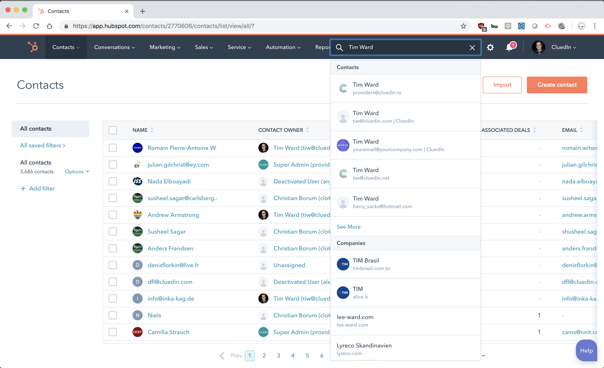
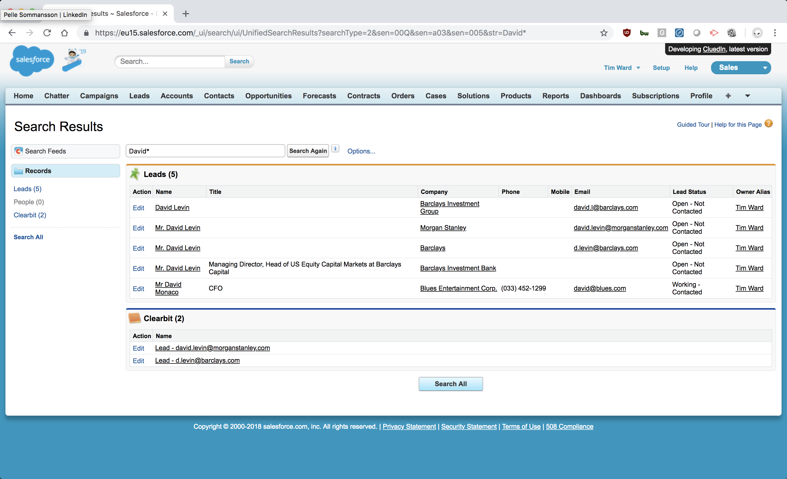
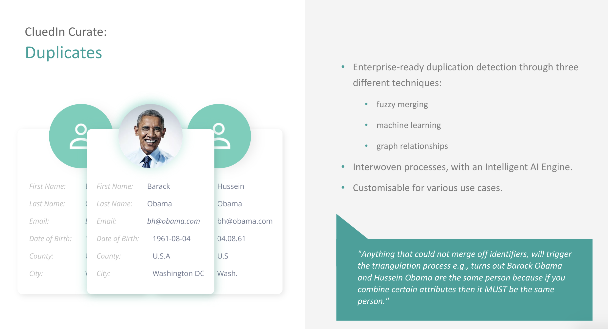
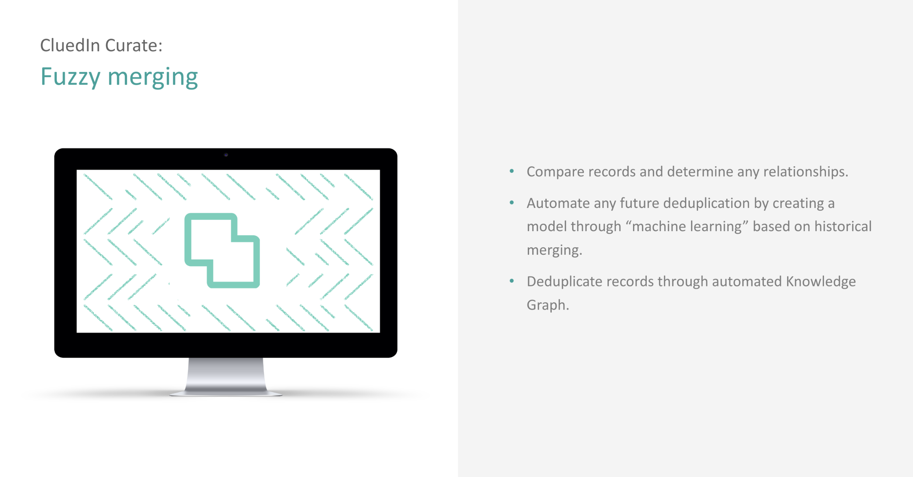

Duplicate records are big typical problem with data sources. It will show itself in many ways, but here are some simple examples: 

Whereas Entity Code matches are the way to 100% merge two records, it is not always the case that you will have this possibility. With that in mind there are other ways that you can help merge records. 

The current merging techniques in CluedIn include:

 - Manual Merge
 - CluedIn Fuzzy Merging Engine (utilising Core Vocabularies and Aliases)
 - CluedIn Train

You can manually merge records in the user interface or using the REST API. CluedIn will ask for a Target record and one or many Source records. The intention is that you will merge the many source records into the Target record. 

The easiest way to manually merge records is to first search for the records you would like to merge and then select the "Merge Records" button from the search interface. You will be prompted to select the many duplicates you will want to merge and then you will go into a merge resolution screen if necessary. 