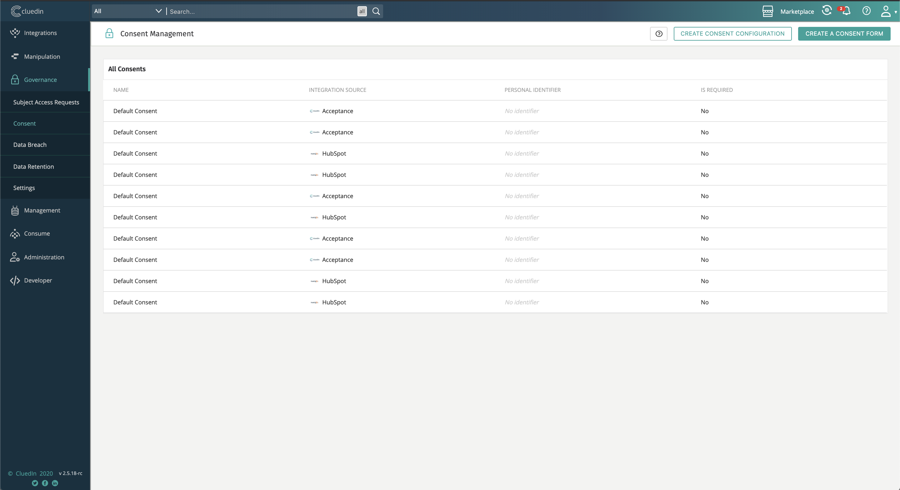

The CluedIn consent management support allows you to map consent against Vocabulary Keys. This allows a Governance/Compliance team to map which Vocabulary keys they will need to prove consent for and then map that to the actual records that are in the CluedIn Data Hub.

  

Consent Entries are typically mapped towards the use of the data itself. For example, if you had a use case to determine if a person was a potential customer, then you are best to map  the specific Vocabulary Keys that you will need for that use case, even if you are capturing the consent for those Keys already from another use case. 

By mapping the consent entries, you will be able to determine where those Vocabulary Keys are being used both incoming and out going sources and targets and you will be able to determine if you have the right consent from an individual to use their data for that specific reason. 

  

By creating a new consent entry, you will specify a Description, a flag specifying if you require all entries to have a value and finally, the Vocabulary Keys that you are binding for consent. 

You can then manually, or using our API, tell CluedIn which individuals you have actually captured consent from. This will allow you to filter your consumption endpoints to only use the data that you have consent for. 