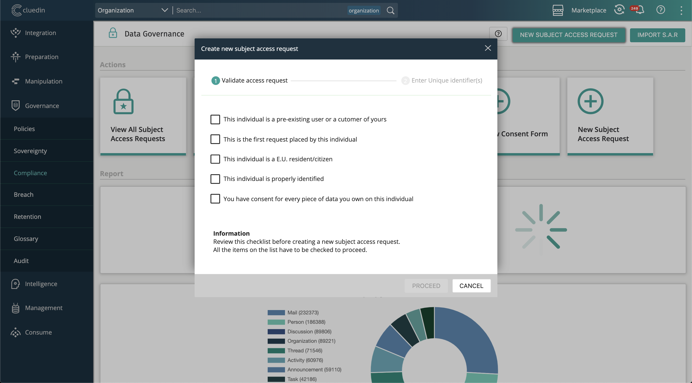

CluedIn allows a user to generate a subject access request to fulfil data privacy acts around the world. 

The process of generating a request assumes that you have integrated the sources that contain personal data. We also assume that you have deduplicated the records to a high precision using the CluedIn list of duplicate suspects. 

  

The first stage of registering a Subject Access Request is to specify that the identity of the request has been confirmed. This is important for not generating reports for an individual that has not confirmed their identity. 

  

After this step you will be asked to look for the individual you will need to generate the subject access report for. By default CluedIn will ship with the ability to lookup via the Name, Email or Phone Number of an individual, however you can modify this in the settings menu of Data Governance to include Vocabulary lookup values. 

  

Using the search facilities, CluedIn will only return matches for records that are of type /Person, /Infrastructure/Contact or /Infrastructure/User. All other records will be hidden by default. You cannot generate a Subject Access Request for any other Entity Type in CluedIn. 

It is at this point that you will notice two filters. The first is to include results from External Data Sources (where they have not merged with internal records) and Shadow Entities (where we only have unidentified references to people e.g. Name). You might find that during this process you will need to merge records manually. 

After you have chosen your subject, you will click Next, which will start to generate the report. 

  

You may find that this report can take multiple minutes to generate. The more data you have associated with a person, the more time it will typically take. You do not need to stay on this report generation page for it to continue its work, you can continue on generating other reports or using CluedIn for other reasons. 

After the report generation has finished, you will have the opportunity to review and edit the report before moving onto the next step. This gives you time to exclude parts of the report that you deem not necessary to share with the subject. 

If you find that you exclude parts of the report, then you can click the "Regenerate Report" button to ask for a new report with the modifications made. Once you are happy with the report, you can either see this in a PDF document, download the compressed version of the report with Json files pertaining to each individual record associated with the subject or finally you can move to the next stage. 

  

Your next stage will ask you if you would like to send the report and give you the option of entering an email address of the subject, in which the report will be sent to the subject. It will be registered in CluedIn that the report has been sent. You can also select "No" and manually send the report. 

  

The next stage allows you to run the mutation pieces of the subject access request, including:

 - Rectification (Edit)
 - Minification (Modify records to only include what you have consent mappings for)
 - Pseudonimisation (Generate a masked version of data that you do not have consent for)
 - Delete (Delete all records associated with this subject)

For these operations to fulfill their role, the respective Mesh API's must be implemented. Each operation above may generate many mesh API commands. These mesh commands are only generated and queued. By default, CluedIn will not run these individual commands until a product owner of that data has manually instructed CluedIn to do so in the Pending Changes tab on the entity pages of the modified records in CluedIn.