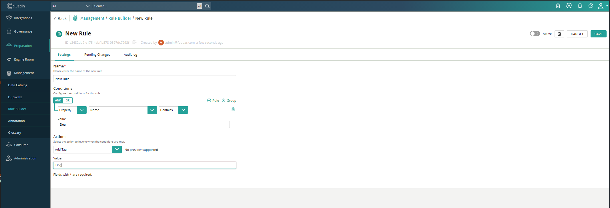
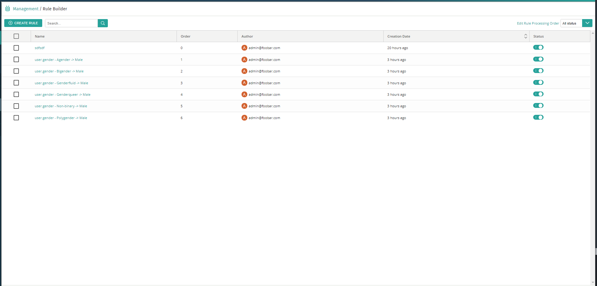

Rules are your way to setup business logic within the CluedIn user interface. Rules are made up of a tree of conditions and a single action. Conditions can be used to build a predicate based of the values of Entity properties, including using the Vocabularies from CluedIn. 



##Automate Rules with CluedIn Clean

Rules can manually be created, but they can also be automated by cleaning data through CluedIn Clean. You will need to make sure this feature is enabled with the Feature.Clean.AutoCreateRules. All mass edit operations within CluedIn Clean will now automatically create rules however it will mark them as deactived by default. It will require you to enabled the rules in the user interface. 



##Build new Actions

New rule actions can be added in the platform by implementing the IRuleAction interface. Here is an example of how you could add an action of adding an Alias to an entity. 

````csharp
using System.Collections.Generic;
using CluedIn.Core.Data.Parts;
using CluedIn.Core.Processing;
using CluedIn.Core.Rules;
using CluedIn.Core.Rules.Models;

namespace CluedIn.CustomRules.Actions
{
    public class AddAlias : IRuleAction
    {
        public string Name => "Add Alias";

        public bool SupportsPreview => false;

        [RuleProperty]
        public string Value { get; set; }

        public RuleActionResult Run(ProcessingContext context, IEntityMetadataPart entityMetadataPart, bool isPreview)
        {
            entityMetadataPart.Aliases.Add(Value);

            return new RuleActionResult { IsSuccess = true, Messages = new string[] { $"Added alias {Value}" } };
        }
    }
}


```