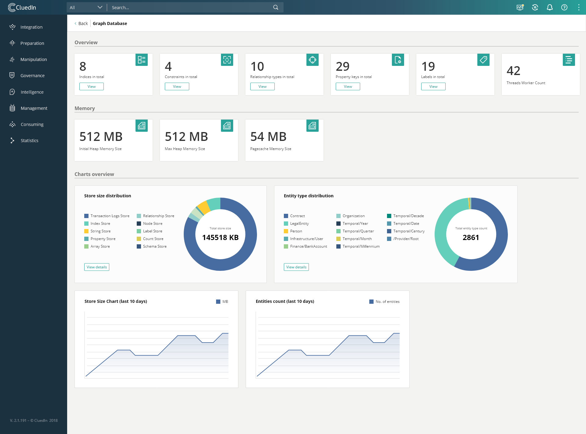
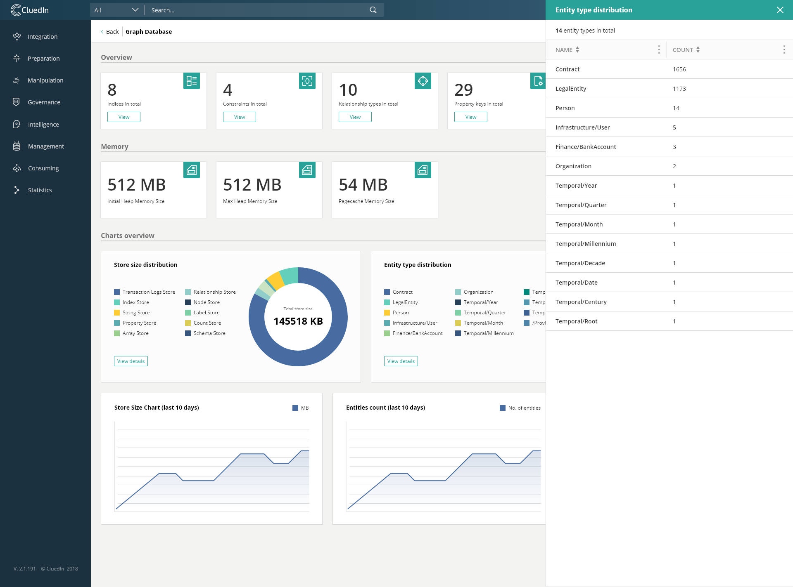

# Statistics Sections
1. [Statistics Room Overview](/docs/70-Statistics/00-Intro/Statistics%20Room.html)
2. [Processing Pipelines](/docs/70-Statistics/10-Pipelines/Pipelines.html)
3. [Graph Database](/docs/70-Statistics/20-Graph/Graph.html)
4. [Search Database](/docs/70-Statistics/30-Search/Search.html)
5. [Relational Database](/docs/70-Statistics/40-Relational/Relational.html)
6. [Cache Database](/docs/70-Statistics/50-Cache/Cache.html)
7. [Configuration](/docs/70-Statistics/60-Configuration/Configuration.html)

The data on this page is updated once per second.

Different bottlenecks or problems with how the data has been structured can be identified through monitoring the entities, relationships, and different properties set in the graph.

# Dashboard




# Overview

- Indexes
- Constraints
- Relationship Types
- Property Keys
- Labels
- Threads Worker Count

The overview section provides information about different key settings and values that are of interest in the Graph Database. Their count is given in overview, but some also offer a list breakdown.

# Memory

- Initial Heap Memory Size
- Max Heap Memory Size
- Pagecache Memory Size

As the names of the properties suggest, these are not live statistics, but configurations.

# Charts Overview

## Store Size

The pie chart shows a breakdown of the disk size used by the graph database. The breakdown provides descriptions for each store type.

The 2 axis chart shows total store size over the last 10 days.

## Entity Type Distribution

The pie chart shows a breakdown of all entity types, and how many entities each contains.

The 2 axis chart shows the number of total entities over the last 10 days.

# API

### GET /api/statistics/graph

#### Stores

| Property        | Type                  | Description   |
|-----------------|-----------------------|---------------|
| Count           | int                   | number of stores |
| TotalSize       | array of objects      | sum of all stores byte sizes over time |
| Data            | array of data objects | the stores data |

##### TotalSize objects

| Property        | Type                | Description   |
|-----------------|---------------------|---------------|
| Value           | long                | sum of all stores byte sizes |
| Date            | string              | date the value has been saved in cache store |

When the endpoint is queried, a new value is added to this array, if there has been at least a day since the date of last added value. This array can have a maximum of 10 values.

##### Stores Data

| Property        | Type                | Description   |
|-----------------|---------------------|---------------|
| Name            | string              | name of store |
| DisplayName     | string              | friendly name for store |
| Description     | string              | short description of what is stored |
| Size            | long                | size in bytes |

---

#### EntityTypes

| Property        | Type                  | Description   |
|-----------------|-----------------------|---------------|
| Count           | int                   | number of entity types |
| Total           | array of objects      | sum of all entities over time|
| Data            | array of data objects | the entity types data |

##### Total objects

| Property        | Type                | Description   |
|-----------------|---------------------|---------------|
| Value           | int                 | sum of all entities |
| Date            | string              | date the value has been saved in cache store |

When the endpoint is queried, a new value is added to this array, if there has been at least a day since the date of last added value. This array can have a maximum of 10 values.

##### EntityTypes Data

| Property        | Type                | Description   |
|-----------------|---------------------|---------------|
| term            | string              | entity type name |
| count           | int                 | number of entities of this entity type |

---

#### RelationshipTypes

| Property        | Type                  | Description   |
|-----------------|-----------------------|---------------|
| Count           | int                   | number of relationship types |
| Data            | array of data strings | the relationship types |

---

#### Indexes

| Property        | Type                  | Description   |
|-----------------|-----------------------|---------------|
| Count           | int                   | number of indexes |
| Data            | array of data strings | the indexes |

---

#### Constraints

| Property        | Type                  | Description   |
|-----------------|-----------------------|---------------|
| Count           | int                   | number of constraints |
| Data            | array of data strings | the constraints |

---

#### PropertyKeys

| Property        | Type                  | Description   |
|-----------------|-----------------------|---------------|
| Count           | int                   | number of property keys |
| Data            | array of data strings | the property keys |

---

#### Labels

| Property        | Type                  | Description   |
|-----------------|-----------------------|---------------|
| Count           | int                   | number of labels |
| Data            | array of data strings | the labels |

---

#### Configuration

| Property        | Type                  | Description   |
|-----------------|-----------------------|---------------|
| Count           | int                   | number of configuration |
| Data            | array of data objects | the configuration data objects |

##### Configuration Data

| Property        | Type                  | Description   |
|-----------------|-----------------------|---------------|
| Name            | string                | name of configuration setting |
| DisplayName     | string                | friendly name of configuration setting |
| Value           | string                | value of configuration setting |

---

```json
{
    "Stores": {
        "Count": 11,
        "TotalSize": [
            {
                "Value": 291027829,
                "Date": "04/03/2020"
            }
        ],
        "Data": [
            {
                "Name": "StringStoreSize",
                "DisplayName": "String Store Size",
                "Description": "Disk space used to store string properties, in bytes.",
                "Size": 6692873
            },
            {
                "Name": "TransactionLogsSize",
                "DisplayName": "Transaction Logs Size",
                "Description": "Disk space used by the transaction logs, in bytes.",
                "Size": 120797627
            },
            {
                "Name": "TotalStoreSize",
                "DisplayName": "Total Store Size",
                "Description": "Disk space used by whole store, in bytes.",
                "Size": 145518015
            },
            {
                "Name": "ArrayStoreSize",
                "DisplayName": "Array Store Size",
                "Description": "Disk space used to store array properties, in bytes.",
                "Size": 3129353
            },
            {
                "Name": "PropertyStoreSize",
                "DisplayName": "Property Store Size",
                "Description": "Disk space used to store properties (excluding string values and array values), in bytes.",
                "Size": 4560972
            },
            {
                "Name": "RelationshipStoreSize",
                "DisplayName": "Relationship Store Size",
                "Description": "Disk space used to store relationships, in bytes.",
                "Size": 1060930
            },
            {
                "Name": "NodeStoreSize",
                "DisplayName": "Node Store Size",
                "Description": "Disk space used to store nodes, in bytes.",
                "Size": 335810
            },
            {
                "Name": "LabelStoreSize",
                "DisplayName": "Label Store Size",
                "Description": "Disk space used to store labels, in bytes",
                "Size": 16400
            },
            {
                "Name": "CountStoreSize",
                "DisplayName": "Count Store Size",
                "Description": "Disk space used to store counters, in bytes",
                "Size": 11136
            },
            {
                "Name": "SchemaStoreSize",
                "DisplayName": "Schema Store Size",
                "Description": "Disk space used to store schemas (index and constrain declarations), in bytes",
                "Size": 8201
            },
            {
                "Name": "IndexStoreSize",
                "DisplayName": "Index Store Size",
                "Description": "Disk space used to store all indices, in bytes",
                "Size": 8896512
            }
        ]
    },
    "EntityTypes": {
        "Count": 14,
        "Total": [
            {
                "Value": 2861,
                "Date": "04/03/2020"
            },
            {
                "Value": 2861,
                "Date": "05/03/2020"
            }
        ],
        "Data": [
            {
                "term": "/Contract",
                "count": 1656
            },
            {
                "term": "/LegalEntity",
                "count": 1173
            },
            {
                "term": "/Person",
                "count": 14
            },
            {
                "term": "/Infrastructure/User",
                "count": 5
            },
            {
                "term": "/Finance/BankAccount",
                "count": 3
            },
            {
                "term": "/Organization",
                "count": 2
            },
            {
                "term": "/Temporal/Year",
                "count": 1
            },
            {
                "term": "/Temporal/Quarter",
                "count": 1
            },
            {
                "term": "/Temporal/Month",
                "count": 1
            },
            {
                "term": "/Temporal/Millennium",
                "count": 1
            },
            {
                "term": "/Temporal/Decade",
                "count": 1
            },
            {
                "term": "/Temporal/Date",
                "count": 1
            },
            {
                "term": "/Temporal/Century",
                "count": 1
            },
            {
                "term": "/Provider/Root",
                "count": 1
            }
        ]
    },
    "RelationshipTypes": {
        "Count": 10,
        "Data": [
            "/Code",
            "/WorksFor",
            "/PartOf",
            "/DiscoveredAt",
            "/At",
            "/UsedBy",
            "/AlternativBankAccount",
            "/BillTo",
            "/SellTo",
            "/OwnedBy"
        ]
    },
    "Indexes": {
        "Count": 8,
        "Data": [
            "DisplayName",
            "EntityType",
            "Name",
            "Organization",
            "Attribute-origin",
            "Code",
            "EntityCode",
            "Id"
        ]
    },
    "Constraints": {
        "Count": 4,
        "Data": [
            "CONSTRAINT ON ( entity:Entity ) ASSERT entity.Attribute-origin IS UNIQUE",
            "CONSTRAINT ON ( entity:Entity ) ASSERT entity.Code IS UNIQUE",
            "CONSTRAINT ON ( entity:Entity ) ASSERT entity.EntityCode IS UNIQUE",
            "CONSTRAINT ON ( entity:Entity ) ASSERT entity.Id IS UNIQUE"
        ]
    },
    "PropertyKeys": {
        "Count": 92,
        "Data": [
            "DisplayName",
            "Organization",
            "EntityType",
            "Name",
            "Id",
            "Attribute-origin",
            "Code",
            "EntityCode",
            "PersistHash",
            "Codes",
            "TimeToLive",
            "ModifiedDate",
            "SortDate",
            "PersistVersion",
            "Attribute-appVersion",
            "DiscoveryDate",
            "Attribute-type",
            "CreatedDate",
            "IsShadowEntity",
            "EdgesSummary",
            "SystemTagName",
            "..."
        ]
    },
    "Labels": {
        "Count": 18,
        "Data": [
            "Entity",
            "nav",
            "/Organization",
            "/EntityCode",
            "/Infrastructure/User",
            "/Person",
            "/LegalEntity",
            "/Provider/Root",
            "/Product",
            "/Temporal/Year",
            "/Temporal/Century",
            "/Temporal/Month",
            "/Temporal/Date",
            "/Temporal/Decade",
            "/Temporal/Millennium",
            "/Temporal/Quarter",
            "/Finance/BankAccount",
            "/Contract"
        ]
    },
    "Configuration": {
        "Count": 4,
        "Data": [
            {
                "Name": "dbms.memory.heap.initial_size",
                "DisplayName": "Initial Heap Size",
                "Value": "512M"
            },
            {
                "Name": "dbms.memory.heap.max_size",
                "DisplayName": "Max Heap Size",
                "Value": "512M"
            },
            {
                "Name": "dbms.memory.pagecache.size",
                "DisplayName": "Page Cache Size",
                "Value": "512M"
            },
            {
                "Name": "dbms.threads.worker_count",
                "DisplayName": "Worker Thread Counts",
                "Value": "2"
            }
        ]
    }
}
```