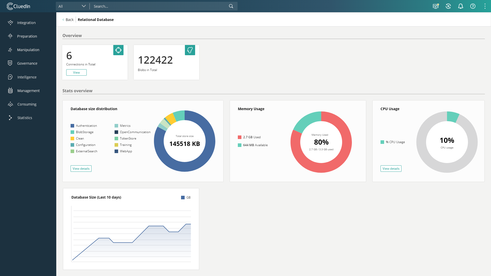
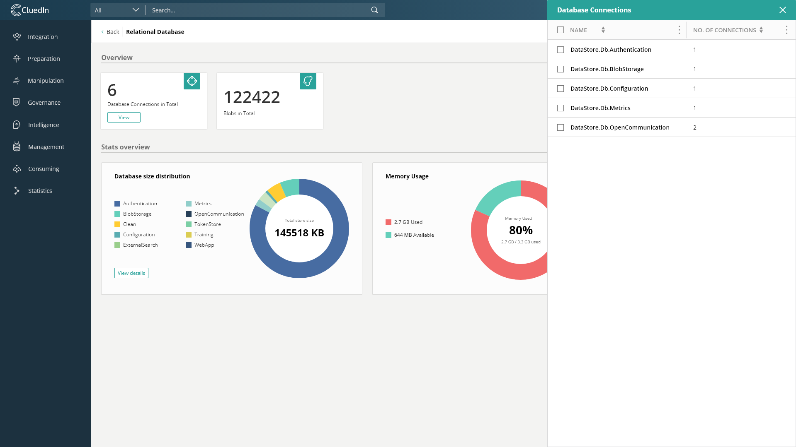
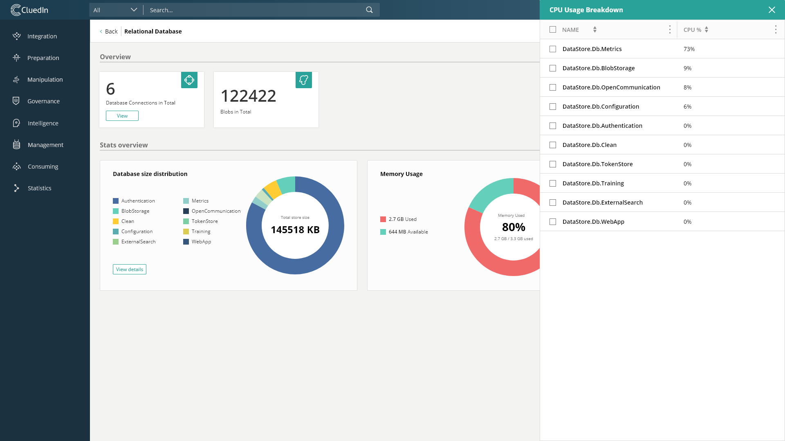
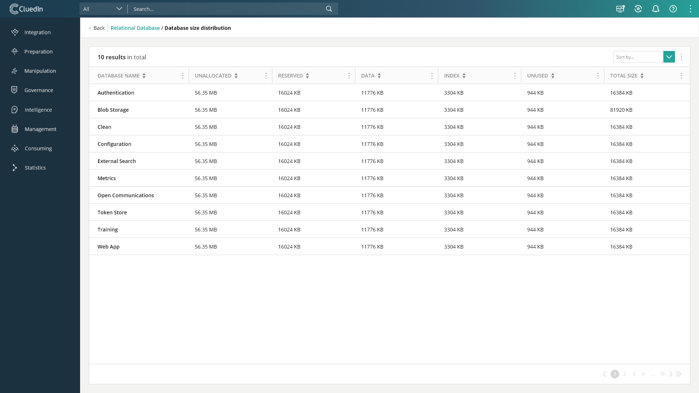

# Statistics Sections
1. [Statistics Room Overview](/docs/70-Statistics/00-Intro/Statistics%20Room.html)
2. [Processing Pipelines](/docs/70-Statistics/10-Pipelines/Pipelines.html)
3. [Graph Database](/docs/70-Statistics/20-Graph/Graph.html)
4. [Search Database](/docs/70-Statistics/30-Search/Search.html)
5. [Relational Database](/docs/70-Statistics/40-Relational/Relational.html)
6. [Cache Database](/docs/70-Statistics/50-Cache/Cache.html)
7. [Configuration](/docs/70-Statistics/60-Configuration/Configuration.html)

The data on this page is updated once per second.

Our relational database handles all the internal data used in running our product, such as authentication details, registered providers, blobs storage, and, the most resource heavy use, metrics. You can use the data here to see if any of these are causing a bottleneck.

# Dashboard





# Overview

- Connections
- Blobs Total

A breakdown of the current connections can be viewed as a sidepanel

# Charts Overview

## Memory

The chart is made out of the used, available, and percentage of memory used.

## CPU

Shows how much of the CPU the database is using, and that percentage is further broken down as a sidepanel, showing the percentage each database is using for it's queries.



## Database Size Distribution

The pie chart shows a breakdown of all the databases and their store size. A description is also provided for each database.

The 2 axis chart shows the total database size over the last 10 days.



# API

### GET /api/statistics/relational

#### DatabaseSizes

| Property        | Type                  | Description   |
|-----------------|-----------------------|---------------|
| Count           | int                   | number of databases |
| Total           | array of objects      | sum of all database byte sizes over time |
| Data            | array of data objects | the stores data |

##### Total objects

| Property        | Type                | Description   |
|-----------------|---------------------|---------------|
| Value           | long                | sum of all store byte sizes |
| Date            | string              | date the value has been saved in cache store |

When the endpoint is queried, a new value is added to this array, if there has been at least a day since the date of last added value. This array can have a maximum of 10 values.

##### DatabaseSizes Data

| Property        | Type                  | Description   |
|-----------------|-----------------------|---------------|
| Name            | string                | the name of the database |
| TotalSize       | string                | sum of all sizes |
| UnallocatedSize | string                | memory not yet used for anything |
| ReservedSize    | string                | reserved memory |
| DataSize        | string                | memory used to store the data of the blobs |
| IndexSize       | string                | memory used to store the indexes of this database |
| UnusedSize      | string                | memory reserved but not used yet |

---

#### NumberOfBlobs

| Property        | Type                  | Description   |
|-----------------|-----------------------|---------------|
| NumberOfBlobs   | int                   | the total number of blobs stored in the database |

---

#### DatabaseConnections

| Property        | Type                  | Description   |
|-----------------|-----------------------|---------------|
| Count           | int                   | number of databases that have connections open |
| Total           | array of objects      | sum of all connections over time |
| Data            | array of data objects | the database connections data |

##### Total Objects

| Property        | Type                | Description   |
|-----------------|---------------------|---------------|
| Value           | int                 | sum of all connections |
| Date            | string              | date the value has been saved in cache store |

##### DatabaseConnections Data

| Property        | Type                | Description   |
|-----------------|---------------------|---------------|
| Name            | string              | name of database |
| Connections     | int                 | number of connections |

When the endpoint is queried, a new value is added to this array, if there has been at least a day since the date of last added value. This array can have a maximum of 10 values.

---

##### Memory

| Property        | Type                  | Description   |
|-----------------|-----------------------|---------------|
| Used            | long                  | used memory in bytes |
| Available       | long                  | available memory in bytes |
| Max             | long                  | max memory in bytes |
| PercentageUsed  | int                   | percentage used |

---

#### CPUPercentUsed

| Property        | Type                  | Description   |
|-----------------|-----------------------|---------------|
| CPUPercentUsed  | int                   | percentage of CPU used |


#### CPUPercentBreakdown

| Property        | Type                  | Description   |
|-----------------|-----------------------|---------------|
| Count           | int                   | count of all databases using CPU |
| Data            | array of data objects | cpu percent breakdown data |

##### CPUPercentBreakdown Data

| Property        | Type                  | Description   |
|-----------------|-----------------------|---------------|
| Name            | string                | name of the database |
| CPUPercent      | int                   | cpu percent used by this database |

---

```json
{
    "DatabaseSizes": {
        "Count": 10,
        "Total": [
            {
                "Value": 163840,
                "Date": "17/03/2020"
            },
            {
                "Value": 163840,
                "Date": "18/03/2020"
            },
            {
                "Value": 163840,
                "Date": "20/03/2020"
            },
            {
                "Value": 163840,
                "Date": "23/03/2020"
            },
            {
                "Value": 16777216,
                "Date": "26/03/2020"
            },
            {
                "Value": 16777216,
                "Date": "31/03/2020"
            }
        ],
        "Data": [
            {
                "Name": "DataStore.Db.Authentication",
                "TotalSize": 16777216,
                "UnallocatedSize": 4508877,
                "ReservedSize": 3874816,
                "DataSize": 1122304,
                "IndexSize": 1425408,
                "UnusedSize": 1327104
            },
            {
                "Name": "DataStore.Db.BlobStorage",
                "TotalSize": 16777216,
                "UnallocatedSize": 4225762,
                "ReservedSize": 4161536,
                "DataSize": 1687552,
                "IndexSize": 1409024,
                "UnusedSize": 1064960
            },
            {
                "Name": "DataStore.Db.Clean",
                "TotalSize": 16777216,
                "UnallocatedSize": 5473566,
                "ReservedSize": 2916352,
                "DataSize": 1048576,
                "IndexSize": 1245184,
                "UnusedSize": 622592
            },
            {
                "Name": "DataStore.Db.Configuration",
                "TotalSize": 16777216,
                "UnallocatedSize": 5536482,
                "ReservedSize": 2850816,
                "DataSize": 1015808,
                "IndexSize": 1245184,
                "UnusedSize": 589824
            },
            {
                "Name": "DataStore.Db.ExternalSearch",
                "TotalSize": 16777216,
                "UnallocatedSize": 5620368,
                "ReservedSize": 2768896,
                "DataSize": 1032192,
                "IndexSize": 1236992,
                "UnusedSize": 499712
            },
            {
                "Name": "DataStore.Db.Metrics",
                "TotalSize": 16777216,
                "UnallocatedSize": 3491758,
                "ReservedSize": 4898816,
                "DataSize": 1613824,
                "IndexSize": 1851392,
                "UnusedSize": 1433600
            },
            {
                "Name": "DataStore.Db.OpenCommunication",
                "TotalSize": 16777216,
                "UnallocatedSize": 461373,
                "ReservedSize": 7929856,
                "DataSize": 2310144,
                "IndexSize": 2031616,
                "UnusedSize": 3588096
            },
            {
                "Name": "DataStore.Db.TokenStore",
                "TotalSize": 16777216,
                "UnallocatedSize": 5326766,
                "ReservedSize": 3063808,
                "DataSize": 1056768,
                "IndexSize": 1261568,
                "UnusedSize": 745472
            },
            {
                "Name": "DataStore.Db.Training",
                "TotalSize": 16777216,
                "UnallocatedSize": 5683282,
                "ReservedSize": 2703360,
                "DataSize": 1007616,
                "IndexSize": 1220608,
                "UnusedSize": 475136
            },
            {
                "Name": "DataStore.Db.WebApp",
                "TotalSize": 16777216,
                "UnallocatedSize": 5683282,
                "ReservedSize": 2703360,
                "DataSize": 1007616,
                "IndexSize": 1220608,
                "UnusedSize": 475136
            }
        ]
    },
    "NumberOfBlobs": 2861,
    "DatabasesConnections": {
        "Count": 5,
        "Total": [
            {
                "Value": 13,
                "Date": "05/03/2020"
            }
        ],
        "Data": [
            {
                "Name": "DataStore.Db.Authentication",
                "Connections": 1
            },
            {
                "Name": "DataStore.Db.BlobStorage",
                "Connections": 1
            },
            {
                "Name": "DataStore.Db.Configuration",
                "Connections": 1
            },
            {
                "Name": "DataStore.Db.Metrics",
                "Connections": 1
            },
            {
                "Name": "DataStore.Db.OpenCommunication",
                "Connections": 9
            }
        ]
    },
    "Memory": {
        "Used": 2467667968,
        "Available": 836395008,
        "Max": 3304062976,
        "PercentageUsed": 74
    },
    "CPUPercentUsed": 1,
    "CPUPercentUsedBreakdown": {
        "Count": 10,
        "Data": [
            {
                "Name": "DataStore.Db.Metrics",
                "CPUPercent": 70
            },
            {
                "Name": "DataStore.Db.OpenCommunication",
                "CPUPercent": 10
            },
            {
                "Name": "DataStore.Db.BlobStorage",
                "CPUPercent": 9
            },
            {
                "Name": "DataStore.Db.Configuration",
                "CPUPercent": 7
            },
            {
                "Name": "DataStore.Db.TokenStore",
                "CPUPercent": 0
            },
            {
                "Name": "DataStore.Db.Authentication",
                "CPUPercent": 0
            },
            {
                "Name": "DataStore.Db.WebApp",
                "CPUPercent": 0
            },
            {
                "Name": "DataStore.Db.Training",
                "CPUPercent": 0
            },
            {
                "Name": "DataStore.Db.ExternalSearch",
                "CPUPercent": 0
            },
            {
                "Name": "DataStore.Db.Clean",
                "CPUPercent": 0
            }
        ]
    }
}
```

