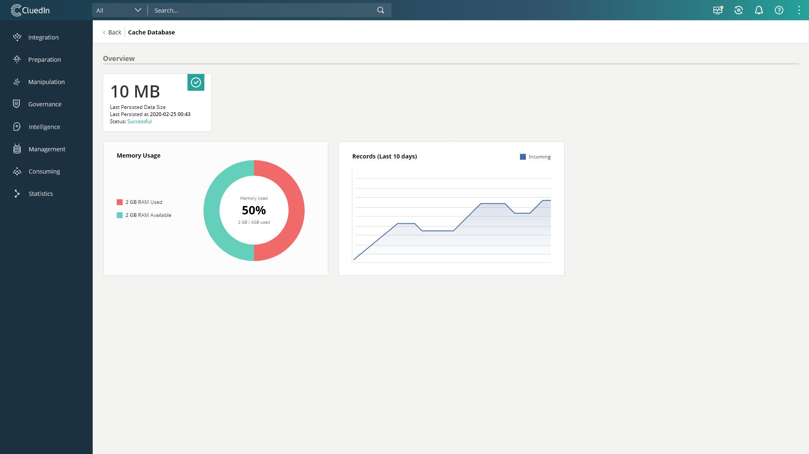

# Statistics Sections
1. [Statistics Room Overview](/docs/70-Statistics/00-Intro/Statistics%20Room.html)
2. [Processing Pipelines](/docs/70-Statistics/10-Pipelines/Pipelines.html)
3. [Graph Database](/docs/70-Statistics/20-Graph/Graph.html)
4. [Search Database](/docs/70-Statistics/30-Search/Search.html)
5. [Relational Database](/docs/70-Statistics/40-Relational/Relational.html)
6. [Cache Database](/docs/70-Statistics/50-Cache/Cache.html)
7. [Configuration](/docs/70-Statistics/60-Configuration/Configuration.html)

The data on this page is updated once per second.

The data here provides a basic overview of what is in our Cache store and it's health.

# Dashboard



# Overview

- Memory - Used in size
- Last Persisted At - Formatted Date
- Last Persisted Status - ok/failed
- Last Persisted Size
- Records - Count

# Charts Overview

## Records Chart

The 2 axis chart shows the records count over the last 10 days.

# API

### GET /api/statistics/cache

#### Overview

| Property            | Type                  | Description   |
|---------------------|-----------------------|---------------|
| Memory              | object                  | currently used RAM in bytes |
| LastPersistedAt     | string                | last persisted date time |
| LastPersistedStatus | string                | last persisted status |
| LastPersistedSize   | long                  | last persisted batch's size in bytes |
| Records             | array of objects      | sum of all records over time |

##### Memory

| Property        | Type                  | Description   |
|-----------------|-----------------------|---------------|
| Used            | long                  | used memory in bytes |
| Available       | long                  | available memory in bytes |
| Max             | long                  | max memory in bytes |
| PercentageUsed  | int                   | percentage used |

##### Records

| Property        | Type                | Description   |
|-----------------|---------------------|---------------|
| Value           | long                | sum of all records |
| Date            | string              | date the value has been saved in cache store |

When the endpoint is queried, a new value is added to this array, if there has been at least a day since the date of last added value. This array can have a maximum of 10 values.

---

```json
{
    "Memory": {
        "Used": 3227648,
        "Available": 3227648,
        "Max": 6455296‬,
        "PercentageUsed": 50
    },
    "LastPersistedAt": "Tuesday, 31 March 2020 10:49:58",
    "LastPersistedStatus": "ok",
    "LastPersistedSize": "581632",
    "Records": [
        {
            "Value": 35,
            "Date": "17/03/2020"
        },
        {
            "Value": 35,
            "Date": "18/03/2020"
        },
        {
            "Value": 53,
            "Date": "23/03/2020"
        },
        {
            "Value": 57,
            "Date": "31/03/2020"
        }
    ]
}
```


