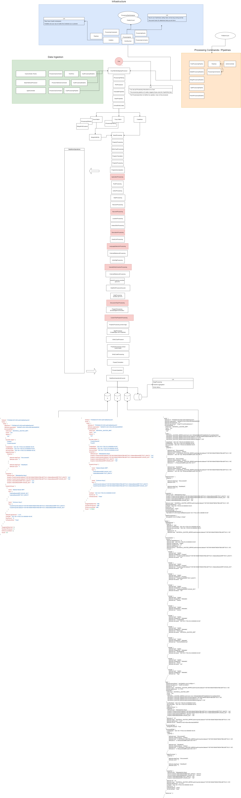

The processing pipeline of CluedIn is the engine that takes Clues and turns them into Entities. The processing pipeline exposes some extensibility endpoints that allow you to inject your own custom logic at certain stages of the pipeline. 

Below is a diagram that shows the full journey of the processing pipeline. 

 

 This digram shows you the different stages of processing, but also exposes the different entry points that you have as a developer to inject your own custom logic. It is important to mention that there are many ways to extend CluedIn and the way we are talking about here is for running your code in the same process as CluedIn. In the majority of cases, this is the most efficient way to inject custom processing logic. You can of course let CluedIn process the data and only interact with it once this data processing has finished. You could use the GraphQL API or Streams to move the appropriate data to another system so you can apply your own custom logic after CluedIn. 