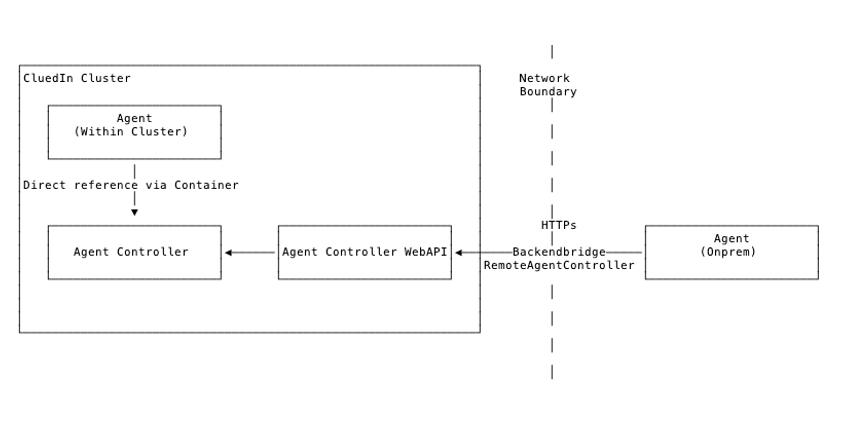
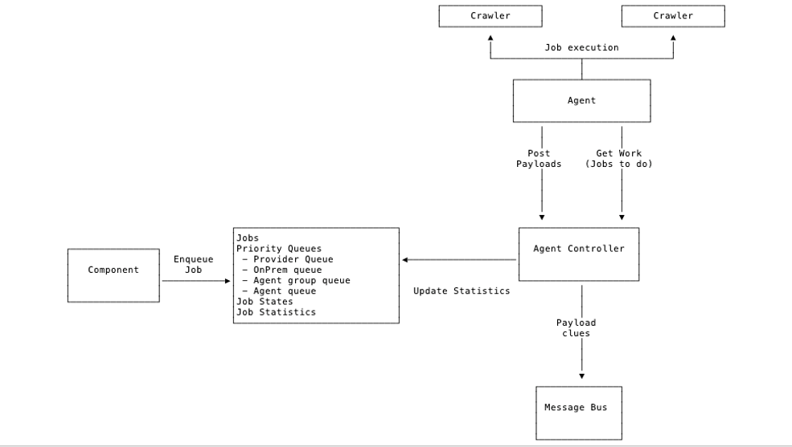

Agents are the orchestrators of running integrations. Agents allow you to run crawlers in remote environments, typically on different machines, even in different physical environments. 

Agents are typically used for running hybrid environments of CluedIn where you may host CluedIn itself in the cloud, but need to run crawls on systems that live within an internal network of a business. 

The Agents are responsible for running scheduled crawls and the robustness of making sure that the crawlers can survive times where they crash. 

For running an Agent, you will need to register an Agent API key within the CluedIn datastore and then the Agents will need matching API keys in their configuration files on the remote machines. CluedIn will use Websockets to communicate between the Agents and the CluedIn Server. 

When deploying your Agents, they will need to have the Agent API key match one of the API Keys that are registered in the Agents Database within CluedIn. The API key must be associated with the Organization ID of the account that is running the Agent.

The simplest way to setup an agent is to remove the ServerComponent folder from CluedIn, leaving only the Agent folder. In container.config, you have to make sure that the URLs are correct (e.g. AgentServerUrl should have the value of the CluedIn's API endpoint).

For communication, Agents cannot receive incoming messages but rather uses a polling mechanism to talk with the CluedIn Server. In this way, other systems cannot instruct the Agents with a Job to run. The Agents will post data, logs and health statistics back to the CluedIn server so that CluedIn has knowledge of what is running within the Agents and any possible issues that could be happening. 

Executes Agent Jobs from the CluedIn System against a 3rd party / provider api



Job results (clues) is sent back to CluedIn as payloads

Agents can be deployed:
 - Within the CluedIn cluster (cloud)
 - As a separate isolated component (onprem)

Cloud (within the CluedIn cluster)
 - Directly connected to the backend
 - Communicates with Agent Controller via direct reference from the container



Onprem (outside of our control)
 - Deployed as VM’s within customers own environment
 - Enables access to customers environments that is not accessible from the CluedIn Cluster Directly
 - Communicates with Agent Controller over HTTP, TLS
 - No access to CluedIn databases, Message Bus etc.
 - Deployed with ComponentHost + individual components
 - Ie. Smaller deployment package than the full CluedIn
 - Processing, WebApi, DataStores is not available
 - Agent API key is used for “Authentication”


Payload
 - Binary Format
 - Multiple Records
 - Compressed

Types of Payloads
 - Clue Payloads
 - Clues produced from Crawlers
 - Agent Job Log Payloads
 - Logs produced from the job/crawler execution
 - (Log shipping from the Agent back to the CluedIn cluster)
 - (CompressedRecord<T> Payload)

Job Types
 - Normal
Execute job, finishes when crawling is done

 - Continuous
Does not finish
Used to monitor as system and produce clues when changes happen
Ie. File system monitoring, Kafka queue,....

Jobs have statistics of
Start / stop dates
Current number of tasks
Number of completed tasks
Number of failed tasks
Number of clues produced
Number of payloads submitted


Jobs can be restricted to only run on
A specific agent
A specific group of agents
Any agent with type
Cloud
SharedProcessor (shared between multiple tenants)
Onprem (A single tenant)

Orchestration Server
Agents automatically download updates from the server
(Zip file deployed centrally)
Enables updates of Agent deployed in scenarios where we do not have access to the machines they are running on.


## Deploying an agent
Agent can be deployed by downloading a build artifact with ServerComponent remove.
You can find the link to the latest version here: {tbd}

### Configuring the agent
Agent can be configured by visiting `container.config` that is inside your `<agent-root>/Agent` folder.

You should see a similar configuration file:
```
<?xml version="1.0" encoding="utf-8"?>
<configuration xmlns:urn="urn:schemas-microsoft-com:asm.v1" xmlns:xdt="http://schemas.microsoft.com/XML-Document-Transform">
  <xdt:Import assembly="ComponentHost" namespace="ComponentHost.Transforms"/>
  <startup xdt:Transform="InsertIfMissing">
    <supportedRuntime version="v4.0" sku=".NETFramework,Version=v4.8"/>
  </startup>

  <appSettings xdt:Transform="InsertIfMissing">
    <add key="ServerUrl"                                                value="https://localhost:9000/" xdt:Locator="Condition(@key='ServerUrl')" xdt:Transform="Replace" />
    <add key="ServerBlobUrl"                                            value="https://localhost:9000/" xdt:Locator="Condition(@key='ServerBlobUrl')" xdt:Transform="Replace" />
    <add key="WebhookUrl"                                               value="https://localhost:9006/" xdt:Locator="Condition(@key='WebhookUrl')" xdt:Transform="Replace" />
    <add key="WebhookServerUrl"                                         value="https://localhost:9006/" xdt:Locator="Condition(@key='WebhookServerUrl')" xdt:Transform="Replace" />
    <add key="ServerStatusUrl"                                          value="http://localhost:9004/" xdt:Locator="Condition(@key='ServerStatusUrl')" xdt:Transform="Replace" />
    <add key="ServerLoggingUrl"                                         value="http://localhost:9005/" xdt:Locator="Condition(@key='ServerLoggingUrl')" xdt:Transform="Replace" />
    <add key="ServerStatusDefaultRedirect"                              value="https://www.cluedin.net/" xdt:Locator="Condition(@key='ServerStatusDefaultRedirect')" xdt:Transform="Replace" />
    <add key="AuthServerUrl"                                            value="https://localhost:9001/" xdt:Locator="Condition(@key='AuthServerUrl')" xdt:Transform="Replace" />
    <add key="Domain"                                                   value="localhost" xdt:Locator="Condition(@key='Domain')" xdt:Transform="Replace" />
    <add key="EmailServer"                                              value="" xdt:Locator="Condition(@key='EmailServer')" xdt:Transform="Replace" />
    <add key="EmailPort"                                                value="" xdt:Locator="Condition(@key='EmailPort')" xdt:Transform="Replace" />
    <add key="EmailDisplayName"                                         value="" xdt:Locator="Condition(@key='EmailDisplayName')" xdt:Transform="Replace" />
    <add key="EmailSender"                                              value="" xdt:Locator="Condition(@key='EmailSender')" xdt:Transform="Replace" />
    <add key="EmailUserName"                                            value="" xdt:Locator="Condition(@key='EmailUserName')" xdt:Transform="Replace" />
    <add key="EmailPassword"                                            value="" xdt:Locator="Condition(@key='EmailPassword')" xdt:Transform="Replace" />

    <add key="Logging.Targets.Exceptions"                               value="false" xdt:Locator="Condition(@key='Logging.Targets.Exceptions')" xdt:Transform="Replace" />

    <add key="Health.TemporaryDirectory.Enabled"                        value="true" xdt:Locator="Condition(@key='Health.TemporaryDirectory.Enabled')" xdt:Transform="Replace" />
    <add key="Health.TemporaryDirectory.FreeSpacePctThreshold"          value="0.0" xdt:Locator="Condition(@key='Health.TemporaryDirectory.FreeSpacePctThreshold')" xdt:Transform="Replace" />
    <add key="Health.TemporaryDirectory.FreeSpaceBytesThreshold"        value="209715200" xdt:Locator="Condition(@key='Health.TemporaryDirectory.FreeSpaceBytesThreshold')" xdt:Transform="Replace" />

    <!-- Agent -->
    <add key="Agent.Enabled"                                            value="true" xdt:Locator="Condition(@key='Agent.Enabled')" xdt:Transform="Replace"/>
    <add key="Agent.ErrorLogging.Project"                               value="6" xdt:Locator="Condition(@key='Agent.ErrorLogging.Project')" xdt:Transform="Replace" />
    <add key="Agent.APIKey"                                             value="!2qwaszx12346" xdt:Locator="Condition(@key='Agent.APIKey')" xdt:Transform="Replace" />
    <add key="Agent.TaskScheduler"                                      value="Default" xdt:Locator="Condition(@key='Agent.TaskScheduler')" xdt:Transform="Replace" />
    <add key="Agent.Queue.MaximumJobsToQueuePerCpu"                     value="1.5" xdt:Locator="Condition(@key='Agent.Queue.MaximumJobsToQueuePerCpu')" xdt:Transform="Replace" />
  </appSettings>

</configuration>
```
### Connecting to Kubernetes master server

Fill out the following configuration to connect to your Kubernetes cluster that is running API and JobServer:

`ServerUrl` should contain a value for your CluedIn WebAPI. Usually it is `https://app.<hostname>/api/`

`ServerBlobUrl` should contain a value to your blob url. By default, it should be the same as your WebApi URL.

`WebhookUrl` should contain your Webhook API Url. By default, it is https://app.<hostname>/webhooks/

`ServerStatusUrl` should be ttps://app.<hostname>/api/status

`ServerLoggingUrl` should point to your WebApi. By default, it should be `https://app.<hostname>/api/`

`AuthServerUrl` should point to your Auth API. By default, you can find Auth API over at `ttps://app.<hostname>/auth/`

### Agent Authentication
#### *_BY DEFAULT, THE AGENT IS ALREADY SETUP TO RUN ON A DEFAULT ON PREMISE CRAWLER. CHANGING A TOKEN IS RECOMMENDED_*

Agent has to authenticate against a registered agent. You can do this by port-forwarding to CluedIn SQL Server 
(`kubectl port-forward -l app=sqlserver 1433 --address 0.0.0.0) and adding an agent registration to `DataStore.Db.OpenCommunication` > `dbo.Agent`, or just fill out a SQL query below:
```
DECLARE @AgentId varchar(60);
SET @AgentId = '6CF17140-0FB0-47C5-AAAA-9A40A0ECF8BA';

DECLARE @AgentGroup varchar(60);
SET @AgentGroup = '612ed11a-b1b3-463f-b4a5-7c1bb7bd55a0';

DECLARE @AgentToken varchar(60);
SET @AgentToken = '--- INSERT YOUR API TOKEN HERE ---';

DECLARE @OrganizationId varchar(60);
SET @OrganizationId = (SELECT Id AS OrganizationId FROM dbo.OrganizationProfile WHERE OrganizationName = '--- INSERT YOUR CLIENT ID HERE ---');

DECLARE @DateTimeMin varchar(60);
SET @DateTimeMin = (select cast(-53690 as datetime));

INSERT INTO dbo.Agent (Id, AccountId, ApiKey, LastPing) VALUES (@AgentId, @OrganizationId, @AgentToken, @DateTimeMin);
```

Then, set the `AgentToken` value in the `container.config`.

### Deploying Crawlers
In order to deploy a crawler, you will need to have a crawler assembly files either from Azure DevOps artifacts or by building a crawler locally. 
Assemblies required:
* CluedIn.Crawling._CrawlerName_
* CluedIn.Crawling._CrawlerName_.Core
* CluedIn.Crawling._CrawlerName_.Infrastructure

_Note, that Provider project is not required because Provider is registereted in the cloud WebApi instance. Everything that is contained in the Provider project will be executed from the cluster_

Crawler assemblies needs to be moved into `<agent-root>/Agent` folder and will be picked up once the Agent is started.

On the cluster, you only need to deploy the `Provider` project's NuGet package. Parts responsible for crawling will be executed by the agent.

### Running the agent
Running the agent is as simple as starting `CluedIn.Server.Host.exe` file. You will see an output where your agent is trying to load the assemblies and connct to the cluster. Make sure there is nothing blocking the call getting to the API server networking-wise.