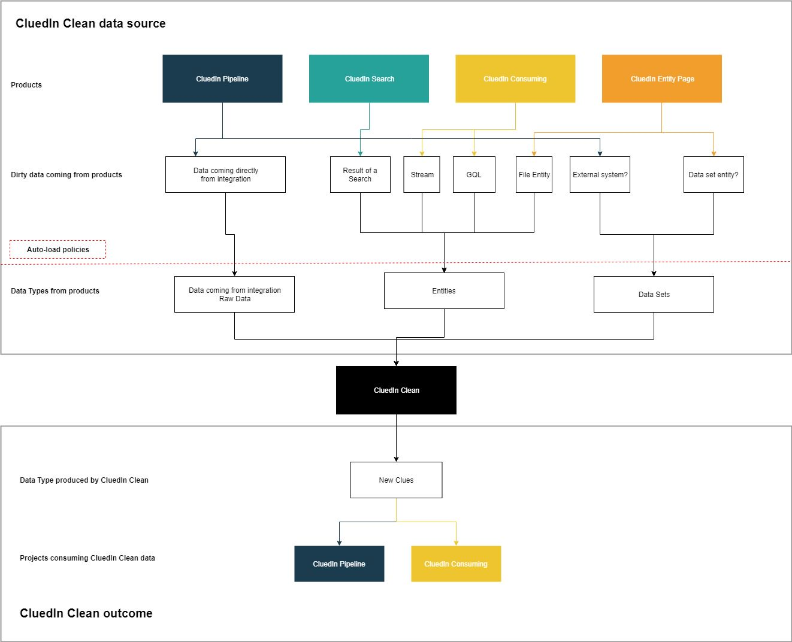
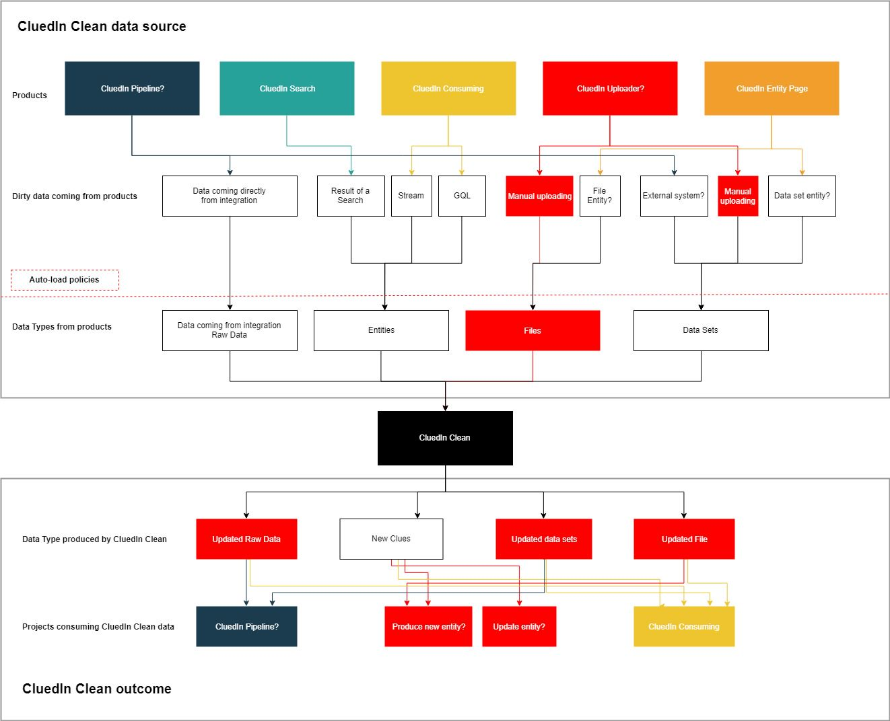
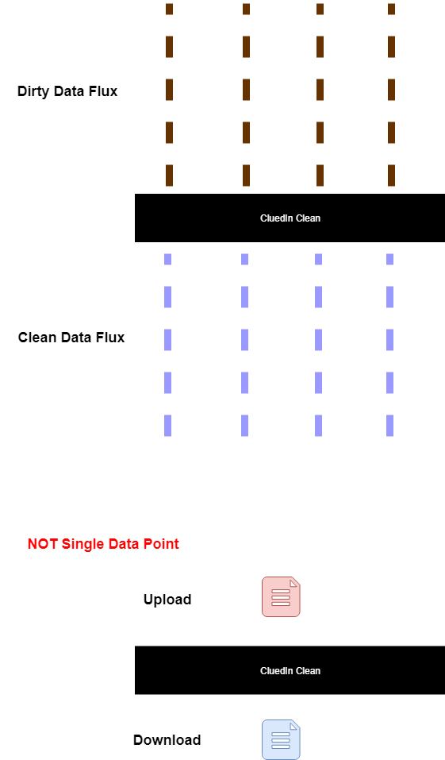
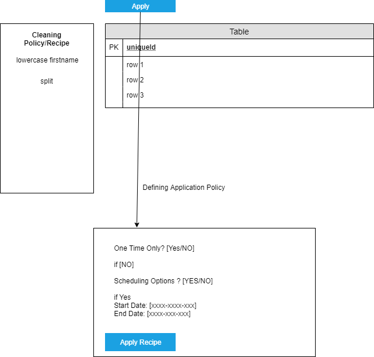

# Data Cleaning

## Scoping

Scoping is the exerice to understand what are the inputs and outputs of a system. This is important in a micro-services architecture as it helps separte the concern for each system.

The first exercice to shape a scope is to define the relationships with other systems.

### Relationship with other systems/products

**Inputs**

Based on this diagram, we can identify the inputs product are:

- CluedIn Pipeline
- CluedIn Search
- CluedIn Consuming
- CluedIn Entity Page

**Outputs**

- CluedIn Pipeline
- CluedIn Consuming

### Workflow Impact (UX)

The inputs and outputs means that on a UX point of view, each product will need to have the ability to start a 'clean workflow' from them.

eg: CluedIn Search => a button 'Start Cleaning'

## Modeling in place

**Inputs Models**

In order to undestand the models in play in Clean, we need to analyse what are the data that Clean will need to handle.

We have identified:

- Raw Data (directly coming from an Integration)
- Entities
  - Search Result
  - Steam
  - GQL Query
  - Single File Entity (dataset, XLS entity file...)
- External System (fed directly - see CludIn Consuming)

All of this can be resumed to:

- Raw Data
- Entities
- Data Set (could be consider as Raw Data?)

**Outpus Models**

- Clue

**Clean produces only one data type, a Clue** 

This will be for other systems to know what to do with those produced Clue. Note that it is important for **lineage** perspective to undestand from the Clue what has been changed on the Entity/Raw Data/Dataset.

## Local/Manual Files are banned !

Local/Manual files are anti data-driven.

Files are a bad practises for data warehouse:

- They can't be track as they live in the compture of a person.
- They can't be trusted and can have many different person.
- They can't be crawled if they are stored on the user's computre.
- They increase the risk of data loss.
- They increase the risk of security/data breach (compture's stolen...).
- They increase the risk of breaching regulation, PII in a local files with sensitive information that can't be modifid/anonymised/removed.
- No retention policies can be set.

**This is the reason we are on a mission to ban local files in company**

## Data Flux

CluedIn.Clean is working on data flux. It means CluedIn.Clean needs to have the ability to apply the same cleaning 'pattern' on a later stage in the exact same way as setup during CluedIn.Clean.

The UI of CluedIn.Clean is not the 'real' data but a Preview of the application of **cleaning policy** being configured.

**Flux, not build for one-time**

**Execution Options**

As said what the user is doing is not to 'clean' the data but to **build a Clean Recipe** on a Flux (Search/GQL/Stream...) that he has setup.

The user can have the options to:

- Apply only once (maybe using the entity creation date to know which data to apply at the configuration time in Clean)
- Apply on the 'flux', meaning that as soon as a 'new' Data is being setup for that stream, we will apply that 'clean policy'
- Some options (Start Date ? End Date? )

Draft Example:

## Features

//TBD