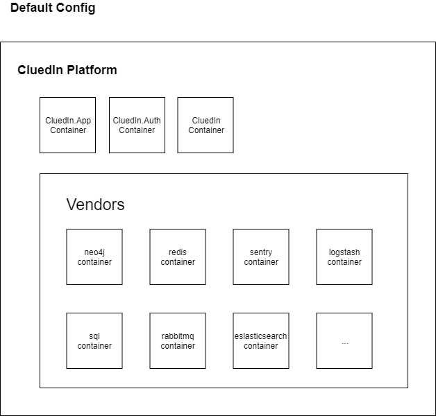

# Development Environment

## IDE

- F-E: [Visual Studio Code](https://code.visualstudio.com/)
- B-E [Visual Studio](https://visualstudio.microsoft.com/vs/community/)

## Code Repositories

**UI**

React single page application for the whole platform.

[CluedIn.UI](https://github.com/CluedIn-io/CluedIn.Widget)

**APP**

The CluedIn.App is containing Application services and renders the UI.

[CluedIn.App](https://github.com/CluedIn-io/CluedIn.App)

**Main**

The main CluedIn platform (will be probably splitted in future versions)

[CluedIn](https://github.com/CluedIn-io/CluedIn)

## Devops Repositories

**Runtime-Environment**

Creates the docker container for key elements in CluedIn such as SQL.

[Runtime-Environment](https://github.com/CluedIn-io/Runtime-Environment)

**Simple Local Docker Deployment**

Get the full CluedIn stack running locally.

[Local Docker](https://github.com/CluedIn-io/Simple-Docker-Deployment)

**Helm**

Deploy a CluedIn in a K8S cluster on Azure

[CluedIn.Helm](https://github.com/CluedIn-io/CluedIn.Helm)

## Architecture

Refer to [Micro Service](./micro.md)
