## On this page
{: .no_toc .text-delta }
1. TOC
{:toc}

Ingesting data to CluedIn involves three basic steps: importing, mapping, and processing data. As a result, your records will become searchable and ready to be cleaned, deduplicated, and streamed.

<iframe src="https://player.vimeo.com/video/843840937?badge=0&amp;autopause=0&amp;player_id=0&amp;app_id=58479" frameborder="0" allow="autoplay; fullscreen; picture-in-picture" allowfullscreen style="position:absolute;top:0;left:0;width:100%;height:100%;" title="Getting started with data ingestion in CluedIn"></iframe>

In this article, you will learn how to import a file into CluedIn, create a mapping, process the data, and search for data.

# Import file

The easiest way to add data to CluedIn is to import a file. In the following procedure, we will import a CSV file containing 500 records.

**To import a file**

1. On the navigation pane, select **Integrations**. Then, select **Import From Files**.

    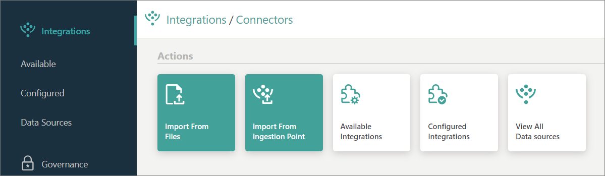

1. On the **Import From Files** pane, do the following:

    1. In the **Add Files** section, add the file.

        You may drag the file or select the file from the computer.

    1. In the **Group** section, leave the default **Create new group** option selected, and then enter the name of the group.

        Group indicates a department or domain within your company that is associated with the data. Think of a group as a folder where you can store files related to similar types of data.

    1. In the lower-right corner, select **Upload**.

        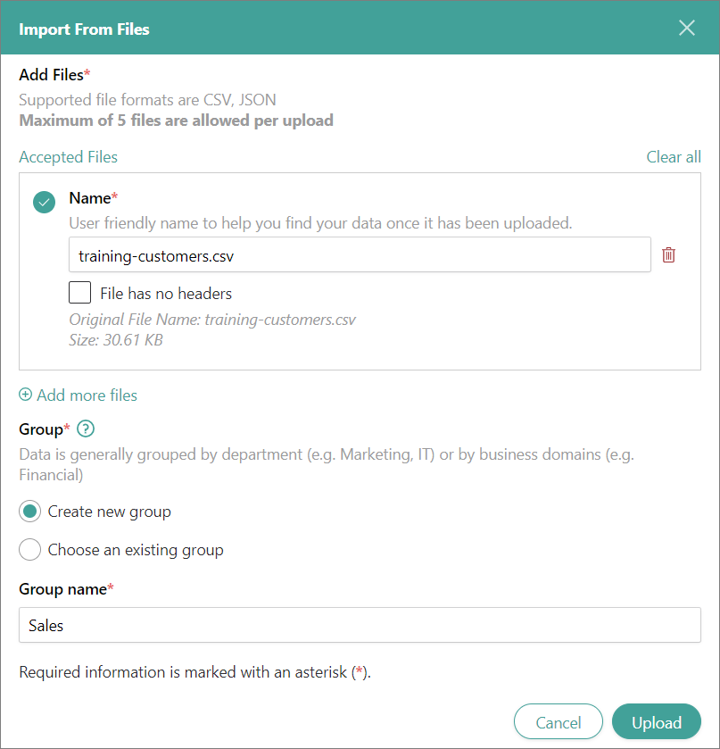        

        After the file is uploaded, you'll receive a notification.

        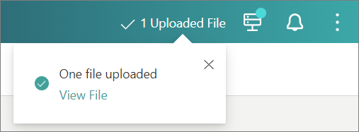

1. On the navigation pane, select **Data Sources**.

    The data from the file is transformed into a data source, which operates similarly to a database.

1. Expand the data source.

    The data source consists of a data set, which operates similarly to a table within the database.

    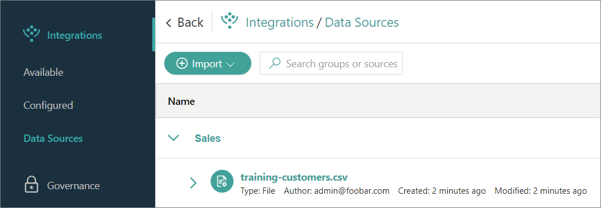

1. Select the name of the data set.

    On the data set details page, you can find the general information about the data set.

    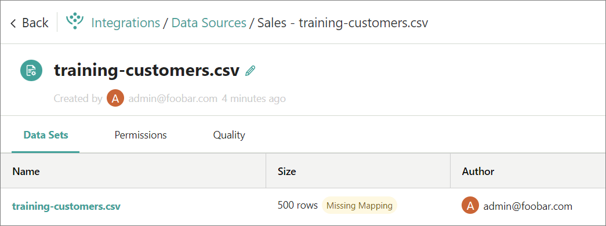    

1. In the table, select the name of the data set.

    Here, you can find a preview of the data from the file.

    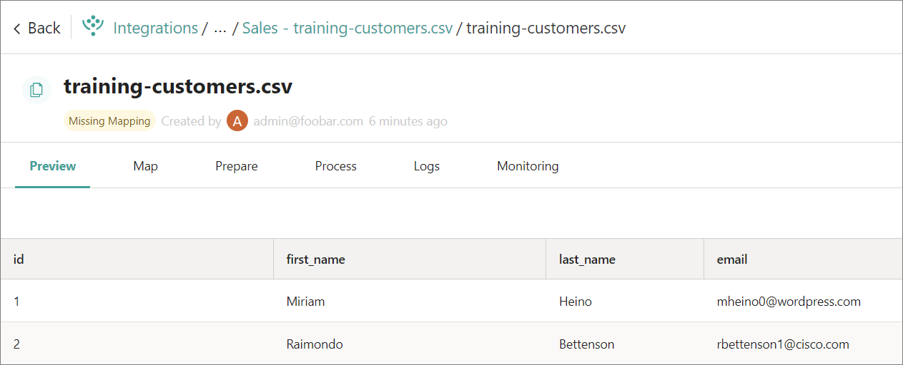

    The data has been parsed and stored in CluedIn, but it has not yet been processed. To prepare the data for processing, you need to create a mapping.

**What does it mean if the data is not processed?**

If you search for the unprocessed data, the search results will not include it.

# Create mapping

Mapping refers to the process of creating a semantic layer for your data. This layer allows CluedIn to understand the nature of the data you are working with. 

**To create a mapping**

1. Under the name of the data source, select the **Missing Mapping** label.

1. In the middle of the page, select **Map Data**.

1. On the **Create Mapping** pane, do the following:

    1. In **Mapping Type**, leave the default **Auto Mapping** option selected. Then, in the lower-right corner, select **Next**.

        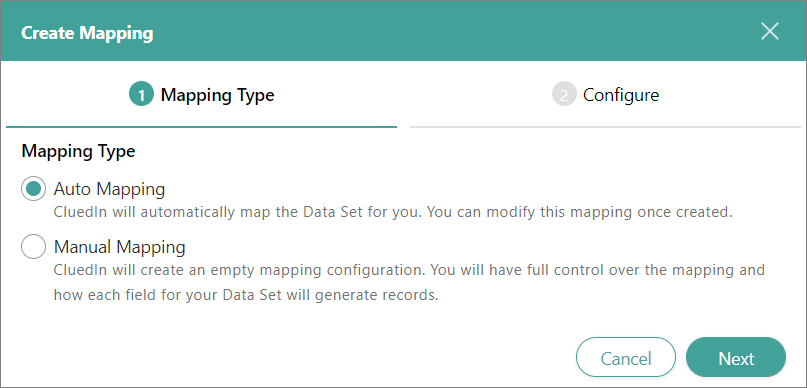

    1. Enter the name of **Entity Type**.

        An entity type is a required common attribute shared among all the records in CluedIn. A well-named entity type is global and should not be changed (for example, Person, Organization, Car) across sources.

    1. In **Entity Type Code**, leave the default value.

    1. In **Icon**, select the visual representation of the entity type.

        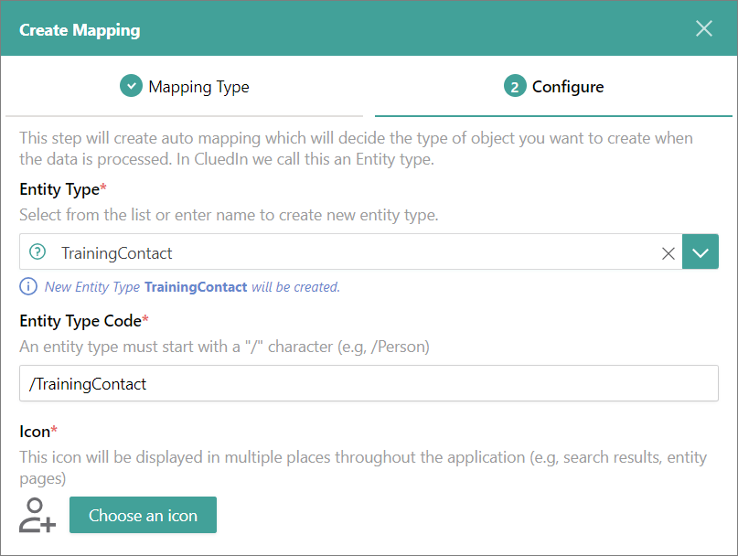

    1. Enter the name of **Vocabulary**.

        A vocabulary helps you define a better semantic model for the original fields in your data set. A vocabulary is more specific than an entity type.

        For example, when ingesting data from two different sources, such as a file and a CRM system, the set of properties available in each source may differ. However, the entity type will always remain the same.

        The **Key prefix** field is filled out by default. This prefix is added to each vocabulary key. Vocabulary keys help CluedIn understand what data you imported to CluedIn.

        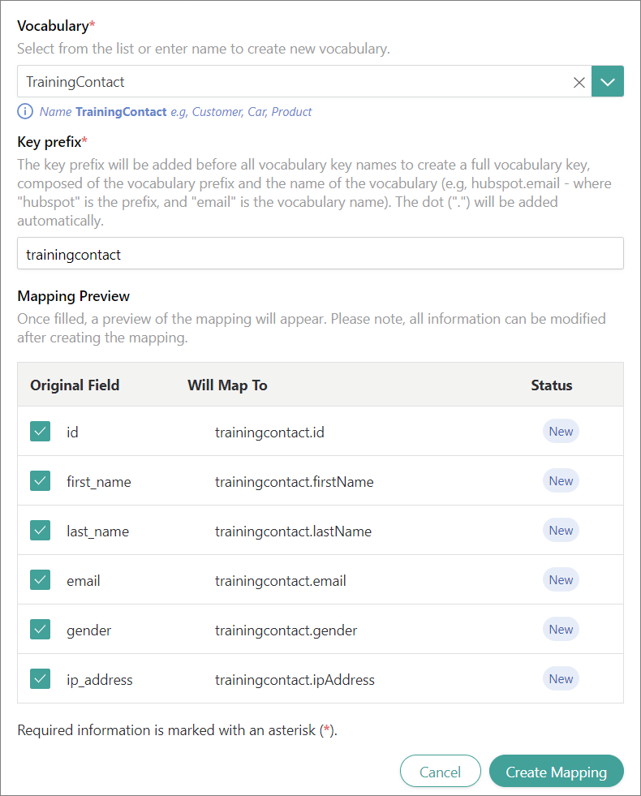

    1. In the lower-right corner, select **Create Mapping**.

    As a result of the mapping process, you can view how the fields from the original file are linked to the fields in CluedIn.

    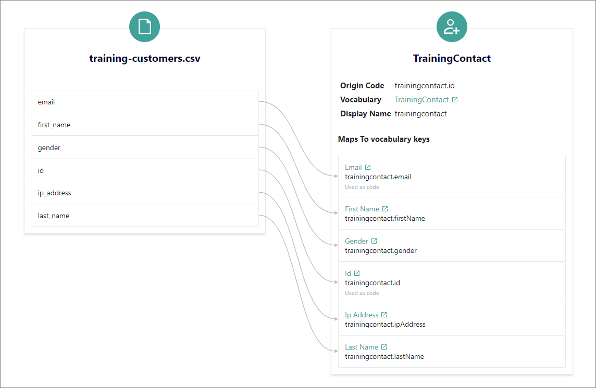

    Now that you have created the mapping, you can process the data.

# Process data

Processing refers to turning the records into clues for governing the data.

**To process data**

1. In the data set, go to the **Process** tab. Then, select the **Process** button.

    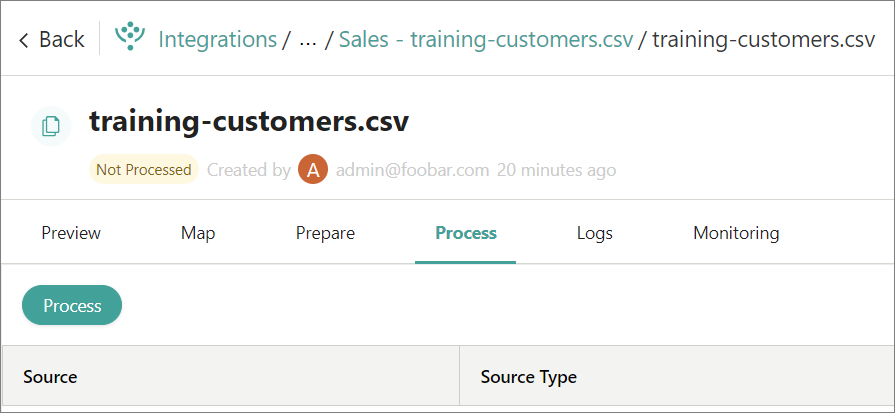

1. On the confirmation pane, in the lower-right corner, select **Confirm**.

    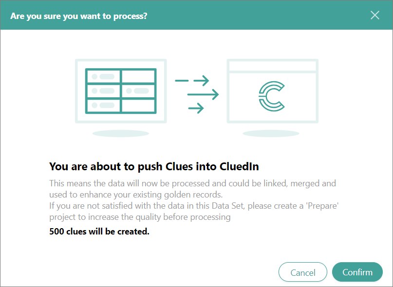

    After the data is processed, you will see a row with general information about processing.

    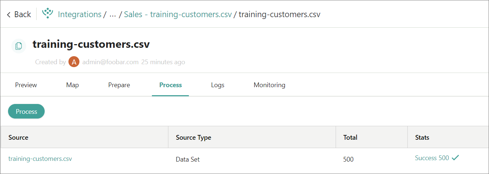

    Now, you can search for data in CluedIn.

# Search for data

After the data has been processed, you can search for any property and view all the values associated with that property. In the following procedure, we will use the email address as an input to search for data.

**To search for data**

1. On the **Preview** tab, open the data set and copy any value. We will copy the email in the first row.

    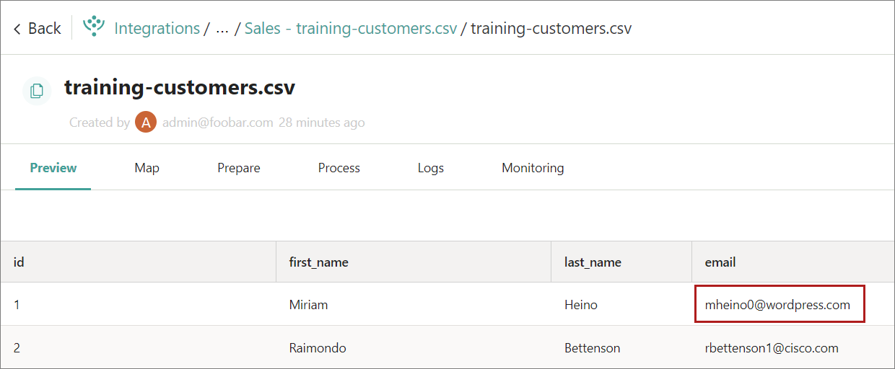

1. Paste the email in the search field, and then select the search icon.

    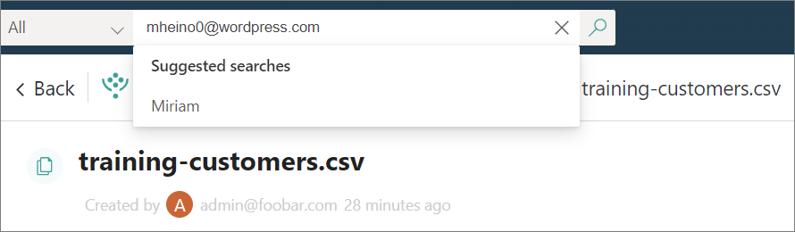

1. On the search results page, select the name of the record.

    The record details page opens.

1. To see all the properties of the record, go to the **Properties** tab.

    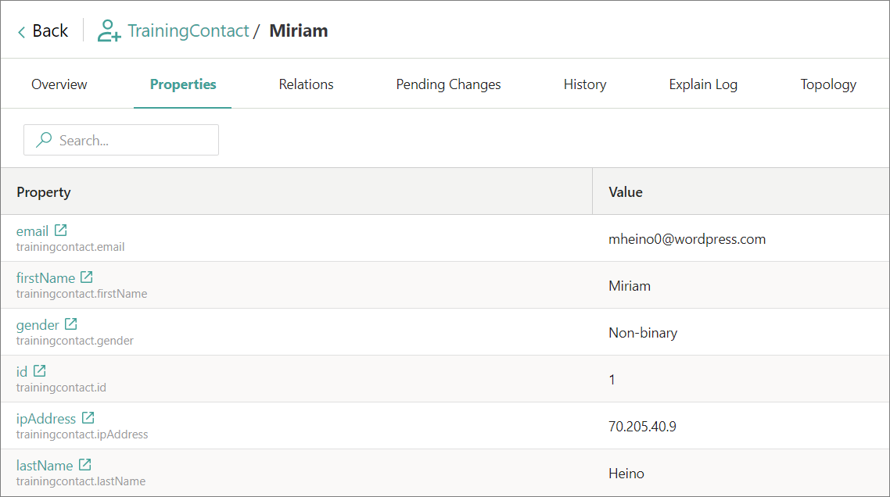

1. To see all values of a certain property, do the following:

    1. Select the property.

        The property details page opens in a new tab.

    1. Go to the **All Values** tab.

        Here, you can view all values that the property has.

        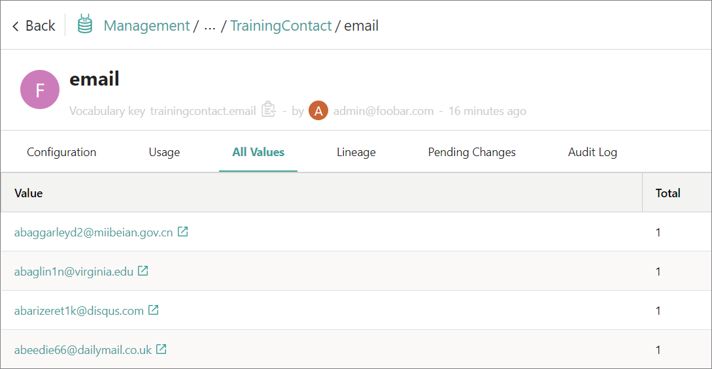

# Results

You have ingested data into CluedIn. 

# Next steps

- Stream data.