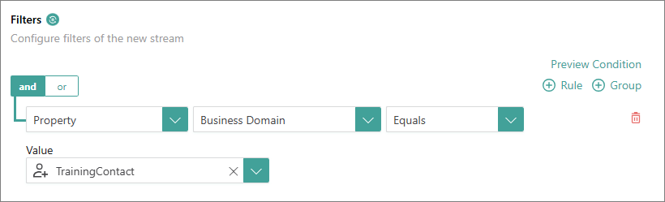
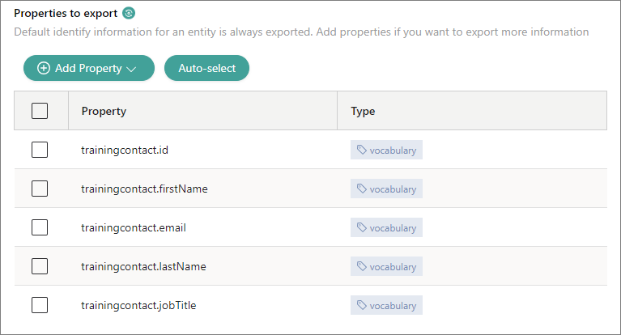
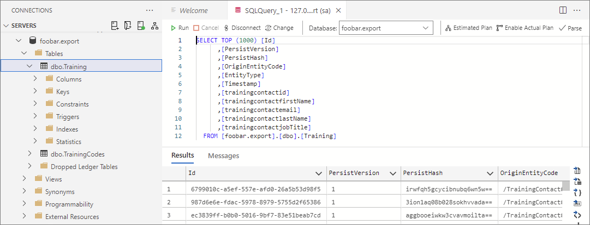

## On this page
{: .no_toc .text-delta }
1. TOC
{:toc}

Streaming data from CluedIn involves setting up an export target and creating a stream.

<iframe src="https://player.vimeo.com/video/845327605?badge=0&amp;autopause=0&amp;player_id=0&amp;app_id=58479" frameborder="0" allow="autoplay; fullscreen; picture-in-picture" allowfullscreen style="position:absolute;top:0;left:0;width:100%;height:100%;" title="Getting started with data streaming in CluedIn"></iframe>

In this article, you will learn how to stream your records from CluedIn to a Microsoft SQL Server database.

# Set up export target

An export target is a place where you can send the data out of CluedIn after it has been processed. In the following procedure, we are going to establish a connection with a Microsoft SQL Server database to use it as an export target.

**To set up an export target**

1. On the navigation pane, select **Consume**. Then, select **Export Targets**.

1. Select **Add Export Target**.

1. On the **Add Export Target** pane, do the following:

    1. On the **Choose Target** tab, find and select **Sql Server Connector**. Then, in the lower-right corner, select **Next**.

        

    1. On the **Configure** tab, enter the database connection details such as **Host**, **Database Name**, **Username**, and **Password**. Optionally, you may add **Port Number** and **Schema**.

        

    1. In the lower-right corner, select **Test Connection**. After you receive a notification that the connection is successful, select **Add**.

        The export target is added.

        

Now, you can create a stream.

# Create stream

A stream is a trigger that starts the process of sending the data to the export target. In the following procedure, we are going to configure the stream and define the data records that will be streamed to a Microsoft SQL Server database.

**To create a stream**

1. On the navigation pane, select **Consume**. Then, select **Streams**. 

1. Select **Create Stream**.

1. On the **Create Stream** pane, enter the **Stream Name**, and then select **Create**.

       

    The stream details page opens.

1. On the **Configuration** tab, in the **Filters** section, select **Add First Filter**, and then specify what data you want to share:

    1. Select the property type (**Property**). 

    1. Select the property (**Entity Type**).

    1. Select the operation (**Equals**).

    1. Select the value of the entity type.

        **Note:** The fields for configuring a filter appear one by one. After you complete the previous field, the next field appears.

          

1. In the upper-right corner of the stream details page, select **Save**. Then, confirm that you want to save changes.

    On the **Preview Condition** tab, you can view all the data that will be streamed to the database.

      

1. Go to the **Export Target Configuration** tab, and then specify the target where the data will be sent:

    1. On the **Choose connector** tab, select **Sql Server Connector**. Then, select **Next**.

          

    1. On the **Properties to export** tab, enter the **Target name**.

        The target name that you enter will be the name of the table in the database.

    1. Select the **Streaming mode**.

        Two streaming modes are available: **Synchronized stream** and **Event log stream**.

        **Synchronized stream** – the database and CluedIn contain the same data that is synchronized. For example, if you edit the record in CluedIn, the record is also edited in the database. 

        **Event log stream** – every time you make a change in CluedIn, a new record is added to the database instead of replacing the existing record.

          
  
    1. In the **Properties to export** section, select **Add Property** > **Add Vocabulary Property**.

          

    1. In the search field, enter the name of the vocabulary and start the search. In the search results, select the needed vocabulary keys that will be added as columns in the database table. Then, select **Add Vocabulary Columns**.

        

    1. Select **Save**.

1. Go to the **Data** tab and review the data that will be shared with the export target.

      

    Currently, the stream is inactive.

1. Start the stream by turning on the toggle next to the stream status. Then, confirm that you want to activate the stream.

    The **Inactive Stream** label disappears, and the stream status is changed to **Active**.

      

    **Note:** On the **Monitoring** tab, you can view different data performance metrics.

1. Go to the database and open the table.

      

    The records have been streamed to the target database.

# Results

You have streamed your records from CluedIn to a Microsoft SQL Server database.

# Next steps

- [Clean data](/getting-started/manual-data-cleaning)