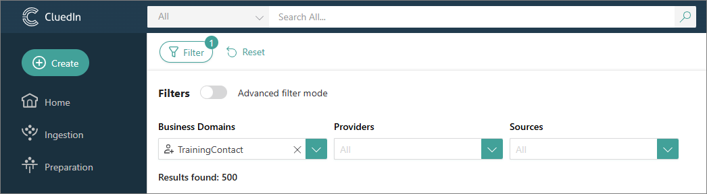
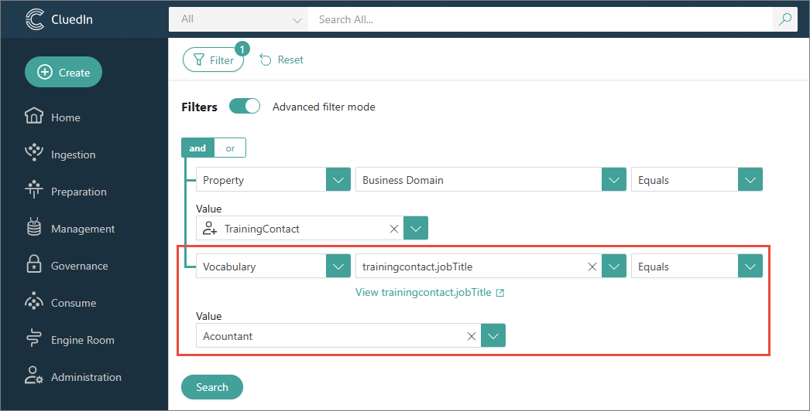
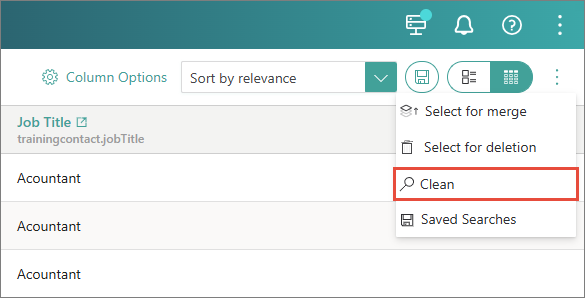
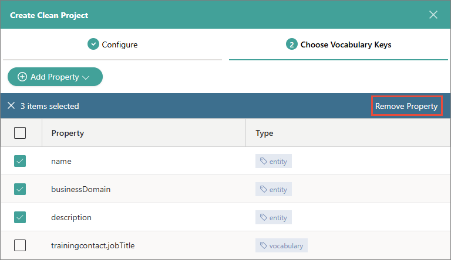
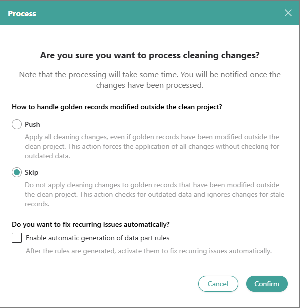

## On this page
{: .no_toc .text-delta }
1. TOC
{:toc}

Cleaning the data in CluedIn involves finding the data that needs to be cleaned, creating a clean project, and modifying the data in the clean application.

<iframe src="https://player.vimeo.com/video/850826311?badge=0&amp;autopause=0&amp;player_id=0&amp;app_id=58479" frameborder="0" allow="autoplay; fullscreen; picture-in-picture" allowfullscreen title="Getting_started_with_manual_data_cleaning"></iframe>

In this guide, you will learn how to manually clean the data that you have ingested into CluedIn.

**Before you start:** Make sure you have completed all steps in the [Ingest data guide](/getting-started/data-ingestion).

**Context:** This guide focuses on resolving a specific issue—a misspelled job title (Acountant). Here, you'll find step-by-step instructions on how to correct this error.

If you come across errors in the record properties or discover records with missing data, you can perform manual data cleaning in CluedIn. This process allows you to ensure the accuracy and completeness of your data set. CluedIn will automatically identify the changes and update the stream with the cleaned records.

**Useful links:** [Search](/key-terms-and-features/search), [Filters](/key-terms-and-features/filters)

## Find data

Finding the data that needs to be cleaned involves defining search filters and specific properties with incorrect values.

**To find data**

1. In the search field, select the search icon. Then, select **Filter**.

1. In the **Entity Types** dropdown list, select the entity type to filter the records.

    

    As a result, all records with the selected entity type are displayed on the page. By default, the search results are shown in the following columns: **Name**, **Entity Type**, and **Description**.

1. To find the specific values that you want to fix, add the corresponding column to the list of search results:

    1. In the upper-right corner, select **Column Options**.

    1. Select **Add columns** > **Vocabulary**.

    1. In the search field, enter the name of the vocabulary and start the search. In the search results, select the needed vocabulary key.

        

    1. Select **Add Vocabulary Columns**.

1. Turn on the advanced filter mode.

    

1. Add a filter rule to display the records containing values that need to be cleaned.

         

    The fields for configuring a filter rule appear one by one. After you complete the previous field, the next field appears.        

1. Select **Search**. The records that match the filter criteria are displayed on the search results page. After finding the records, [save the search](/key-terms-and-features/search#saved-searches). This way you can quickly verify if the values have been cleaned.

## Create a clean project

After you have found the data that needs to be cleaned, create a clean project.

**To create a clean project**

1. In the upper-right corner of the search results page, select the ellipsis button, and then select **Clean**.

    

1. Enter the **Project Name** and then select **Next**.

1. Select the checkboxes next to the properties that do not require fixing, and then select **Remove Property**.

    

1. Select **Create**. The clean project is created.

    

1. Select **Generate Results** and then confirm your choice. When the results are generated, the status of the clean project changes to **Ready for clean**. Now, you can proceed to correct the misspelled values.

## Modify data in the clean application

1. In the upper-right corner of the clean project, select **Clean**.

    The clean application opens, where you can view the values that should be modified.

    

1. Point to the value than needs to be modified, and then select **Edit**.

1. Enter the correct value, and then select **Apply to all identical cells**.

    

1. In the upper-right corner, select **Process**. In the confirmation dialog box, select **Skip stale data** and clear the **Enable rules auto generation** checkbox. Then, confirm that you want to process the data.

    

    CluedIn automatically identifies the changes and updates the records. To verify that your changes have been applied, [retrieve the saved search](/key-terms-and-features/search#saved-searches).

{:.important}
All changes to the records in CluedIn are tracked. You can search for the needed record and on the **History** pane, you can view all actions associated with the record. For more information, see [History](/key-terms-and-features/golden-records/history).

## Results & next steps

After you manually cleaned the data, the misspelled values were corrected. By following the steps outlined in this guide, you can address various errors and inconsistencies in your data.

The next item on the list of common data management tasks is deduplication. Learn how to identify and merge duplicates in the [Deduplicate data guide](/getting-started/data-deduplication).