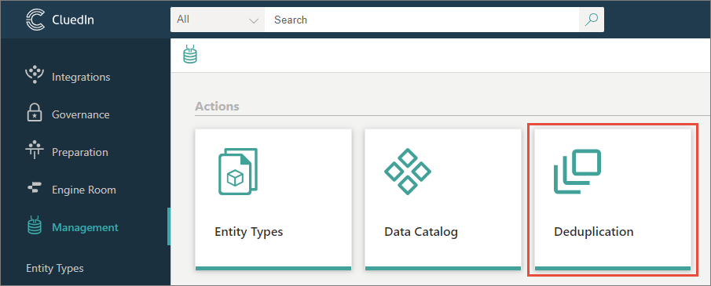
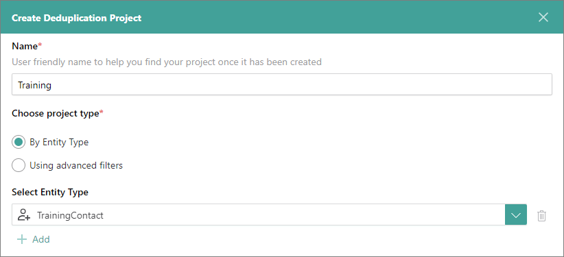
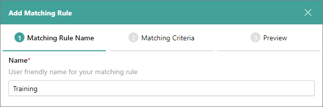
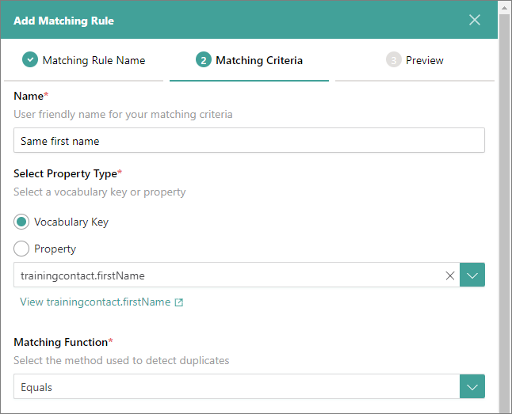
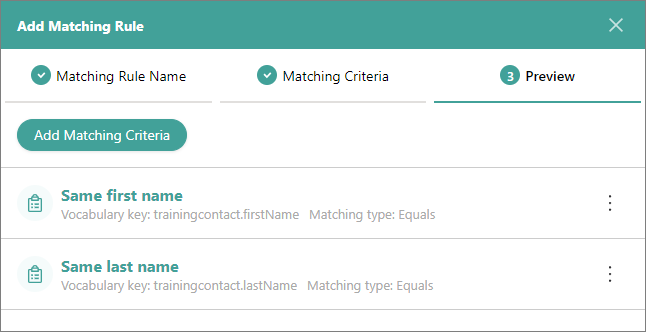
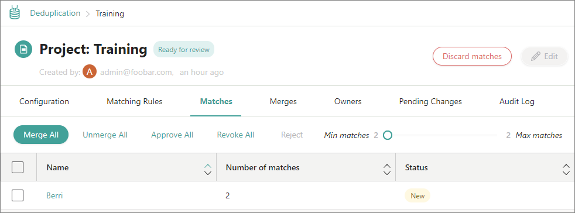
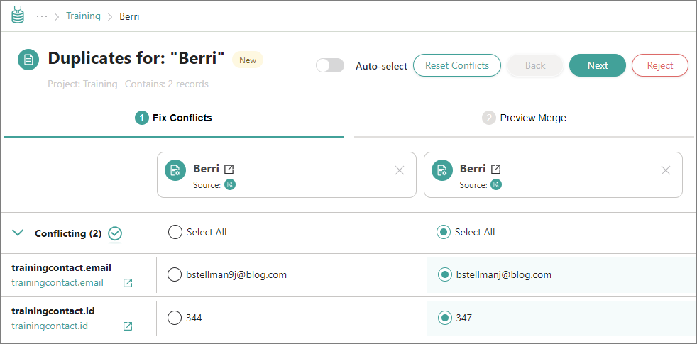
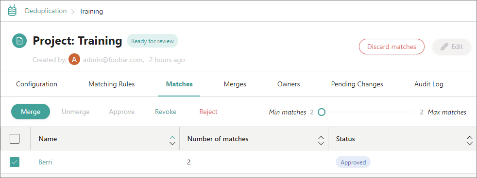
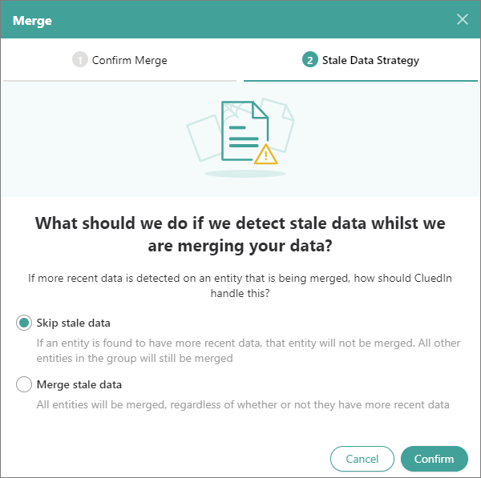

## On this page
{: .no_toc .text-delta }
1. TOC
{:toc}

Deduplication process helps you find and merge duplicate records based on certain criteria. This process involves creating a deduplication project, adding a matching rule for identifying duplicates, and fixing duplicates.

<iframe src="https://player.vimeo.com/video/850839188?badge=0&amp;autopause=0&amp;player_id=0&amp;app_id=58479" frameborder="0" allow="autoplay; fullscreen; picture-in-picture" allowfullscreen title="Getting started with data deduplication in CluedIn"></iframe>

In this guide, you will learn how to find and merge duplicates in the data you ingested into CluedIn..

**Before you start:** Make sure you have completed all steps in the [Ingest data guide](/getting-started/data-ingestion).

**Context:** This guide focuses on identifying duplicates based on the same first name and last name.

## Create deduplication project

Creating a deduplication project involves setting up filters to identify the data that will be checked for duplicates.

**To create a deduplication project**

1. On the navigation pane, go to **Management** > **Deduplication**.

    

1. Select **Create Deduplication Project**.

1. Enter the name of the deduplication project.

1. 1. In the **Choose project type** section, select an option for identifying the golden records that will be checked for duplicates. Depending on the selected option, provide the required details:

    - **By entity type** – select the entity type; all golden records belonging to the selected entity type will be checked for duplicates. You can choose multiple entity types.

    - **Using advanced filters** – set up the filter parameters; all golden records that meet the filter criteria will be checked for duplicates. You can add multiple filter rules. Read more about filters [here](/Documentation/Key-terms-and-features/Filters).

    

1. Select **Create**.

## Add a matching rule

Matching rule is used to compare golden records and identify duplicates based on specified criteria. Adding a matching rule involves defining the criteria that will be used to detect duplicates.

**To add a matching rule**

1. Go to the **Matching Rules** tab, and then select **Add Matching Rule**.

1. Enter the name of the matching rule.

    

1. Select **Next**.

1. Select the vocabulary key; all values associated with this vocabulary key will be checked for duplicates.

1. In the **Matching Function** dropdown list, select the method for detecting duplicates.

    
    
1. Select **Next**.

1. On the **Preview** tab, review the defined matching criteria.

    To add more matching criteria to the rule, select **Add Matching Criteria**, and then repeat steps 4–6.

    

1. Select **Add Rule**.

    The status of the deduplication project becomes **Ready to generate**.

1. Select **Generate Results**, and then confirm your choice.

    The process of generating results may take some time. After the process is completed, you will receive a notification. If duplicates are detected, the results will be displayed on the page. The results are organized into groups containing records that match your criteria. For example, on the following screenshot, the group consists of two duplicates. 

    

## Fix duplicates

The process of fixing duplicates involves reviewing the values from duplicate records and selecting which values you want to merge into the deduplicated record.

**To fix duplicates**

1. Select the name of the group.

    The **Fix Conflicts** tab opens. Here, you can view the details of the duplicate records. In the **Conflicting** section, you can find the properties that have different values in the duplicate records. In the **Matching** section, you can find the properties that have the same values in the duplicate records.

1. In the **Conflicting** section, select the values that you want to merge into the deduplicated record.

    

1. Select **Next**.

1. On the **Preview Merge** tab, review the values that will be merged into the deduplicated record.

1. Select **Approve**. Then, confirm that you want to approve your selection of values for the group.

1. Select the checkbox next to the group name, and then select **Merge**.

    

1. Confirm that you want to merge the records from the group:

    1. Review the group that will be merged and select **Next**.

    1. Select an option to handle the data merging process if more recent data becomes available for the entity. Then, select **Confirm**.

        

    The process of merging data may take some time. After the process is completed, you will receive a notification. As a result, the duplicate records have been merged into one record. On the **Merges** tab, you can view the merged records.

{:.important}
All changes to the records in CluedIn are tracked. You can search for the needed record and on the **Topology** pane, you can view the visual representation of the records that were merged through the deduplication process.

## Results & next steps

After you identified and merged duplicates, the count of golden records decreased. By following the steps outlined in this guide, you can conduct additional checks for duplicates in your data using various matching functions.

The next item on the list of common data management tasks is data streaming. Now that your data has been cleaned and deduplicated, you can send it to a Microsoft SQL Server database. Learn how to send data from CluedIn to external systems in the [Stream data guide](/getting-started/data-streaming).
