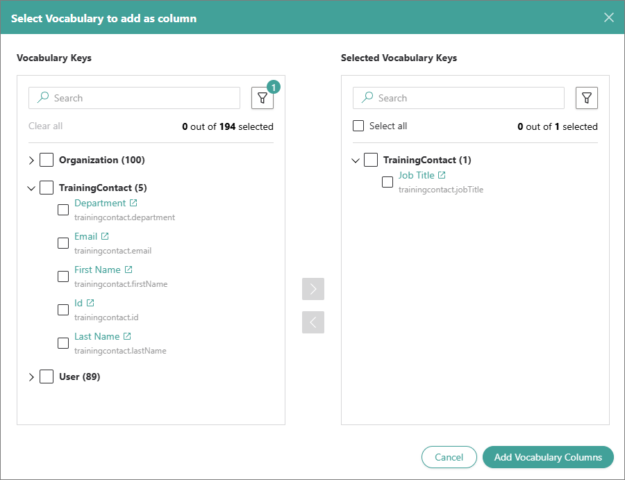
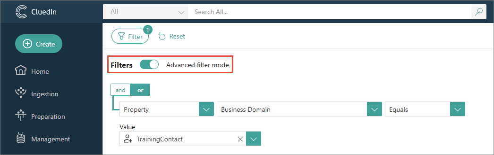
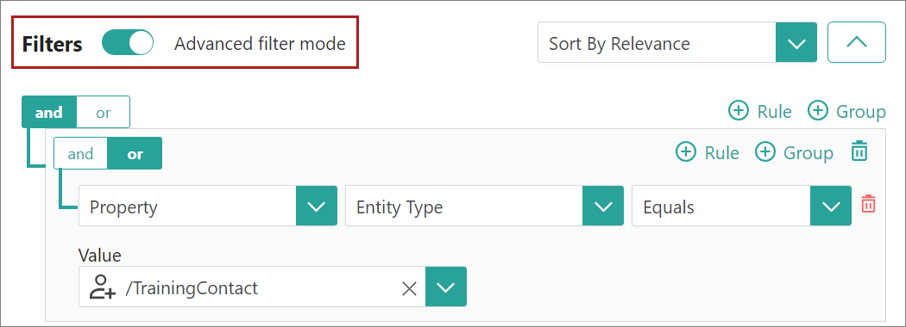
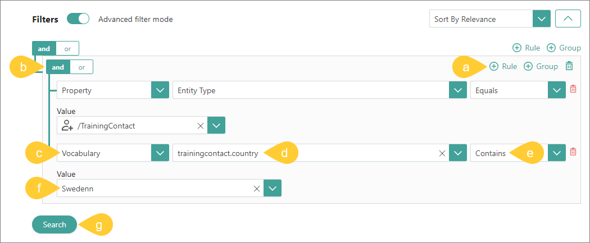
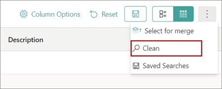

## On this page
{: .no_toc .text-delta }
1. TOC
{:toc}

Cleaning the data in CluedIn involves finding the data that needs to be cleaned, creating a clean project, and making the necessary changes to the data.

<iframe src="https://player.vimeo.com/video/850826311?badge=0&amp;autopause=0&amp;player_id=0&amp;app_id=58479" frameborder="0" allow="autoplay; fullscreen; picture-in-picture" allowfullscreen style="position:absolute;top:0;left:0;width:100%;height:100%;" title="Getting_started_with_manual_data_cleaning"></iframe>

In this article, you will learn how to manually clean the data that you have ingested into CluedIn and streamed to a Microsoft SQL Server database.

If you come across errors in the vocabulary key values or discover records with missing data, you can perform manual data cleaning in CluedIn. This process allows you to ensure the accuracy and completeness of your data set. CluedIn will automatically identify the changes and update the stream with the cleaned records. 

**Prerequisites**

Before proceeding with the data cleaning process, ensure that you have completed the following tasks:

1. Ingested some data into CluedIn. For more information, see [Ingest data](/getting-started/data-ingestion).

1. Created a stream that keeps the data synchronized between CluedIn and the Microsoft SQL Server database. For more information, see [Stream data](/getting-started/data-streaming).

# Find data

As a first step, you need to find the data in CluedIn that needs to be cleaned.

**To find data**

1. In the search field, select the search icon. Then, select **Filter**.

1. In the **Entity Types** dropdown list, select the entity type that you want to use as a filter for all records.

    

    As a result, all records with the selected entity type are displayed on the page. By default, the search results are shown in the following columns: **Name**,  **Entity Type**, and **Description**.

1. To find the specific values that you want to fix, add the corresponding columns to the list of search results:

    1. In the upper-right corner, select **Column Options**.

    1. Select **Add columns** > **Vocabulary**.

        

    1. In the search field, enter the name of the vocabulary and start the search. In the search results, select the needed vocabulary keys. Then, select **Add Vocabulary Columns**.

        

    The columns are added to the search results page.

    If you want a certain column to be the first one, you can move it by selecting the corresponding row and dragging it to the top position.

    

1. Turn on the advanced filter mode.

    

1. Configure a filter to display the records that need to be cleaned:

    1. Select **Rule**.

    1. Select **and**.

    1. Select the property type (**Vocabulary**).

    1. Select the vocabulary key.

    1. Select the operation.

    1. Select the value that needs to be fixed.

    1. Select **Search**.

               

        **Note:** The fields for configuring a filter appear one by one. After you complete the previous field, the next field appears.        

        The records that match the filter criteria are displayed in the search results.

1. Save the search. In the upper-right corner, select  (**Save current search**). Then, enter the name of the search and select **Save**.

    

    To find the saved search, select , and then select **Saved Searches**.

      

    You have found the data that needs to be cleaned.

# Create clean project

After you have found the data that needs to be cleaned, create a clean project.

**To create a clean project**

1. In the upper-right corner, select the ellipsis button, and then select **Clean**.

    

1. On the **Create Clean Project** pane, do the following:

    1. On the **Configure** tab, enter the **Clean Project Name**. Then, in the lower-right corner, select **Next**.

    1. On the **Choose Vocabulary Keys** pane, select the needed vocabulary keys. Then, in the lower-right corner, select **Create**.

        
        
        You created the clean project.

1. In the upper-right corner, select **Generate Results**. Then, confirm that you want to generate results for the clean project.

    You can view the generating results progress bar that appears instead of the **Generate Results** button. After the results have been generated, the status of the clean project changes to **Ready for clean**.

    Now, you can proceed to modify the needed data records.

# Modify data

After you have generated the results of the clean project, make the needed changes to your data records.

**To modify the data**

1. In the upper-right corner of the clean project, select **Clean**.

    A new tab opens. It contains the records that need to be modified.

    

1. Point to the value than needs to be modified, and then select **Edit**.

1. Enter the correct value.

1. Depending on whether you want to apply this change just to one record or to multiple similar records, do one of the following:

    - If you want to apply the change to one record, select **Apply**.

    - If you want to apply the change to multiple similar records, select **Apply to All Identical Cells**.

        

1. Go back to the tab with the clean project.

    You can notice that the **Ready to process** label appeared under the clean project name.

1. In the upper-right corner, select **Process**. 

1. In the confirmation dialog box, clear the **Enable rules auto generation** checkbox. Then, confirm that you want to process the data.

    

    After the data has been processed, you will receive a notification. Also, the **Processed** label appears under the clean project name.

    CluedIn automatically identifies the changes and updates the data set. Because the stream is in the synchronized mode, the database table is also automatically updated.

1. To verify that your changes have been applied:

    1. In CluedIn: select the search button. Then, go to **Saved Searches** and select the search that we created in step 6 of [Find data](#Find-data).

        No search results are displayed on the page.

    1. In the database: run the query to find the records that needed to be cleaned.

        No search results are displayed.

        

    You have cleaned your data.

**Note:** All changes to the data records in CluedIn are tracked. You can search for the needed data record and on the **History** pane, you can view all actions associated with the record.

# Results

You have performed manual data cleaning in CluedIn.

# Next steps

- [Deduplicate data](/getting-started/data-deduplication)