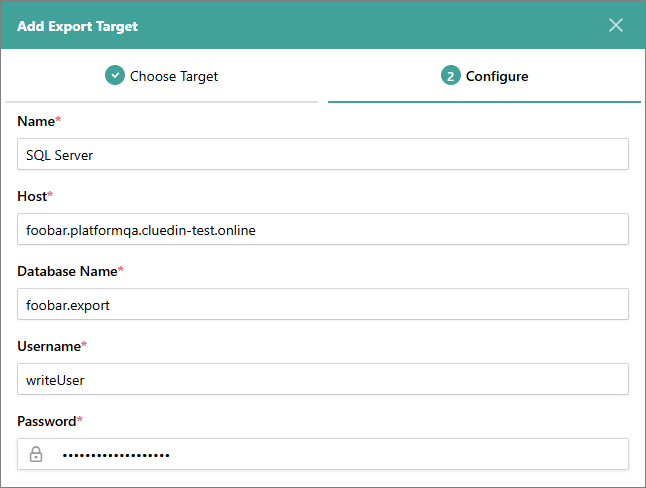
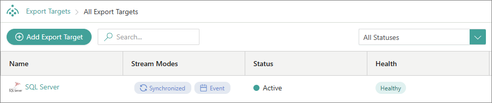
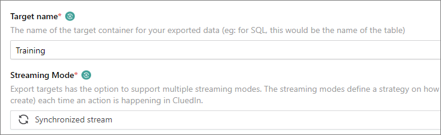
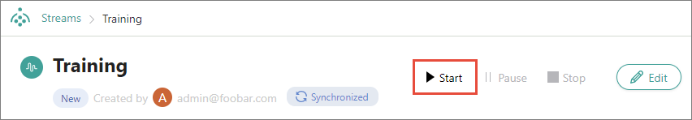

## On this page
{: .no_toc .text-delta }
1. TOC
{:toc}

Streaming data from CluedIn involves setting up an export target and creating a stream.

<iframe src="https://player.vimeo.com/video/845327605?badge=0&amp;autopause=0&amp;player_id=0&amp;app_id=58479" frameborder="0" allow="autoplay; fullscreen; picture-in-picture" allowfullscreen title="Getting started with data streaming in CluedIn"></iframe>

In this guide, you will learn how to stream your records from CluedIn to a Microsoft SQL Server database.

**Before you start:** Make sure you have completed all steps in the [Ingest data guide](/getting-started/data-ingestion).

## Set up an export target

An export target is a place where you can send the data out of CluedIn after it has been processed. In the following procedure, we are going to establish a connection with a Microsoft SQL Server database to use it as an export target.

**To set up an export target**

1. On the navigation pane, go to **Consume** > **Export Targets**.

1. Select **Add Export Target**.

1. On the **Choose Target** tab, find and select **Sql Server Connector**. Then, select **Next**.

    

1. On the **Configure** tab, enter the database connection details such as **Host**, **Database Name**, **Username**, and **Password**. Optionally, you may add **Port Number** and **Schema**.

    

1. Select **Test Connection**. After you receive a notification that the connection is successful, select **Add**.

    The export target is added.

    

    Now, you can create a stream.

## Create a stream

A stream is a trigger that starts the process of sending the data to the export target. In the following procedure, we are going to configure the stream and define the records that will be streamed to a Microsoft SQL Server database.

**To create a stream**

1. On the navigation pane, go to **Consume** > **Streams**. 

1. Select **Create Stream**.

1. Enter the **Stream Name**, and then select **Create**. 

    The stream details page opens.

1. On the **Configuration** tab, in the **Filters** section, select **Add First Filter**, and then specify what data you want to share.

    

    The fields for configuring a filter appear one by one. After you complete the previous field, the next field appears.

1. Select **Save**. To view the records that match stream filters, go to the **Preview Condition** tab.

1. Go to the **Export Target Configuration** tab.

1. On the **Choose connector** tab, select **Sql Server Connector**, and then select **Next**.

      

1. On the **Properties to export** tab, enter the **Target Name**. The target name that you enter will be the name of the table in the database.

1. Select the **Streaming Mode**. Two streaming modes are available:

    - **Synchronized stream** – the database and CluedIn contain the same data that is synchronized. For example, if you edit the record in CluedIn, the record is also edited in the database. 

    - **Event log stream** – every time you make a change in CluedIn, a new record is added to the database instead of replacing the existing record.

          

1. In the **Properties to export** section, click **Auto-select**. All vocabulary keys associated with the records in the strem filter will be displayed on the page.

      

1. Select **Save**. To view the data that will be sent to the database, go to the **Data** tab.

1. Start the stream by selecting the play button. Then, confirm that you want to start the stream.

    

    The **Streaming** and **Exporting** labels appear under the stream name, indicatig that the stream is active.

    

    On the **Monitoring** tab, you can view different data performance metrics.

1. Go to the database and open the table.

      

    The records have been sent to the database.

## Results & next steps

After completing all steps outlined in this guide, you learned how to configure the connection to a Microsoft SQL Server database and how to send data from CluedIn to the database. If you make any changes to the records in CluedIn, they will be automatically updated in the database. For example, if you fix the job title values in CluedIn, they will be automatically corrected in the database.

Next, learn how to create rules for automating data transformation and capturing data quality issues in the [Create rules guide](/getting-started/rule-builder).