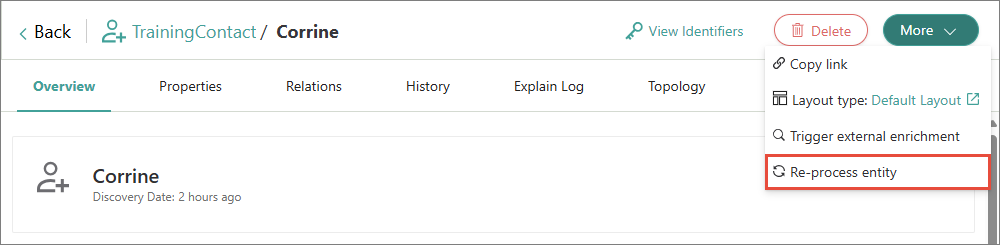
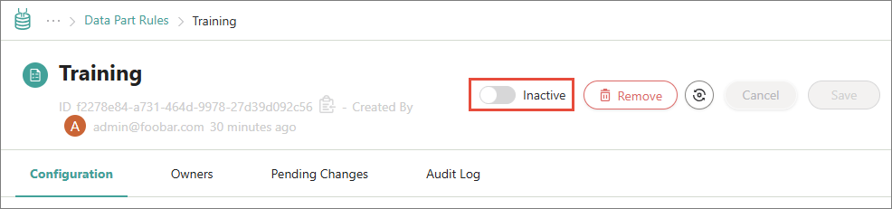

## On this page
{: .no_toc .text-delta }
1. TOC
{:toc}

Rule Builder allows you to create rules for cleaning, transforming, normalizing, and modifying the data.

<div class="videoFrame">
<iframe src="https://player.vimeo.com/video/850936950?badge=0&amp;autopause=0&amp;player_id=0&amp;app_id=58479" frameborder="0" allow="autoplay; fullscreen; picture-in-picture" allowfullscreen title="Getting started with Rule Builder in CluedIn"></iframe>
</div>

In this article, you will learn how to create rules in CluedIn using the Rule Builder tool.

You can create a rule either before or after processing the data.

# Create rule

Creating a rule involves configuring a filter and defining the rule action.

**To create a rule**

1. On the navigation pane, go to **Management** > **Rule Builder**.

1. Choose the [type of rule](/management/rules/rule-types) that you want to create. Then, select **Create Rule**.

1. Enter the name of the rule. Then, select **Create**.

    The rule details page opens.

1. In the **Filters** section, select **Add First Filter**, and then specify to which items the rule will be applied:

    1. Select the type of property (**Property** or **Vocabulary**).

    1. Depending on the type of property that you selected before, find and select the needed property or vocabulary key.

    1. Select the operation.

    1. Select the value of the property or vocabulary key.

        If you want to create a rule for a value that does not yet exist in CluedIn, then enter a new value. 

        

        {:.important}
        The fields for configuring a filter appear one by one. After you complete the previous field, the next field appears. For more information, see [Filters](/key-terms-and-features/filters).

1. In the **Actions** section, select **Add Action**, and then configure the action that CluedIn can perform on the filtered items:

    1. Enter the name of the action.

    1. (Optional) If you want to narrow down your filter query, specify additional conditions for the rule. To do this, in the **Conditions** section, select **Add first rule**, and then configure the condition according to the instructions from step 4.

    1. In the **Action** section, select the action to be performed by the rule. To learn more about what each action does, see [Rules reference](/management/rules/rules-reference).

    1. Depending on the action that you selected, provide the required information.

        For example, if you selected the **Add tag** action, specify the value of the tag.

        

    1. In the lower-right corner, select **Add Action**.

    {:.important}
    You can add multiple actions to the rule.

1. Activate the rule by turning on the toggle next to the rule status.    

1. In the upper-right corner of the rule details page, select **Save**.

    Now, the rule is active.

    

1. Depending on whether the rule applies to the processed or unprocessed data, do one of the following:

    1. If the rule is applied to the processed data, [re-process the entity](#re-process-entity).

    1. If the rule applies to the unprocessed data, process the data as described in the [Ingest data guide](/getting-started/data-ingestion).

    You created the rule.

# Re-process entity

After you created the rule for the processed data, you need to re-process the entity to apply the rule. Depending on the number of entities that you need to re-process, you can choose one of the following actions:

- If you need to re-process many entities, use the GraphQL tool.

- If you need to re-process few entities, re-process each entity manually.

**To re-process the entity using the GraphQL tool**

1. On the navigation pane, go to **Consume** > **GraphQL**.

1. Enter a query to re-process all entities that belong to a certain entity type. Replace _TrainingContact_ with the needed name of entity type.
```
{
	search(query: "entityType:/TrainingContact") {
		entries {
			actions {
				postProcess
			}
		}
	}
}
```
1. Execute the query.

    You re-processed all entities that belong to a certain entity type. Now, the action from the rule is applied to all entities.

**To re-process the entity manually**

1.  Find and open the needed entity.

1. In the upper-right corner of the entity details page, select **More** > **Re-process entity**.

    

    You re-processed the entity. Now, you can view the result of an action performed by the rule.

    

1. To re-process other entities, repeat steps 1–2.

# Change rule

After you created the rule, you can edit, [inactivate](#inactivate-rule), or [delete](#delete-rule) it.

## Inactivate rule

If you currently do not need the rule, but might need it in future, inactivate the rule.

**To inactivate the rule**

1. Open the rule.

1. Inactivate the rule by turning on the toggle next to the rule status.

    

    You inactivated the rule, but the items to which the rule was applied still contain the changes made by the rule.

1. To return the items to which the rule was applied to their original state, [re-process the entity](#re-process-entity).

    You inactivated the rule and returned the items to which the rule was applied to their original state.

## Delete rule

If you no longer need the rule, delete it.

**To delete the rule**

1. Open the rule.

1. On the rule details page, select the delete icon, and then confirm that you want to delete the rule.

    You deleted the rule, but the items to which the rule was applied still contain the changes made by the rule.

1. To return the items to which the rule was applied to their original state, [re-process the entity](#re-process-entity).

    You deleted the rule and returned the items to which the rule was applied to their original state.

# Actions

In the following table, you can learn about the actions that can be performed by the rule.

| Action | Description |
|--|--|
| Add Alias | Adds an alias to the entity. You need to specify the alias that you want to add. |
| Add Tag | Adds a tag to the entity. You need to specify the tag that you want to add. |
| Add Value | Adds a value to the vocabulary key. You can select the existing value or create a new value. Use this action when the vocabulary key doesn't contain any value. |
| Add Value with CluedIn AI | Adds a value to the property or vocabulary key according to your prompt. For example, you can check if the email address in the entity is a personal address or business address. |
| Change Entity Type | Changes the entity type. You can select the existing entity type or create a new entity type. |
| Copy Value | Copies the value from one field (source field) to another (target field). |
| Delete Value | Deletes the value that you select. |
| Mask Value | Applies a mask to the value. You can use this action to hide sensitive data. |
| Move Value | Moves the value from one field (source field) to another (target field). |
| Remove Alias | Removes alias from the entity. You need to specify the alias that you want to remove. |
| Remove All Tags | Removes all tags from the entity. |
| Remove line breaks | Removes line breaks from the value. By default, line breaks are replaced with spaces, but you can specify other replacement options. |
| Remove Tag | Removes a tag from the entity. You need to specify the tag that you want to remove.|
| Replace | Replaces one value with another. You need to provide both the value you want to replace and its corresponding replacement value. |
| Set Value | Changes the value of the vocabulary key. You can select the existing value or create a new value. Use this action when the vocabulary key contains a value and you want to change this value to another one. |
| Set Value with CluedIn AI | Changes the value of the property or vocabulary key according to your prompt. |
| To CamelCase | Changes the value to camel case and removes all spaces. |
| To LowerCase | Changes the value to lower case. |
| To TitleCase | Changes the value to title case. |
| To UpperCase | Changes the value to upper case. |
| Trim WhiteSpace | Removes white space from the value. |
| Unmask Value | Removes the mask from the value. |

# Results

You have created a rule in CluedIn using the Rule Builder tool.

# Next steps

- [Create hierarchies](/getting-started/hierarchy-builder)
