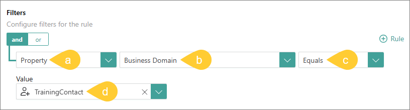
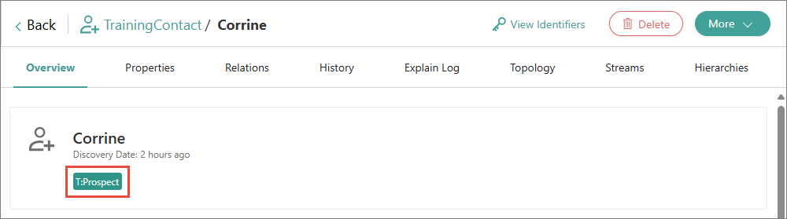

## On this page
{: .no_toc .text-delta }
1. TOC
{:toc}

Rule Builder allows you to create rules for cleaning, transforming, normalizing, and modifying the data.

<div class="videoFrame">
<iframe src="https://player.vimeo.com/video/850936950?badge=0&amp;autopause=0&amp;player_id=0&amp;app_id=58479" frameborder="0" allow="autoplay; fullscreen; picture-in-picture" allowfullscreen title="Getting started with Rule Builder in CluedIn"></iframe>
</div>

In this article, you will learn how to create rules in CluedIn using the Rule Builder tool.

You can create a rule either before or after processing the data.

# Create rule

Creating a rule involves configuring a filter and defining the rule action.

**To create a rule**

1. On the navigation pane, go to **Management** > **Rule Builder**.

1. Choose the [type of rule](/management/rules/rule-types) that you want to create. Then, select **Create Rule**.

1. Enter the name of the rule. Then, select **Create**.

    The rule details page opens.

1. In the **Filters** section, select **Add First Filter**, and then specify to which items the rule will be applied:

    1. Select the type of property (**Property** or **Vocabulary**).

    1. Depending on the type of property that you selected before, find and select the needed property or vocabulary key.

    1. Select the operation.

    1. Select the value of the property or vocabulary key.

        If you want to create a rule for a value that does not yet exist in CluedIn, then enter a new value. 

        

        {:.important}
        The fields for configuring a filter appear one by one. After you complete the previous field, the next field appears. For more information, see [Filters](/key-terms-and-features/filters).

1. In the **Actions** section, select **Add Action**, and then configure the action that CluedIn can perform on the filtered items:

    1. Enter the name of the action.

    1. (Optional) If you want to narrow down your filter query, specify additional conditions for the rule. To do this, in the **Conditions** section, select **Add first rule**, and then configure the condition according to the instructions from step 4.

    1. In the **Action** section, select the action to be performed by the rule. To learn more about what each action does, see [Rules reference](/management/rules/rules-reference).

    1. Depending on the action that you selected, provide the required information.

        For example, if you selected the **Add tag** action, specify the value of the tag.

        

    1. In the lower-right corner, select **Add Action**.

    {:.important}
    You can add multiple actions to the rule.

1. In the upper-right corner of the rule details page, select **Save**, and then confirm your choice.

1. Activate the rule by turning on the toggle next to the rule status.

    

1. Depending on whether the rule applies to the processed or unprocessed data, do one of the following:

    - If the rule applies to the processed data, [re-process the records](#re-process-records).

    - If the rule applies to the unprocessed data, process the data as described in the [Ingest data guide](/getting-started/data-ingestion).

# Reprocess records

After you created the rule for the processed data, you need to reprocess the records to apply the rule. You can reprocess the records in the following ways:

- Reprocess via the rule details page.

- Reprocess using the GraphQL tool.

- Reprocess each record manually.

**To reprocess records via the rule details page**

1. Near the upper-right corner of the rule details page, select the reprocess icon.

    

1. Confirm that you want to reprocess the records associated with the rule.

    After the reprocessing is completed, the records associated with the rule are updated in accordance with the rule’s actions.

**To reprocess records using the GraphQL tool**

1. On the navigation pane, go to **Consume** > **GraphQL**.

1. Enter a query to reprocess all records that belong to a certain entity type. Replace _TrainingContact_ with the needed name of entity type.
```
{
	search(query: "entityType:/TrainingContact") {
		entries {
			actions {
				postProcess
			}
		}
	}
}
```
1. Execute the query.

    You reprocessed all records that belong to a certain entity type. Now, the action from the rule is applied to those records.

**To reprocess a record manually**

1.  Find and open the needed record.

1. In the upper-right corner of the record details page, select **More** > **Re-process entity**.

    

    You re-processed the record. Now, you can view the result of an action performed by the rule.

    

1. To re-process other records, repeat steps 1–2.

# Change rule

After you created the rule, you can [edit](#edit-rule), [inactivate](#inactivate-rule), or [delete](#delete-rule) it.

## Edit rule

If you want to change the rule—name, description, filters, or actions—edit the rule.

**To edit the rule**

1. In the rule details page, make the needed changes.

1. Near the upper-right corner of the rule details page, select **Save**. If you edited filters or actions, the confirmation dialog appears where you have to decide what to do with the records associated with the rule.

1. In the confirmation dialog, do one of the following:

    - If you want to reprocess the records affected both by the previous and current rule configuration, select the checkbox, and then confirm your choice.

        

        For example, in the previous configuration, the rule added the tag _Prospect_ to all records of the _TrainingContact_ entity type. If you edit the rule filter and change the entity type to _Contact_, then selecting the checkbox will remove the tag from the records of the _TrainingContact_ entity type and add it to the records of the _Contact_ entity type.

    - If you don't want to reprocess the records affected both by the previous and current rule configuration, leave the checkbox unselected, and then confirm your choice. You can reprocess such records later. However, note that reprocessing via the rule details page applies only to the records matching the current rule configuration. To revert rule actions on records matching the previous rule configuration, you'll need to reprocess such records via GraphQL or manually.

## Inactivate rule

If you currently do not need the rule, but might need it in future, inactivate the rule.

**To inactivate the rule**

1. Open the rule.

1. Inactivate the rule by turning on the toggle next to the rule status.

    

    You inactivated the rule, but the records to which the rule was applied still contain the changes made by the rule.

1. To return the records to which the rule was applied to their original state, [reprocess the records](#reprocess-records).

## Delete rule

If you no longer need the rule, delete it.

**To delete the rule**

1. Open the rule.

1. On the rule details page, select the delete icon, and then confirm that you want to delete the rule.

    You deleted the rule, but the records to which the rule was applied still contain the changes made by the rule.

1. To return the records to which the rule was applied to their original state, [reprocess the records](#reprocess-records).

# Results

You have created a rule in CluedIn using the Rule Builder tool.

# Next steps

- [Create hierarchies](/getting-started/hierarchy-builder)
