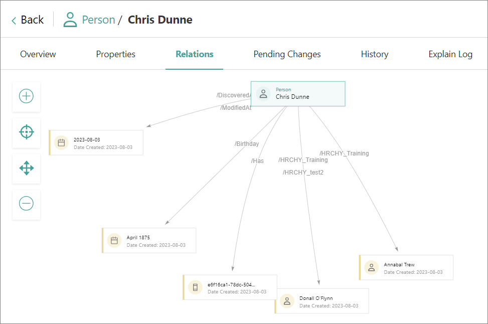
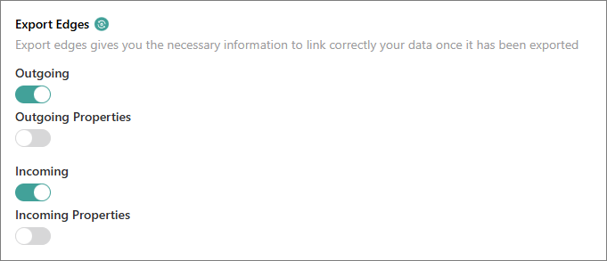

## On this page
{: .no_toc .text-delta }
1. TOC
{:toc}

Hierarchy Builder allows you to visualize relations between golden records. For example, you can create a corporate structure hierarchy within a company, or a hierarchy representing relations between companies (parent, subsidiary, branch).

<iframe src="https://player.vimeo.com/video/852717264?badge=0&amp;autopause=0&amp;player_id=0&amp;app_id=58479" frameborder="0" allow="autoplay; fullscreen; picture-in-picture" title="Getting started with Hierarchy Builder"></iframe>

In this article, you will learn how to create hierarchies in CluedIn using the Hierarchy Builder tool.

**Prerequisites**

Before proceeding with hierarchies, ensure that you have completed the following tasks:

1. Ingested some data into CluedIn. For more information, see [Ingest data](/getting-started/data-ingestion).

1. Created a stream that keeps the data synchronized between CluedIn and the Microsoft SQL Server database. For more information, see [Stream data](/getting-started/data-streaming).

## Build a hierarchy

1. On the navigation pane, go to **Management** > **Hierarchy Builder**.

1. Select **Create Hierarchy**.

1. On the **Create Hierarchy** pane, specify the details of the hierarchy:
    
    1. Enter the name of the hierarchy.

    1. If you want to limit the records for building the hierarchy, find and select the business domain.

        All records belonging to the selected business domain will be available to build the hierarchy. If you do not select the business domain, then all records existing in the system will be available to build the hierarchy.

    1. In the lower-right corner, select **Create**.

        

        The hierarchy builder page opens.

1. Build the visual hierarchy by dragging the records from the left pane to the canvas.

    

1. In the upper-right corner of the page, select **Save**.

    The status of the hierarchy becomes **Draft**. Although the hierarchy is in CluedIn, the relations between the elements within the hierarchy have not been established yet. To establish the relations between the elements of the hierarchy, publish the hierarchy.

1. In the upper-right corner of the page, select **Publish**. Then, confirm that you want to publish the hierarchy.

    You created the hierarchy.

You can view the hierarchy on the **Hierarchy Builder** page or on the **Hierarchies** tab of the golden record page. In addition, you can view the relations between the records on the **Relation** tab of the golden record page.

To make sure that the data in the Microsoft SQL Server database reflects the relations that you set up, [update the stream configuration](#update-stream-configuration).

## Manage a hierarchy

After you created the hierarchy, you can do the following actions with the elements of the hierarchy:

- Replace elements.

    

- Collapse and expand elements. To collapse all elements below a certain element, point to the needed element and select **Collapse**. To expand the collapsed elements, point to the parent element, and select **Expand**.

    You can also collapse all elements under a parent element. To do that, in the lower-right corner, select **Collapse all** ().

- View the data associated with the elements. To do that, select the element.

## Update stream configuration

After you published the hierarchy, update the stream to ensure that the data in the database reflects the relations between the records that you set up.

**To update the stream**

1. On the navigation pane, go to **Consume** > **Streams**.

1. Open the needed stream.

1. Go to the **Export Target Configuration** page. Then, select **Edit Target Configuration** and confirm that you want to edit the stream.

1. On the **Choose a connector** tab, select **Next**.

1. On the **Properties to export** tab, find the **Export Edges** section. Then, turn on the **Outgoing** and **Incoming** toggles.

    

1. In the upper-right corner, select **Save**. Then, confirm that you want to save your changes.

    The stream is updated with the relations between records. As a result, new tables are created in the database: **dbo.xyzOutgoingEdges** and **dbo.xyzIncomingEdges**, where _xyz_ is the target name.

    

    If you update the hierarchy, the relations between records will be automatically updated in the database.

## Results

You have created a hierarchy in CluedIn.

## Next steps

- [Create glossary](/getting-started/glossary)

