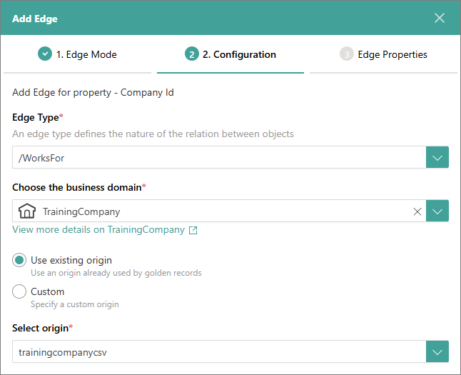
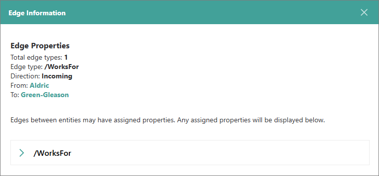

## On this page
{: .no_toc .text-delta }
1. TOC
{:toc}

Relations are built between source ("to") and target ("from") records by using edges of a certain type (for example, /WorksFor). You can create relations either before or after processing the data.

<iframe src="https://player.vimeo.com/video/854717569?badge=0&amp;autopause=0&amp;player_id=0&amp;app_id=58479" frameborder="0" allow="autoplay; fullscreen; picture-in-picture" style="position:absolute;top:0;left:0;width:100%;height:100%;" 
title="Getting started with relations in CluedIn"></iframe>

In this article, you will learn how to add and view relations between golden records.

Creating relations between golden records consists of editing the mapping of the data set that you will use as a source and adding the edge that will link the source to the target.

**Prerequisites**

Before proceeding with relations between golden records, ensure that you have completed the following tasks:

1. Ingested (imported, mapped, and processed) the data to which you will be linking the records. For example, this could be the list of companies with the CompanyID and CompanyName columns. For more information, see [Ingest data](/getting-started/data-ingestion).

1. Imported and mapped the data that you will be linking to already existing records. For example, this could be the list of employees working for companies from the file in prerequisite 1. The file with employees may contain the following columns: EmployeeName and CompanyID. For more information, see [Import file](/getting-started/data-ingestion#import-file) and [Create mapping](/getting-started/data-ingestion#create-mapping).

# Edit mapping

After you imported and mapped the data that you will be linking to already existing records, edit the mapping configuration.

**To edit the mapping**

1. On the navigation pane, go to **Integration** > **Data Sources**.

1. Find and select the needed data set.

1. On the toolbar, select **Map**. Then, select **Edit Mapping**.

1. Go to the **Map entity** tab. Then, expand the **Entity Codes** section.

1. Delete the entity code by which you will link the current entity to other entities:

    1. Select the checkbox next to the entity code.

    1. Select **Delete Entity Code**.

        

    Now, you can proceed to add the edge relations.

# Add edge relations

Adding edge relations means linking the current data set to already existing records.

**To add edge relations**

1. Go to the **Add edge relations** tab, and then select **Add relation**.

    The **Add Edge** pane opens on the right side of the page.

1. On the **Edge Mode** tab, do the following:

    1. Select the property to which you want to add edge relation.

    1. Select the edge mode.

        

    1. In the lower-right corner, select **Next**.

1. On the **Configuration** tab, do the following:

    1. Specify the edge type to define the nature of relation between objects.

        You can select the existing edge type or create a new one. To create a new edge type, enter a slash (/) and then enter a name.

    1. Find and select the entity type to which you will link the records belonging to the current entity type.

    1. Enter the origin of the current data set. It will displayed after you process the data.

        

    1. In the lower-right corner, select **Next**.

1. On the **Edge Properties** tab, in the lower-right corner, select **Add Edge**.

1. Select **Finish** to save your changes.

    You added edge relations. To view relations between golden records, [process the data](/getting-started/data-ingestion#process-data) and [stream the records](/getting-started/data-streaming).

# View relations between golden records

After you processed the data and streamed the records, you can view the relations between golden records in the following places:

- In CluedIn: on the **Relations** tab of the record details page.

    

    To view the edge relation details, select the arrow that connects the entities.

    

- In the database: in the tables named **dbo.xyzOutgoingEdges** and **dbo.xyzIncomingEdges**, where _xyz_ is the target name.

    

    If you add more edge relations between the records, CluedIn will automatically identify the changes and update the stream with new edge relations.