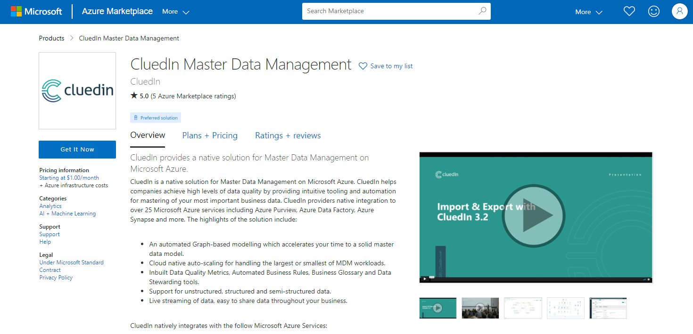

The Azure Marketplace is the best place to get started with a new installation of CluedIn.
Using the marketplace you can start your development, test, and production environments with a few simple installation steps and be up and running within twenty minutes.

[CluedIn Master Data Management] deploys as an Azure Managed Application within your own Azure infrastructure. As a managed application, CluedIn can access and support your installation when needed.

Deploying through the marketplace allows you to use simple hourly pricing and upgrade to a full license when needed. So you can freely use CluedIn for a few hours of investigation or dig deeper
and integrate with a suite of Azure services to develop your [Master Data Management] solution.

[CluedIn Master Data Management]: https://azuremarketplace.microsoft.com/en-gb/marketplace/apps/cluedin.azurecluedin?tab=Overview
[Master Data Management]: https://docs.microsoft.com/en-us/azure/architecture/reference-architectures/data/cluedin
