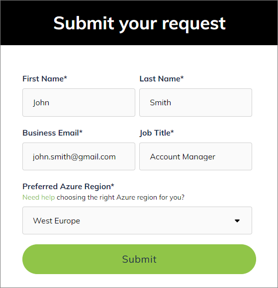

## On this page
{: .no_toc .text-delta }
1. TOC
{:toc}

In this article, you will learn how to subscribe to CluedIn SaaS in the Azure portal and how to configure your CluedIn account.

<iframe src="https://player.vimeo.com/video/927057390?badge=0&amp;autopause=0&amp;player_id=0&amp;app_id=58479" frameborder="0" allow="autoplay; fullscreen; picture-in-picture" title="CluedIn SaaS installation"></iframe>

CluedIn SaaS is currently available by invitation only. You can request an invitation [here](https://www.cluedin.com/saas-invitation-application).

After you submit an application, you'll receive an email with the license key needed to complete the SaaS installation process.

The CluedIn SaaS installation process consists of 2 parts: 

1. Subscribing to CluedIn SaaS in the Azure Marketplace. All details provided in this step are required by Microsoft.

1. Configuring an account with CluedIn. All details provided in this step are required by CluedIn.

## Subscribe to CluedIn SaaS in Azure Marketplace

Before you start the CluedIn SaaS installation process, make sure you have an **Azure account**. If you don't have it, all you need is a valid credit card to create a [pay-as-you-go](https://azure.microsoft.com/en-us/pricing/purchase-options/pay-as-you-go/search/?ef_id=_k_EAIaIQobChMIwOntxpn2hAMV_AYGAB3AMAFmEAAYASAAEgJ8LPD_BwE_k_&OCID=AIDcmmbnk3rt9z_SEM__k_EAIaIQobChMIwOntxpn2hAMV_AYGAB3AMAFmEAAYASAAEgJ8LPD_BwE_k_&gad_source=1&gclid=EAIaIQobChMIwOntxpn2hAMV_AYGAB3AMAFmEAAYASAAEgJ8LPD_BwE) account.

**To subscribe to CluedIn SaaS**

1. In the Azure Marketplace, search for CluedIn.

1. From the results, select **CluedIn Master Data Management – MDM (SaaS)**.

    

1. On the **CluedIn Master Data Management SaaS** page, select **Get It Now**.

    

    On the page that opens, you can review basic information about CluedIn SaaS. Then, select **Subscribe**.

1. On the **Basics** tab, in the **Project details** section, do the following:

    1. Select a **Subscription** where you want to store CluedIn SaaS application in your Azure account.

    1. Select or create a **Resource group** to hold the SaaS application.

1. In the **SaaS details** section, enter a **Name** for the SaaS application.

    

1. (Optional) Select **Next: Tags** On the **Tags** tab, you can define tags to help you find your SaaS resource later.

1. Select **Review + subscribe**.

1. On the **Review + subscribe** tab, review the terms of use, contact information, and billing details.

    {:.important}
    Billing is handled exclusively by Microsoft.

1. Select **Subscribe**.

    You'll see the following message: _Your SaaS subscription is in progress_. This process takes a few minutes. Don't close the window until it's finished.

    

    After the subscription is completed, the **Configure account now** button becomes active, and you'll receive an email requesting you to activate the new subscription. 

1. In the SaaS offer in the online store, select **Configure account now** or in the email, select **Configure now**. You'll be redirected to the CluedIn account configuration page.

## Configure an account with CluedIn

To configure an account with CluedIn, you need a valid license key. You can find a license key in an email from CluedIn if you have previously requested SaaS application. If you don't have a license key, request it [here](https://www.cluedin.com/saas-invitation-application).

**To configure a CluedIn account**

1. On the CluedIn account configuration page, enter a license key, and then select **Validate your license key**.

    

1. Provide basic information for setting up your CluedIn account:

    1. Enter your **Email**.

    1. Enter an **Organization Name** to create a link to your CluedIn instance.

    1. Enter a **Password** for signing in to your CluedIn instance.

    1. Select an **Azure Region** where you want CluedIn to be installed.

    1. Select **Complete configuration**.

        

    Our automatic installer will start preparing your isolated environment. Once it is ready, you will receive an email with instructions on how to get started. It can take up to 30 minutes to receive an email. You may close this page while waiting for an email.

In the email, you'll find a link to your CluedIn account. To sign in, enter the email and password that you provided to configure your CluedIn account.

For more information about signing in, see [Getting access](/getting-access#sign-in-by-email).