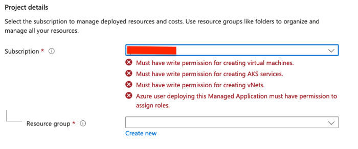

# CluedIn AMA - Pre-Install Checks

Before beginning the installation there are a few checks and permissions that need to happen in order to ensure a smooth installation experience.

### Identify the user carrying out installation

The user who is triggering the installation must have all the correct permissions assigned to them or their user group.

CluedIn will be installed into an Azure Resource Group, the installation user would ideally be *at least*  a`Contributor` to that group or ideally the `Owner` of that resource group. 

### Permission to purchase from the Azure Market Place

The other permission required, is the ability to purchase paid-for applications from the Azure Marketplace. 

By default, this is usually set to `No` - Meaning it prevents users from deploying any software from Azure Marketplace.

This must be set to `Free+Paid` in order to complete the purchase registration on the marketplace.

More information available here: https://docs.microsoft.com/en-us/marketplace/azure-purchasing-invoicing#purchase-policy-management

### Check Azure registrations

The final set of permissions are around provider registrations and quotas. Provider registrations allow you to create certain resource types in Azure.
The CluedIn installation creates various different resource types so we need to check that the installation user has the correct authority to create them.

The list of registrations for CluedIn are as follows:

* `Microsoft.Cache`
* `Microsoft.Capacity`
* `Microsoft.Compute`
* `Microsoft.ContainerService`
* `Microsoft.EventHub`
* `Microsoft.KeyVault`
* `Microsoft.ManagedIdentity`
* `Microsoft.Network`
* `Microsoft.OperationalInsights`
* `Microsoft.OperationsManagement`
* `Microsoft.Resources`
* `Microsoft.Storage`
* `Microsoft.Sql`

### Check vCPU quotas

There are four common VM family types that CluedIn will create as part of the AKS (Kubernetes) node pools. 

The subscription needs to have enough spare vCPU quota in order to provision the different nodes.

* At least 36 vCPUs in the **StandardDSv4Family** quota

* At least 32 vCPUs in the **StandardDSv8Family** quota

* At least 32 vCPUs in the **StandardFSv2Family** quota

* At least 2 vCPUs in the **StandardDSv2Family** quota

If you are looking to enable auto-scaling on the processing node you will need to ensure a higher quota on the FSv2 family. This will also depend on your license type.

### Helper Script

CluedIn have created a PowerShell script that can check the current users provider registrations.

It requires the Azure CLI (az) to be installed on the system running it. 

Installation instructions can be found here: https://docs.microsoft.com/en-us/cli/azure/install-azure-cli

```powershell
param(
    [Parameter(Mandatory)]
    [string]$SubscriptionId,
    [switch]$Register,
    [switch]$Wait
)

$ErrorActionPreference = 'Stop'

if(!(Get-Command az)) {
    Write-Error "You must install the azure cli to continue"
}

# Login
function GetCurrentSubscription { az account show --query 'id' -o tsv }
$currentSubscription = GetCurrentSubscription
if(!$currentSubscription) { az login -o none }

if($currentSubscription -ne $SubscriptionId){
    az account set --subscription $SubscriptionId
    $currentSubscription = GetCurrentSubscription
    if($currentSubscription -ne $SubscriptionId){
        Write-Error "Could not login to subscription ${SubscriptionId}"
    }
}

function FetchProviders {
    $requiredProviders = @(
        "Microsoft.Cache",
        "Microsoft.Capacity",
        "Microsoft.Compute",
        "Microsoft.ContainerService",
        "Microsoft.EventHub",
        "Microsoft.KeyVault",
        "Microsoft.ManagedIdentity",
        "Microsoft.Network",
        "Microsoft.OperationalInsights",
        "Microsoft.OperationsManagement",
        "Microsoft.Resources",
        "Microsoft.Storage",
        "Microsoft.Sql"
    )

    az provider list --query '[].{ Name: namespace, Registered: registrationState}' |
        ConvertFrom-Json |
        ForEach-Object {
            $required = $requiredProviders -contains $_.Name
            Add-Member -InputObject $_ -NotePropertyName Required -NotePropertyValue $required -PassThru
        } |
        Sort-Object Required,Name,Registered
}

$providers = FetchProviders

if($Register) {
    $toRegister = $providers.Where({ $_.Required -and $_.Registered -ne 'Registered'})
    if($toRegister) {
        Write-Host "Registering missing providers"
        $toRegister | ForEach-Object {
            az provider register --namespace $_.Name --accept-terms --wait
        }

        $providers = FetchProviders
    } else {
        Write-Host "All required providers registered" -ForegroundColor Green
    }
}

$providers
```

The CluedIn installer will also attempt to check most of these permissions, so if you see errors such as ..



.. please re-check the permissions assigned to that user before proceeding.