## On this page
{: .no_toc .text-delta }
1. TOC
{:toc}

# CluedIn AMA - Installation

This document will take you through the various options provided by the Azure Marketplace Application (AMA) installer.

### Before you start

Please ensure the person initiating the installation has all the correct permissions to carry out the installation.

### Getting started within the Azure Marketplace

Searching for "Cluedin" in the Azure marketplace should take you to "CluedIn Master Data Management".

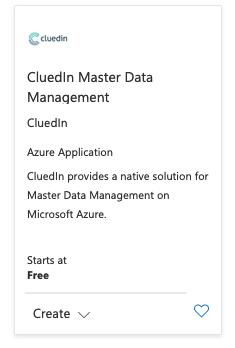

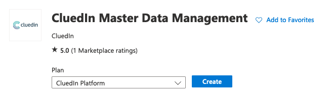

.. from here you will be able to select "CluedIn Platform" as the plan and click `Create` to proceed.

---

### Resource Group + Licensing Tab

The first tab is the "basics" tab, where we can select the Azure resource group to install into and select or provide license details.

The installer will attempt to detect the permissions of the user installing the application. If they do not match the required permission set, then it will fail validation.

The resource group you select must be empty (i.e., have no other Azure resources inside it) or you will receive an error.

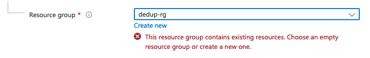

The region specifies the Azure region in which the different resources will be created (this will probably match your resource group location).

If you have not been issued a license by CluedIn already, you can select `Essential`, `Professional` or `Elite`, and a license key will be generated for you automatically.

The license types have different hourly rates and other restrictions, so please read the license information carefully.

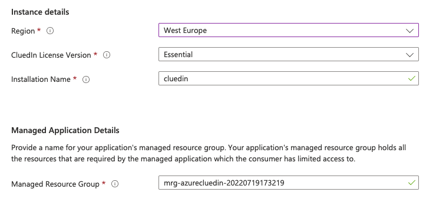

If you have been issued a license key, then please select "Existing License Key" and enter it in the text box provided.

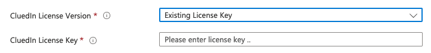

The "Installation Name" and "Managed Resource Group" do not normally need to be updated.

---

### Initial Setup Tab

#### Organization & Admin Setup

The first part of this tab is for the creation of the organization and main CluedIn administrator account.

The organization name will be used as part of the URL, so it will ideally be one word with no dashes or hyphens.

The password must be greater than 12 characters long.

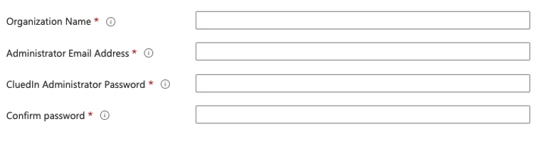

#### SMTP Details

The second part of the form allows the entry of the SMTP details. Email is needed to send invitations to other users you may wish to add to CluedIn.

The SMTP port must be the SSL port.

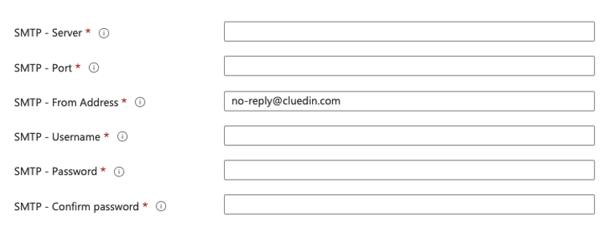

SMTP details can be changed post-installation by raising a ticket with CluedIn Support.

#### SSO Details

CluedIn supports using Azure AD as a Single Sign-On provider. Enable the section and enter the details.

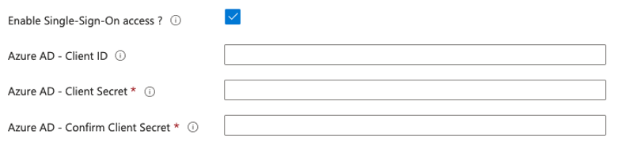

This feature can be enabled post-installation. This is often preferable as some Azure AD group mapping to CluedIn groups needs to take place.

---

### AKS Setup Tab

This tab contains the different machines used for the different node-pools in AKS (Azure Kubernetes Service).

Most of the time, there will be nothing to adjust on this page unless advised by CluedIn Support.

The `VM Count` can be increased if needed (please consult with CluedIn support) but has a minimum level to ensure all resources can be scheduled.

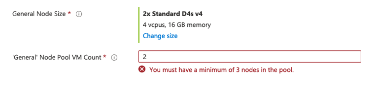

The `Processing` node size will change depending on the license type you have selected on the `Basics` tab.

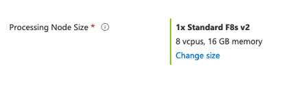

If you have been issued a license, the processing node type will be hidden as it is encoded into the license.

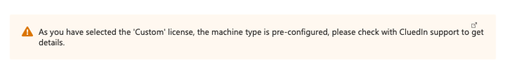

#### Auto-Scaling

The processing node-pool can have auto-scaling enabled, meaning that as CPU pressure builds (high workload) in this node pool, it will allow AKS to start up new nodes to compensate for the increase in load.

The extra nodes used will be shut down when the load returns to normal levels again, but there is an extra infrastructure and possible licensing cost incurred by scaling up.

Please get in touch with CluedIn support for more information.

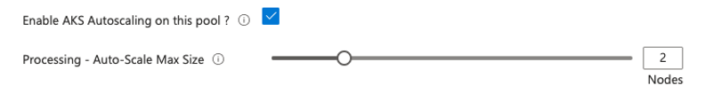

Auto-Scaling can be enabled post-installation.

---

### Service Setup Tab

This section defines the different major services that make up CluedIn's data layer. 

By default, CluedIn uses resources provisioned inside the cluster and uses Azure managed (encrypted) disks to store any data created.

This is a good default, so there should be any need to change anything on this page.

There are different options to let the installer use existing or provision new services as part of the setup. However, many of these options can incur extra infrastructure charges from Azure as new resources are provisioned or used.

#### Azure SQL

By default, we create an instance of SQL Server inside the cluster, backed with 1TB disks.

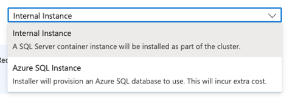

The installer can provision an Azure SQL (Elastic Pool) to install all the databases. The Azure SQL resource will be created inside the managed resource group.

#### Azure Cache (Redis)

By default, we create a scalable instance of Redis inside the cluster.

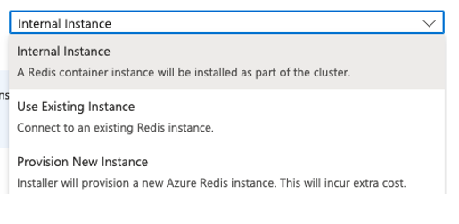

CluedIn can be configured to use an existing instance of Redis if provided with connection details.

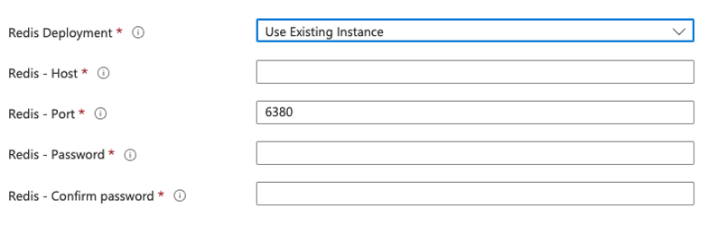

The installer can also provide a new Azure Redis Cache for use by CluedIn. The Azure Redis Cache resource will be created inside the managed resource group.

#### ElasticSearch 

By default, we create a scalable instance of ElasticSearch inside the cluster, backed with 1TB disks.

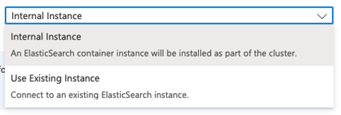

CluedIn can be configured to use an existing instance of ElasticSearch if provided with connection details.

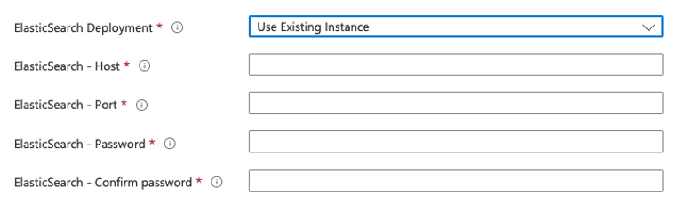

#### Azure Event Hub

By default, we do not create an event hub instance.

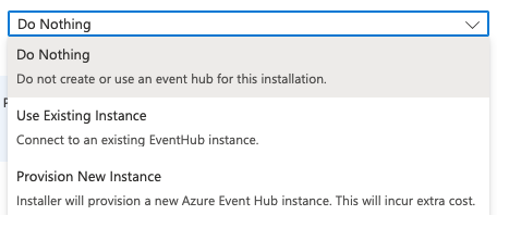

CluedIn can be configured to use an existing instance of Azure Event Hub if provided with connection details.

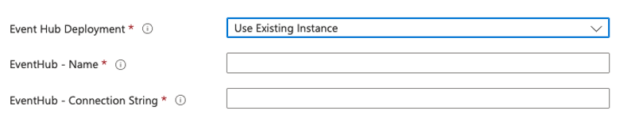

The installer can provision an Azure Event Hub instance for use by CluedIn. The Azure Event Hub resource will be created inside the managed resource group.

#### Purview

CluedIn can be configured to use an existing instance of Azure Purview if provided with connection details.

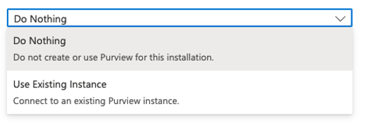

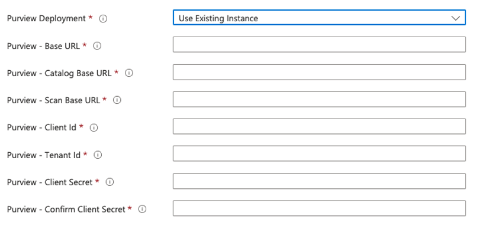

**! NOTE !**

All of these features can be configured post-installation by raising a ticket with CluedIn Support.

---

### Advanced Configuration Tab

This tab contains technical and debugging switches for use by CluedIn Support. The majority of these options should not be touched and can cause the installation to fail if misconfigured or changed. 

Only make modifications on the advice of CluedIn Support personnel. 

#### Advanced Networking

There may be a requirement to change the address CIDR ranges of the VNET that gets created. For example, if you are connecting to a VNET that has similar internal IP addresses, and you wish to avoid a clash.

You can enable the `Advanced Networking` section to make changes to the VNET defaults.

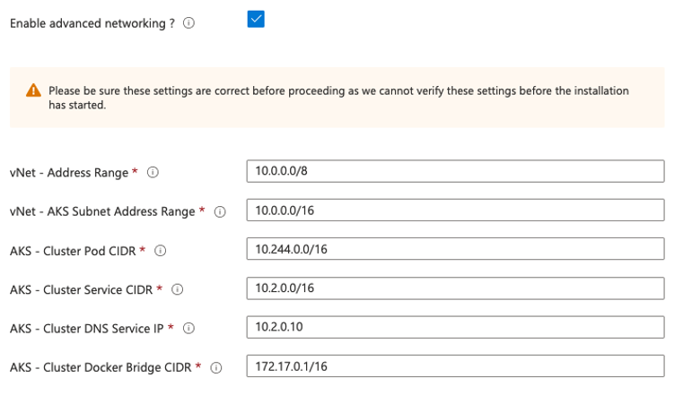

**! NOTE !**

The installer is unable to verify these IP ranges and their validity before the installation starts, so please double-check all settings before proceeding.

---

### Post Installation

Once the installation is complete, you will receive an email with the address of your new CluedIn cluster.

If you have not enabled SMTP yet, you can locate the address in the `output` section of the `Managed Application -> Parameters and Outputs` area.

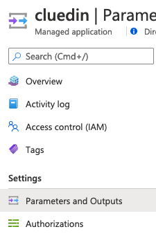

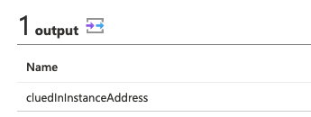

You will be able to log in to CluedIn using the details you provided in the `Initial Setup` tab of the installer.