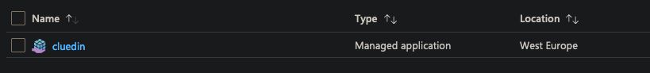
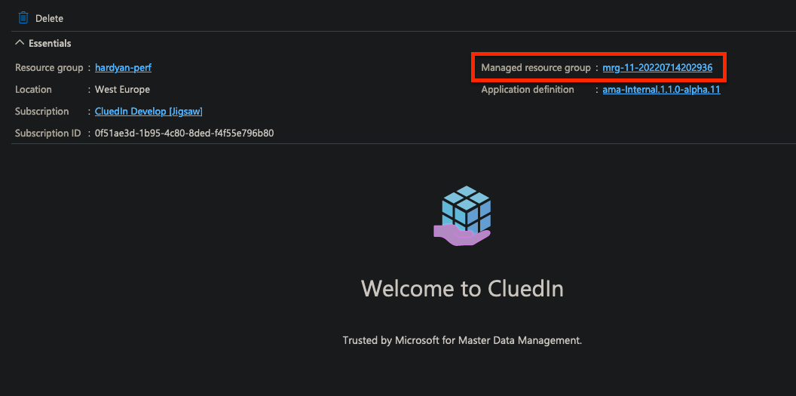
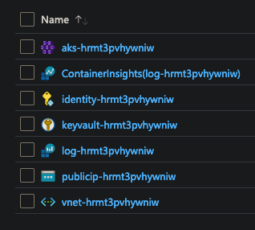
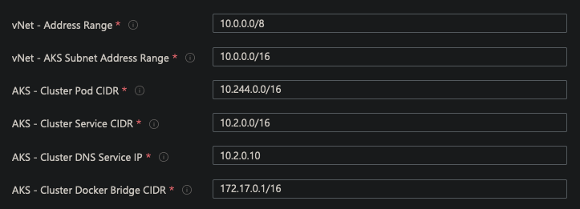
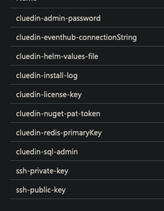

## On this page
{: .no_toc .text-delta }
1. TOC
{:toc}

# CluedIn AMA - Resources

When installing the CluedIn Azure Marketplace Application (AMA) various Azure resources are created.
This document will take you through what gets created and what purpose they serve.

---

### Managed Application

When installing the AMA the first resource created is the `Managed Application` resource.
This is the top-level resource that contains all the other resources that will be created.

While it has no direct functions at this time, if there is a problem with the installation it recommended to remove/delete this top-level resource and this, in turn, will cascade-delete all child resources.

---
**! NOTE !**

Deleting a managed application can take Azure a little time to de-register the installation from its billing and other back-end processes.
If you need to run an installation a second time, in quick succession, it is recommended to change the name of the installation slightly, so there is not a clash.

---

### Managed Resource Group

The managed application will create a managed resource group (usually with a name beginning `mrg-`). You can click through to this resource group while inside the `Overview` tab of the managed application.

---

### Azure Resources

The installation will deploy various Azure resources into the managed resource group and also install the CluedIn Kubernetes application using Helm.

All resources are created with a unique name to avoid any clashes with other resources.

---

#### Managed Identity (`idenity-`)

The installation will create a managed identity that is used as the `owner` of the other resources.

---

#### VNET (`vnet-`)

A new VNET is created to hold all the network configurations for the services. This can be peered later with other VNETs if needed.

A single subnet called `AksSubnet` is created to contain any AKS networking.

Default ranges/CIDRs are configured as follows:

---

#### Public IP (`publicip-`)

A public IP is created for use with the AKS ingress service.
This is created here so that in the event of needing to reconfigure or re-create the AKS configuration, the IP that may have been used for DNS configuration will not be lost/re-issued.

---

#### Keyvault (`keyvault-`)

Any "sensitive" values that are generated as part of the installation are stored as secrets inside this keyvault.

This contains things such as SSH keys for the AKS cluster, any generated passwords and also any passwords passed into the installer.

This also contains the installation log and the Helm chart `values.yaml` used to install the CluedIn application.

---

#### AKS - Cluster (`aks-`)

This is the main AKS/Kubernetes cluster that is used to host the CluedIn application.

It also contains the five different node pools onto which the CluedIn application's various workloads will be deployed.

The node pools are as follows:

* **system** - All Kubernetes system workloads run on this node pool.
* **data** / **dataneo** - Primary databases such as SQL Server , RabbitMQ, ElasticSearch and Neo4J run on this node pool.
* **processing** - This where CluedIn processes incoming data. This is the most powerful node-pool and can be scaled out depending on workload requirements.
* **general** - This node pool is where the main CluedIn API instance runs along with any supporting microservices.

---

#### AKS - Persistent Volumes

Persistent disks are created to hold data created by the installation. These can be scaled-up as demand for space increases.

| Service             | Size  | Azure Disk Type     |
|---------------------|-------|---------------------|
| ElasticSearch       | 1TB   | Standard SSD LRS    |
| SQL Server - Data   | 1TB   | Standard SSD LRS    |
| SQL Server - Logs   | 1TB   | Standard SSD LRS    |
| SQL Server - Backup | 1TB   | Standard SSD LRS    |
| RabbitMQ            | 500GB | Standard SSD LRS    |
| Neo4J               | 1TB   | Standard SSD LRS    |
| Redis               | 32GB  | Standard SSD LRS    |
| CluedIn Prepare     | 32GB  | Standard SSD LRS    |
 | Cluedin Nuget       | 500MB | Standard Azure File |

---

#### AKS - Log Analytics (`log-`) + ContainerInsights

This is where log data is aggregated for the cluster, and alerts and monitoring can be configured.