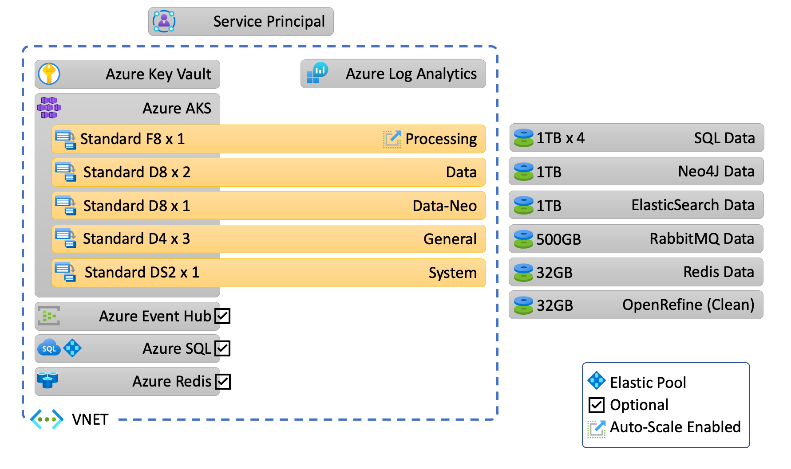
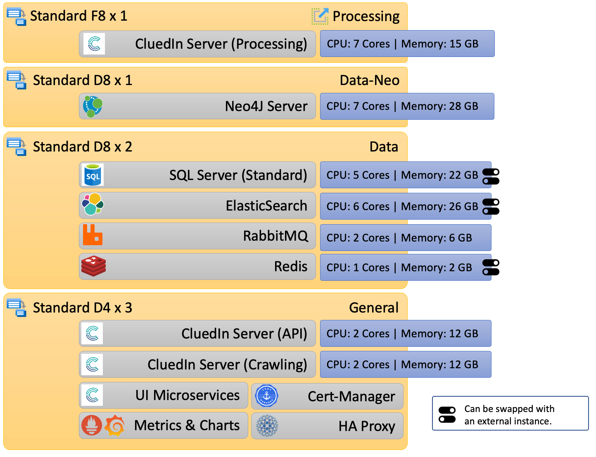

## On this page
{: .no_toc .text-delta }
1. TOC
{:toc}

# CluedIn AMA - Architecture overview

This diagram represents the Azure resource architecture of the AMA solution running with an `Essential` license.

This diagram represents the CPU and memory allocation for each service running with an `Essential` license.

