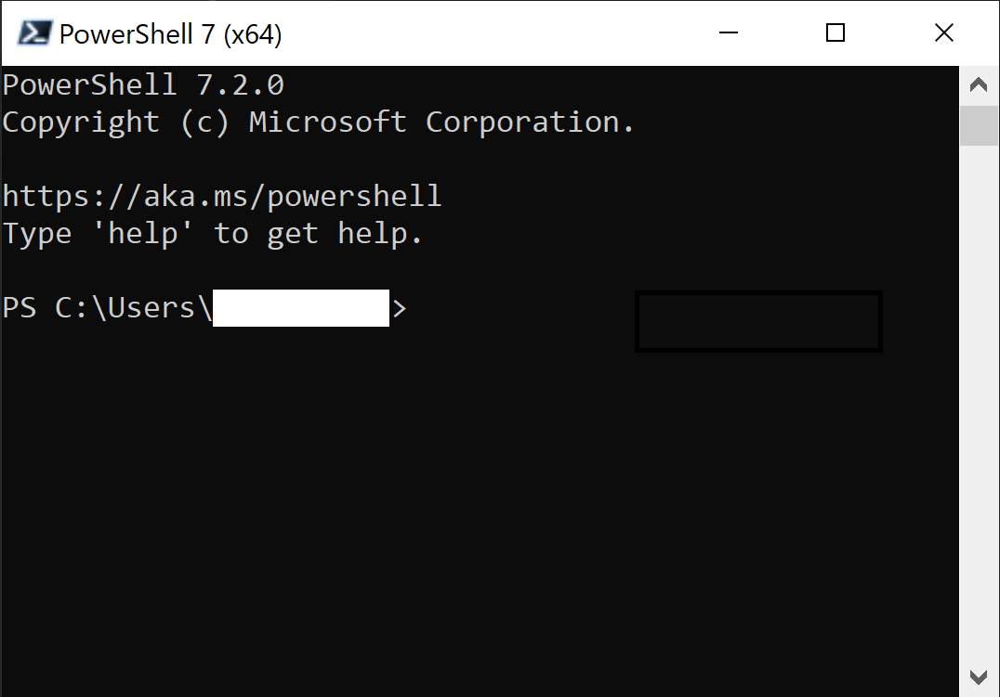
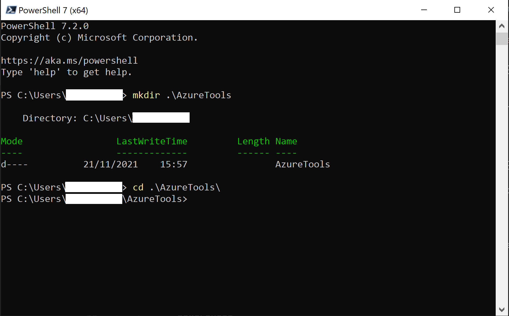
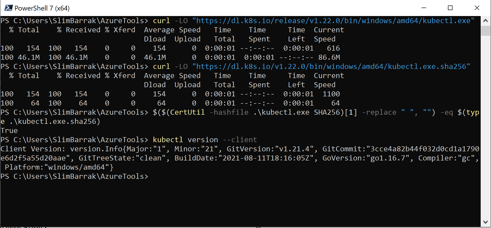
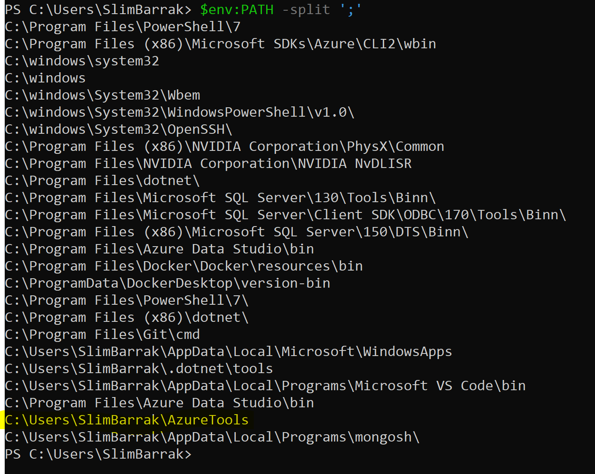
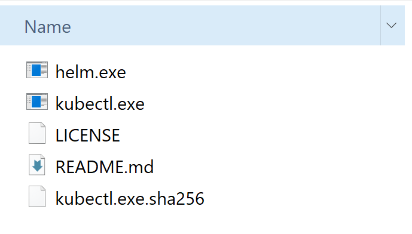

## On this page
{: .no_toc .text-delta }
1. TOC
{:toc}

---
### Introduction


In order to prepare the setup of CluedIn in Azure, you need to have all required tools ready on your machine. Once the pre-requisites are met, you can choose between a manual step-by-step, or a guided PowerShell installation.


### Pre-requisites & Preparation

- Install [PowerShell 7](https://docs.microsoft.com/en-us/powershell/scripting/install/installing-powershell?view=powershell-7) locally.
- Install [Azure CLI](https://docs.microsoft.com/en-us/cli/azure/install-azure-cli) for the specific OS you are using ([Windows](https://docs.microsoft.com/en-us/cli/azure/install-azure-cli-windows?tabs=azure-cli), [MacOS](https://docs.microsoft.com/en-us/cli/azure/install-azure-cli-macos) or [Linux](https://docs.microsoft.com/en-us/cli/azure/install-azure-cli-linux?pivots=apt))
- Create a folder where you can store the different tools & files you will need for the installation, for example `C:\Users\$env:username\AzureTools`, where `$env:username` contains your user name.
    - Open a PowerShell 7 session
    
    - Create a new folder using the following command:
```powershell
mkdir C:\Users\$env:username\AzureTools
```
        Navigate to the new folder
```powershell
cd C:\Users\$env:username\AzureTools
```
        
    - Assign the path of your folder to a new Environment Variable, that you can name **AzureTools** for example:
```powershell
$env:AzureTools = "C:\Users\$env:username\AzureTools"
```
    - Add the newly created variable to your machine's PATH variable:
```powershell
$env:PATH += ";C:\Users\$env:username\AzureTools"
```
    **Moving forwards, make sure you are inside the newly created folder.**
- Install **kubectl** locally: [Windows](https://kubernetes.io/docs/tasks/tools/install-kubectl-windows/), [MacOS](https://kubernetes.io/docs/tasks/tools/install-kubectl-macos/) or [Linux](https://kubernetes.io/docs/tasks/tools/install-kubectl-linux/).
    - Example for Windows:
        - In your PowerShell session, run the following commands one by one:
        
            Command to install kubectl.exe
```powershell
curl -LO "https://dl.k8s.io/release/v1.22.0/bin/windows/amd64/kubectl.exe"
```
            Command to install the kubectl Checksum file
```powershell
curl -LO "https://dl.k8s.io/v1.22.0/bin/windows/amd64/kubectl.exe.sha256"
```
            Command to check the validity of the installation (should return True)
```powershell
$($(CertUtil -hashfile .\kubectl.exe SHA256)[1] -replace " ", "") -eq $(type .\kubectl.exe.sha256)
```
            Command to check the installed version
```powershell
kubectl version --client
```
            The results should look like the following
            
            Make sure kubectl is added to your PATH through the AzureTools folder
```powershell
$env:PATH -split ';'
```
            
- Install [Helm](https://helm.sh/docs/intro/install/)
    - Choose the latest release that suits your OS [here](https://github.com/helm/helm/releases)
    - Download the appropriate zip, for example: `helm-vX.Y.Z-windows-amd64.zip` for Windows x64
    - Extract the content on the zip into your AzureTools folder

    **After performing the above steps, your Azure Folder should look like the following:**
    
    

- Check your Azure access & permissions:
    - You must be [added as a user](https://docs.microsoft.com/en-us/azure/active-directory/fundamentals/add-users-azure-active-directory#add-a-new-user) in your company's Azure tenant
    - You must have the [Contributor role](https://documentation.cluedin.net/deployment/azure/aks#role-based-access-control-rbac) on the Azure Subscription you will be using for the installation.

- Provision a [hostname for the CluedIn application](https://documentation.cluedin.net/deployment/azure/dns), for example: `cluedin-dev.companyName.com`, this will be the hostname used in the remainder of the installation.
- Purchase or generate an [SSL certificate](https://documentation.cluedin.net/deployment/azure/certificate) bound to *.hostname, for example: *.cluedin-dev.companyName.com. If you choose not to use HTTPS immediately (despite its importance, especially for production environments), you can reconfigure CluedIn later to use HTTPS.
- You own a Docker Hub account, for which you requested access to CluedIn's Docker images. Please contact `support@cluedin.com` if you have not gotten the access enabled yet.

### Option 1: Step-by-Step Setup

- Go to [Step-by-Step Setup](/deployment/azure/setup/walkthrough)

### Option 2: PowerShell Setup

- Go to [PowerShell Setup](/deployment/azure/setup/powershell)