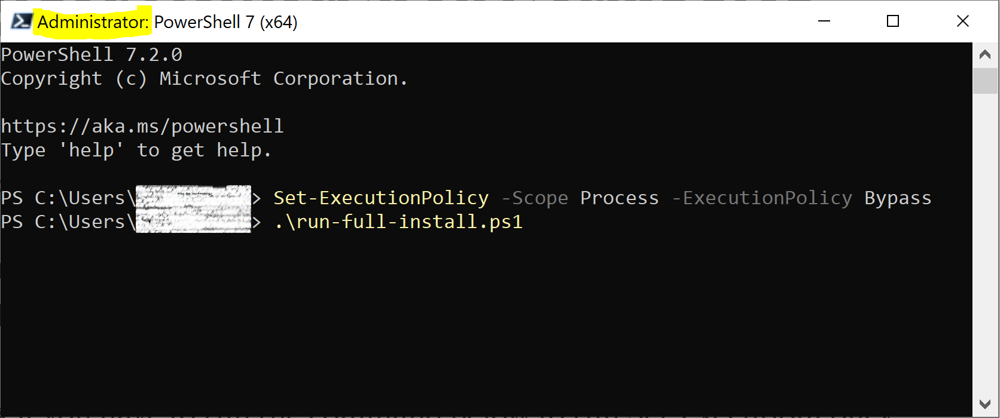

{: .no_toc }
## On this page
{: .no_toc .text-delta }
1. TOC
{:toc}

---
### Introduction

This installation process is done through command lines using [PowerShell 7](https://docs.microsoft.com/en-us/powershell/scripting/install/installing-powershell?view=powershell-7), [Azure CLI](https://docs.microsoft.com/en-us/cli/azure/install-azure-cli), [Kubectl](https://kubernetes.io/docs/tasks/tools/install-kubectl/#install-kubectl) and [Helm](https://helm.sh/).

The purpose of the chart is to install the CluedIn application. This includes the actual CluedIn server, website, and other [services required](../../getting-started) (storage, queues, etc.)

### Pre-requisites
- Install [PowerShell 7](https://docs.microsoft.com/en-us/powershell/scripting/install/installing-powershell?view=powershell-7) locally.
- Install [Azure CLI](https://docs.microsoft.com/en-us/cli/azure/install-azure-cli) for the specific OS you are using ([Windows](https://docs.microsoft.com/en-us/cli/azure/install-azure-cli-windows?tabs=azure-cli), [MacOS](https://docs.microsoft.com/en-us/cli/azure/install-azure-cli-macos) or [Linux](https://docs.microsoft.com/en-us/cli/azure/install-azure-cli-linux?pivots=apt))
- You are an admin of your computer, or can run PowerShell as an admin.
    **Moving forwards, make sure you are inside the newly created folder.**
- Install **kubectl** locally: [Windows](https://kubernetes.io/docs/tasks/tools/install-kubectl-windows/), [MacOS](https://kubernetes.io/docs/tasks/tools/install-kubectl-macos/) or [Linux](https://kubernetes.io/docs/tasks/tools/install-kubectl-linux/).
    - Example for Windows:
        - In your PowerShell session, run the following commands one by one:
        
            Command to install kubectl.exe
```powershell
curl -LO "https://dl.k8s.io/release/v1.22.0/bin/windows/amd64/kubectl.exe"
```
            Command to install the kubectl Checksum file
```powershell
curl -LO "https://dl.k8s.io/v1.22.0/bin/windows/amd64/kubectl.exe.sha256"
```
            Command to check the validity of the installation (should return True)
```powershell
$($(CertUtil -hashfile .\kubectl.exe SHA256)[1] -replace " ", "") -eq $(type .\kubectl.exe.sha256)
```
            Command to check the installed version
```powershell
kubectl version --client
```

- Install [Helm](https://helm.sh/docs/intro/install/)
    - Choose the latest release that suits your OS [here](https://github.com/helm/helm/releases)
    - Download the appropriate zip, for example: `helm-vX.Y.Z-windows-amd64.zip` for Windows x64
    - Extract the content on the zip into your machine

- Check your Azure access & permissions:
    - You must be [added as a user](https://docs.microsoft.com/en-us/azure/active-directory/fundamentals/add-users-azure-active-directory#add-a-new-user) in your company's Azure tenant
    - You must have the [Contributor role](https://documentation.cluedin.net/deployment/azure/aks#role-based-access-control-rbac) on the Azure Subscription you will be using for the installation.

- Provision a [hostname for the CluedIn application](https://documentation.cluedin.net/deployment/azure/dns), for example: `cluedin-dev.companyName.com`.
- Purchase or generate an [SSL certificate](https://documentation.cluedin.net/deployment/azure/certificate) bound to *.hostname, for example: *.cluedin-dev.companyName.com. If you choose not to use HTTPS immediately (despite its importance, especially for production environments), you can reconfigure CluedIn later to use HTTPS.
- You own or have access to a Docker Hub account, for which you requested access to CluedIn's Docker images. Please contact `support@cluedin.com` if you have not gotten the access enabled yet. 
Please note that if you are using an account that has MFA enabled, you need to [create an Access Token](https://docs.docker.com/docker-hub/access-tokens/) and use it instead of your docker password when asked to enter your Docker credentials during the installation process.

### Download the Installation script and run it

- Save this <a href="../../../assets/ps1/run-full-install.ps1" download>Installation Script</a> to a folder of your choice on your computer. *In this example, the script is saved to* `C:\Users\$env:UserName`

- Open a PowerShell 7 session **as administrator** on your computer and run the following command, this will enable local scripts to run:
```powershell
Set-ExecutionPolicy -Scope Process -ExecutionPolicy Bypass
```
- Run the `run-full-install.ps1` script and let it guide you through the whole installation process



### Next Steps

After logging in to the platform, you can proceed with enabling single sign on for your users to access the platform, as well as start loading data in via Data Sources or installing some crawlers. 
Below you will find some useful links on achieving the above:
- [Enabling Single Sign On](../../administration/authentication)
- [Restricting access to CluedIn Clean via Basic Authentication](../../kb/basic-auth-cluedin-clean)
- [Install a crawler/custom component](../../integration/install-integrations)

Optionally, you can also adjust other settings to cater for more complex scenarios:
- [Persistence/Using Managed Disks](./persistence)
- [Azure SQL Server](./sql)
- [Scaling](./scaling)
- [Monitoring and logging](./monitoring)