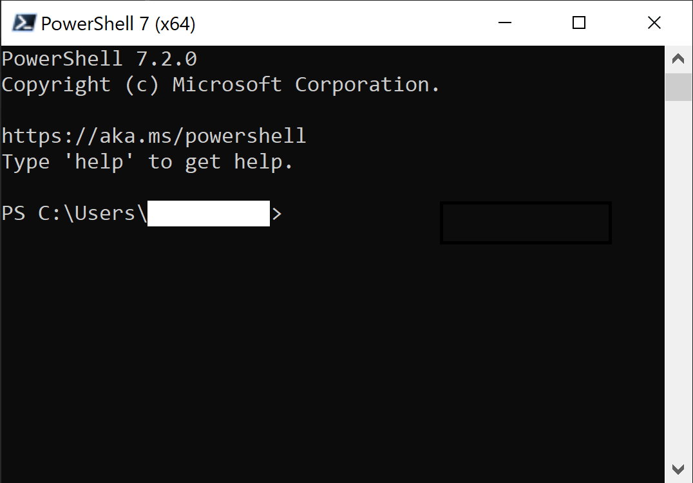
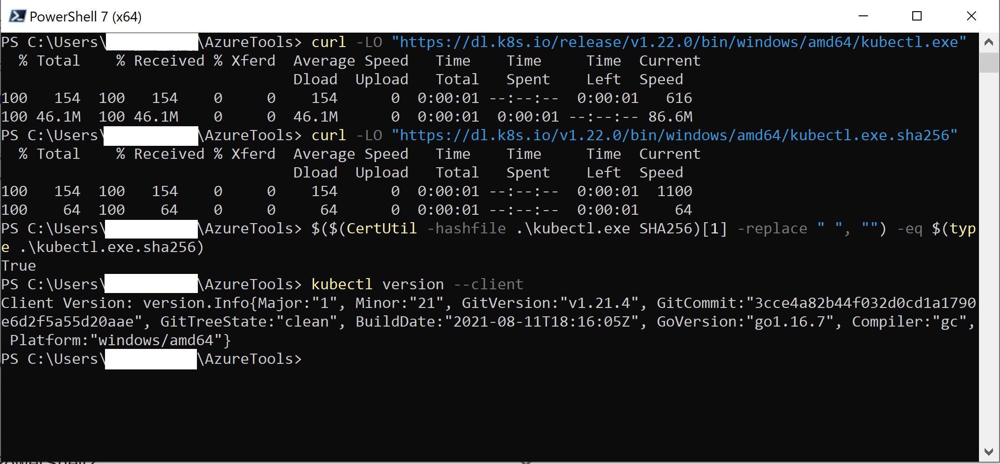
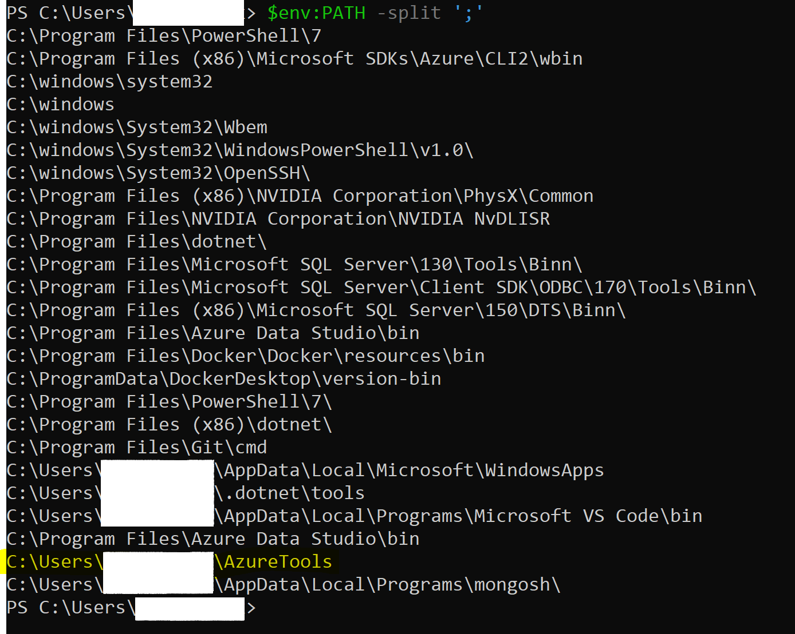
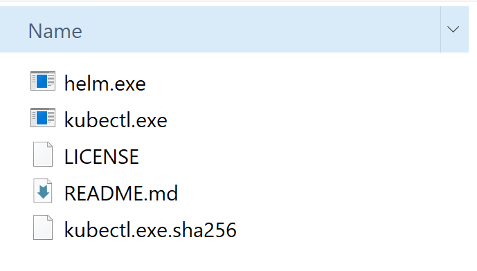
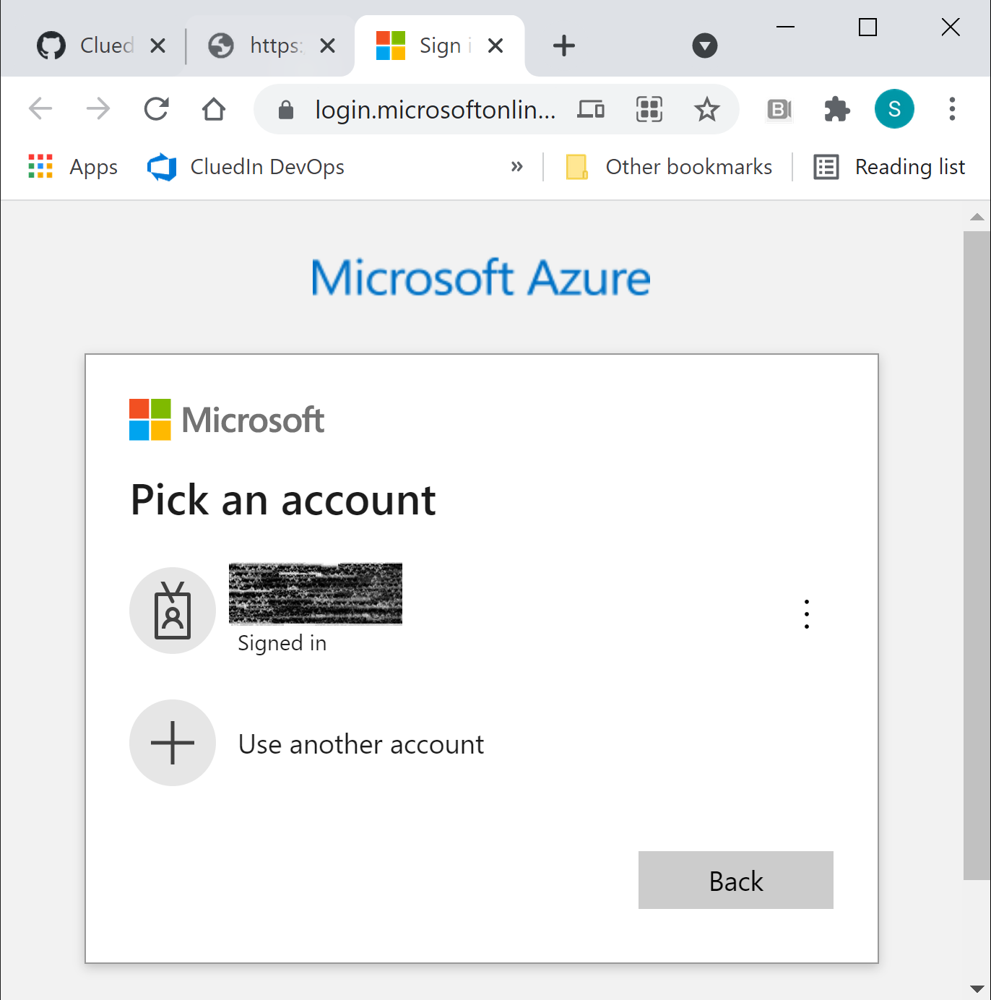
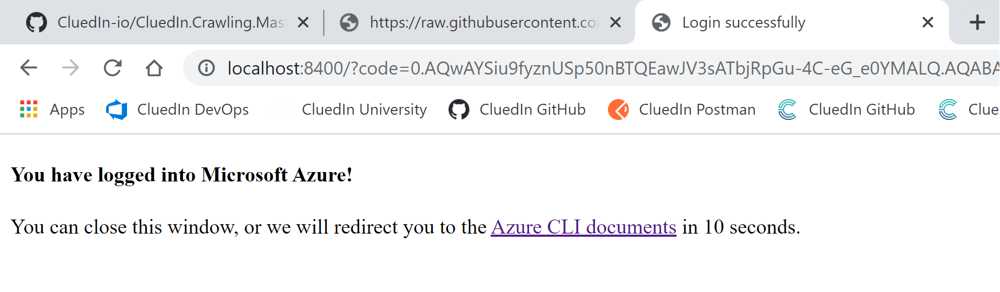
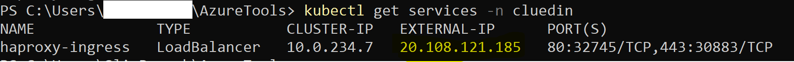

# Step by step installation
{: .no_toc }
## On this page
{: .no_toc .text-delta }
1. TOC
{:toc}

---
### Introduction

This installation process is done through command lines using [PowerShell 7](https://docs.microsoft.com/en-us/powershell/scripting/install/installing-powershell?view=powershell-7), [Azure CLI](https://docs.microsoft.com/en-us/cli/azure/install-azure-cli), [Kubectl](https://kubernetes.io/docs/tasks/tools/install-kubectl/#install-kubectl) and [Helm](https://helm.sh/).

The purpose of the chart is to install the CluedIn application, this includes the actual CluedIn server, website, and other [services required](../../getting-started) (storage, queues, etc.)

### Pre-requisites & Preparation
- Install [PowerShell 7](https://docs.microsoft.com/en-us/powershell/scripting/install/installing-powershell?view=powershell-7) locally.
- Install [Azure CLI](https://docs.microsoft.com/en-us/cli/azure/install-azure-cli) for the specific OS you are using ([Windows](https://docs.microsoft.com/en-us/cli/azure/install-azure-cli-windows?tabs=azure-cli), [MacOS](https://docs.microsoft.com/en-us/cli/azure/install-azure-cli-macos) or [Linux](https://docs.microsoft.com/en-us/cli/azure/install-azure-cli-linux?pivots=apt))
- Create a folder where you can store the different tools & files you will need for the installation, for example **C:\Users\\$env:username\AzureTools**, where `$env:username` contains your user name.
    - Open a PowerShell 7 session
    
    - Create a new folder using the following command:
        ```powershell
        mkdir C:\Users\$env:username\AzureTools
        ```
        Navigate to the new folder
        ```powershell
        cd C:\Users\$env:username\AzureTools
        ```
        
    - Assign the path of your folder to a new Environment Variable, that you can name **AzureTools** for example:
        ```powershell
        $env:AzureTools = "C:\Users\$env:username\AzureTools"
        ```
    - Add the newly created variable to your machine's PATH variable:
        ```powershell
        $env:PATH += ";C:\Users\$env:username\AzureTools"
        ```
    **Moving forwards, make sure you are inside the newly created folder.**
- Install **kubectl** locally: [Windows](https://kubernetes.io/docs/tasks/tools/install-kubectl-windows/), [MacOS](https://kubernetes.io/docs/tasks/tools/install-kubectl-macos/) or [Linux](https://kubernetes.io/docs/tasks/tools/install-kubectl-linux/).
    - Example for Windows:
        - In your PowerShell session, run the following commands one by one:
        
            Command to install kubectl.exe
            ```powershell
            curl -LO "https://dl.k8s.io/release/v1.22.0/bin/windows/amd64/kubectl.exe"
            ```
            Command to install the kubectl Checksum file
            ```powershell
            curl -LO "https://dl.k8s.io/v1.22.0/bin/windows/amd64/kubectl.exe.sha256"
            ```
            Command to check the validity of the installation (should return True)
            ```powershell
            $($(CertUtil -hashfile .\kubectl.exe SHA256)[1] -replace " ", "") -eq $(type .\kubectl.exe.sha256)
            ```
            Command to check the installed version
            ```powershell
            kubectl version --client
            ```
            The results should look like the following
            
            Make sure kubcetl is added to your PATH through the AzureTools folder
            ```powershell
            $env:PATH -split ';'
            ```
            
- Install [Helm](https://helm.sh/docs/intro/install/)
    - Choose the latest release that suits your OS [here](https://github.com/helm/helm/releases)
    - Download the appropriate zip, for example: helm-vX.Y.Z-windows-amd64.zip for Windows x64
    - Extract the content on the zip into your AzureTools folder

    **After performing the above steps, your Azure Folder should look like the following:**
    
    

- Check your Azure access & permissions:
    - You must be [added as a user](https://docs.microsoft.com/en-us/azure/active-directory/fundamentals/add-users-azure-active-directory#add-a-new-user) in your company's Azure tenant
    - You must have the [Contributor role](https://documentation.cluedin.net/deployment/azure/aks#role-based-access-control-rbac) on the Azure Subscription you will be using for the installation.

- Provision a Hostname for the CluedIn application, for example: cluedin-dev.companyName.com, this will be the hostname used in the remainder of the installation.
- Purchase or generate an SSL certificate bound to *.hostname, for example: *.cluedin-dev.companyName.com. If you choose not to use HTTPS immediately (despite its importance, especially for production environments), you can reconfigure CluedIn later to use HTTPS.
- You own a Docker Hub account, for which you requested access to CluedIn's Docker images. Please contact your appointed account or partner manager if you have not gotten the access enabled yet.

### Login to Azure

Open a PowerShell session, and run the following command:
```powershell
az login
```
A browser window will open with Microsoft Azure login page:


Choose the account you want to use, enter the approptiate MFA information, once you are connected you will get this confirmation message


You can now read, create and access resources in your Azure tenant through Azure CLI.

### Create a resource group for your Kubernetes Cluster
In connected PowerShell session, run the following command:
```powershell
$location = "westeurope" # location is the deployment region of the resource group. Example: eastus, centralus, westeurope etc...
$rgName = "rg-cluedin-dev" # rgName is the name of the resource group. Example: rg-cluedin-dev or rg-cluedin-prod
$subscription = "DataOps-Subscription" # subscription is the name of the parent subscription for the resource group
az group create --location $location --name $rgName --subscription $subscription
```

### Create an AKS Cluster to host your CluedIn application
In this step, you will create an AKS cluster with the following nodepool sizing:

| Node Pool         | VM SKU Type         | Amount        | Purpose  | 
|-------------------|:-------------       |:-------------:| :----    |
| Core Pool         | `Standard_DS2_v2`   | 1             | Kubernetes agent internal processes |
| Data Pool         | `Standard_A8_v2`    | 2             | Memory Optimized pool for Databases |
| Processing Pool   | `Standard_F16s_v2`  | 1             | CPU Optimized for Processing workloads |
| General Pool      | `Standard_F4s_v2`   | 2             | General Purpose nodepool to house CluedIn Microservices |

**NB:** Later, you can choose to downscale or upscale your nodepools depending on your needs and the of your workloads.

- Save this <a href="../../../assets/js/create-cluster-template.json" download>ARM Template</a> and <a href="../../../assets/js/create-cluster-params.json" download>ARM Template Parameters</a> files to your `C:\Users\$env:username\AzureTools` folder.
- Open the **create-cluster-params.json** file and edit the values of the following parameters:
    - `resourceName`: choose a name for your AKS cluster, for example: aks-cluedin-dev, aks-cluedin-test, aks-cluedin-prod etc...
    - `location`: choose the deployment region, for example: uksouth, eastus, westeurope etc...
    - `dnsPrefix`: DNS prefix for your cluster, for example: aks-cluedin-dev-dns, aks-cluedin-test-dns etc...
    - `kubernetesVersion`: 1.20.9 or later
    - `networkPlugin`: can be "kubenet" or "azure". If you choose azure, you need to add another parameter called vnetSubnetID and add its value. More information on how to get the ID can be found [here](https://docs.microsoft.com/en-us/cli/azure/network/vnet/subnet?view=azure-cli-latest). **For the remainder of the installation, we are using Kubenet.**
    - `workspaceName`: choose a workspace name, this is used for the monitoring of your cluster.
    - `omsWorkspaceId`: The format should be /subscriptions/**{subscription-id}**/resourcegroups/defaultresourcegroup-**{region}**/providers/microsoft.operationalinsights/workspaces/**{workspaceName}**, you need to replace the parts in **bold** by the appropriate values. In order to find your subscription Id, you can run the following command 
        ```powershell
        az account show    
        ```
- Once you finish editing the **create-cluster-params.json**, save and close it.
- Run the following script to create your AKS cluster with the predefined parameters:
    ```powershell
    $rgName = "resource-group-name" # example: "rg-cluedin-dev" 
    $deploymentName = "name-of-deployment" # example: "aks-cluedin-dev-deployment" 
    $armTemplatePath = "C:\Users\$env:username\AzureTools\create-cluster-template.json" # ARM Template that you saved previously.
    $paramsPath = "C:\Users\$env:username\AzureTools\create-cluster-params.json" # Params file that you saved and edited previously.

    az deployment group create `
        --name $deploymentName `
        --resource-group $rgName `
        --template-file $armTemplatePath `
        --parameters $paramsPath
    ```

- Once the cluster is successfully created, run the following command to check cluster's information:
    ```powershell
    $rgName = "resource group name" # for example: rg-cluedin-dev
    $clusterName = "cluster name" # for example: aks-cluedin-dev
    az aks show --name $clusterName --resource-group $rgName
    ```

**Now, you are ready to install CluedIn on your cluster.**

### Networking & Security

- Merge your AKS context to your created cluster using the following command:
    ```powershell
        $rgName = "resource group name" # for example: rg-cluedin-dev
        $clusterName = "cluster name" # for example: aks-cluedin-dev 
        az aks get-credentials --resource-group $rgName --name $clusterName
        ```
- Install HAProxy ingress controller using helm:
    - Navigate to the AzureTools folder and create the namespace that will host the CluedIn components:
        ```powershell
        kubectl create namespace cluedin
        helm repo add haproxy-ingress https://haproxy-ingress.github.io/charts
        helm install haproxy-ingress haproxy-ingress/haproxy-ingress --namespace=cluedin
        ```
    - Run the following command to retrieve the External IP Address assigned to the controller:
        ```powershell
        kubectl get services -n cluedin
        ```
        If the external IP shows as "pending", give it a moment before trying again, then save the External IP address from the output, you will need it for your DNS configuration. 
        
- DNS Routine (If applicable): Through your DNS provider's management system, make your chosen host point to the public IP of the ingress controller for the following routes:
  - `app.<hostname>`, for example: **app.cluedin-dev.companyName.com**
  - `<organizationName>.<hostname>`, for example: **product.cluedin-dev.companyName.com**

- SSL Certificate (If applicable): Create a secret with the SSL certificates for the following routes:
    - `app.<hostname>`, for example: **app.cluedin-dev.cluedin.com**
    - `<organizationName>.<hostname>`, for example **product.cluedin-dev.companyName.com**
    - `clean.<hostname>`, for example **clean.cluedin-dev.companyName.com**
    - Admin URLs:
        - `grafana.<hostname>`, for example **grafana.cluedin-dev.companyName.com**
        - `promotheus.<hostname>`, for example **promotheus.cluedin-dev.companyName.com**
        - `alertmanager.<hostname>`, for example **alertmanager.cluedin-dev.companyName.com**
        - `alertmanager.<hostname>`, for example **alertmanager.cluedin-dev.companyName.com**
    - If possible, the SSL Certificate can be a wildcard one, for example: ***.cluedin-dev.companyName.com**
    - The certificate secret can be created using the following command: 
    ```powershell 
    kubectl create secret tls <secret-name>--key <private-key-path> --cert <public-certificate-path>
    ```
    **NB: private-key-path = path to the *tls.key* file and public-certificate-path = path to *tls.crt* file. There is an option to run without SSL, although not recommended, especially for production environments.**

### Install CluedIn using Helm

- Start by registering the Helm chart repository containing CluedIn chart: 
```powershell
helm repo add cluedin https://cluedin-io.github.io/Charts/
helm repo update
```

- Create a secret with your Docker credentials to access CluedIn images through Docker Hub:
    Run the following command:
    ```powershell
    kubectl create secret docker-registry docker-registry-key `
    --namespace cluedin `
    --docker-server='docker.io' `
    --docker-username='<your Dockerhub username>' `
    --docker-password='<your Dockerhub password>' `
    --docker-email='<your Docker Hub email>'
    ```

    A confirmation message will appear when the secret is created.

- Make sure you are in your AzureTools folder, then using the command below, you will fetch the values.yml configuration file to configure your CluedIn instance
    ```powershell
    helm inspect values cluedin/cluedin > values.yml
    ```
    The file will be downloaded to your AzureTools folder.

    


Fill out the values.yaml file, specifically the following sections:
**Default Organization and application Admin**
```yaml
bootstrap: 
  organization: 
    name: "orgName" # Organization Account Name, example: Products, Customers, People, Vendors etc...
    email: "admin@companyName.com" # Admin account's Email
    username: "admin@companyName.com "# Admin account's username (should be the same as above) 
    prefix: "orgNamePrefix" # Organization prefix used in the URL to access this organization (tenant), can be the same as organizationName
    password: "!!!StrongPassword123!!!" # Admin account's password
    emailDomain: "companyName.com" # Admin account's Email domain, can be left empty and admin email's domain will be used in this case.
```
**DNS Configuration**
If your hostname is *companyName.com* and you choose a prefix to your CluedIn dev application that is *cluedin-dev*, your DNS section should like the following:
```yaml
  dns:
    hostname: "companyName.com"  # Base host to use for all URLs. Will be combined with the organization name e.g https://<org-name>.<hostname>
    prefix: "cluedin-dev" # Usually a qualifier to the CluedIn instance, but can be left empty
    subdomains: # The following are the default, each one corresponds to a subdomain
      application: "app" # For app.cluedin-dev.companyName.com
      openrefine: "clean" # For clean.cluedin-dev.companyName.com
      grafanaAdmin: "grafana" # For grafana.cluedin-dev.companyName.com
      prometheusAdmin: "prometheus" # For prometheus.cluedin-dev.companyName.com
      alertManagerAdmin: "alertmanager" # For alertmanager.cluedin-dev.companyName.com
      seq: "seq" # For seq.cluedin-dev.companyName.com
```
Please note that the above is also equivalent to:
```yaml
  dns:
    hostname: "cluedin-dev.companyName.com"
    prefix: ""
    subdomains: ...
```
Finally, if you choose to use the Ingress controller's external IP with no specific hostname until you get your DNS configuration sorted out, the DNS section would be:
```yaml
  dns:
    hostname: "EXTERNAL_IP_VALUE.nip.io"  # For example 20.90.172.127.nip.io
    prefix: ""
    subdomains: ...
```

*Please note that organization prefix cannot contain a hyphen or a dot in it.

**SSL and HTTPS (If applicable)**
If you are adding Modify the following section as per your needs:
```yaml
  ingress:
    forceHttps: True # Set to True if you want to force HTTPS usage
    annotations:
      kubernetes.io/ingress.class: haproxy
      ingress.kubernetes.io/ssl-redirect: "false"
    tls:
      hosts: [ "*.cluedin-dev.companyName.com" ] # enumerate the hosts defined in the certificate, or wildcard URL.
      secretName: "SSL-Secret-Name" # TLS Secret to use for ingress - If no hosts create a wildcard host
      hasClusterCA: false  # If certificates are generated by a local CA (secret has 'ca.crt' section)
```

Save the values.yml file. Please note that these different settings can be modified later even after the installation of CluedIn.

**Install Cluedin**

Run the following command to install CluedIn:
```powershell
$releaseName = "choose a name for the release" # Example: cluedin-dev
$pathToValuesYml = "Path to values.yml" # Example: C:\Users\$env:username\AzureTools\values.yml
helm upgrade $releaseName cluedin/cluedin -n cluedin --install --values $pathToValuesYml
```

Upon running the `helm upgrade` command, Helm will begin installation of CluedIn platform into your Kubernetes cluster. At the end of the installation process, you will be prompted with configuration of your install, URLs you can use to access your freshly installed platform. 

All the workloads may take up to 10 minutes to spin up. You can check your status by running:
```powershell
kubectl get pods -n cluedin
```
In a healthy installation scenario, all the pods should be in a `Ready` state.

Additionally, you can check the health of the platform by going to `https://app.<hostname>/api/status` healthcheck API.

You will be able to login to the platform by going to `https://app.<hostname>/` (or `http://app.<hostname>/` if not using SSL). 

### Next Steps

After logging in to the platform, you can proceed with enabling single sign on for your users to access the platform, as well as start loading data in via Data Sources or installing some crawlers. 
Below you will find some useful links on achieving the above:
- [Enabling Single Sign On](../../administration/authentication)
- [Restricting access to CluedIn Clean via Basic Authentication](../../kb/basic-auth-cluedin-clean)
- [Install a crawler/custom component](../../integration/install-integrations)

Optionally, you can also adjust other settings to cater for more complex scenarios:
- [Persistence/Using Managed Disks](./persistence)
- [Azure SQL Server](./sql)
- [Scaling](./scaling)
- [Monitoring and logging](./monitoring)