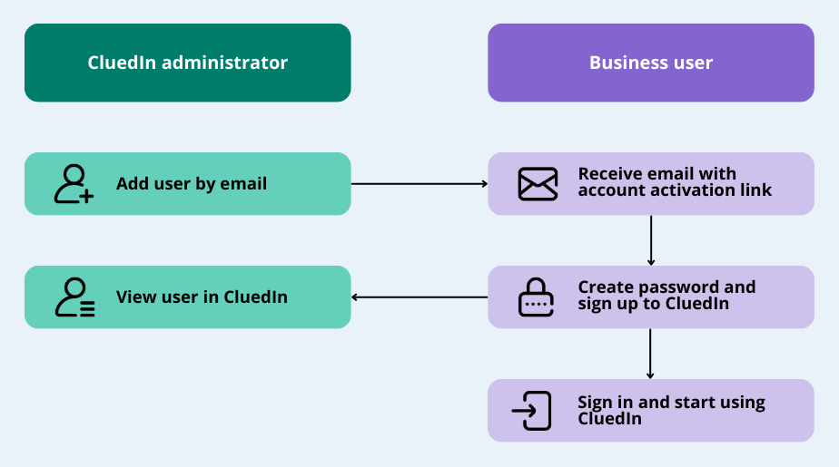
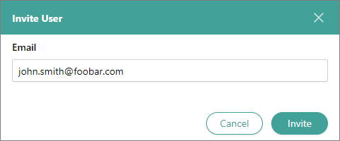
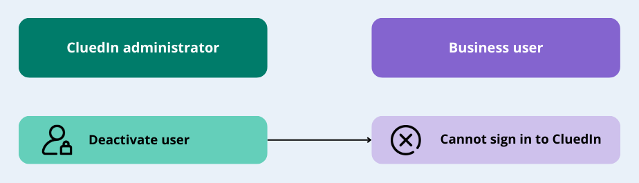
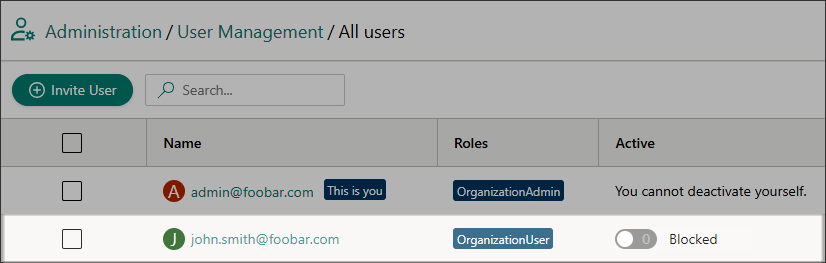

## On this page
{: .no_toc .text-delta }
1. TOC
{:toc}

In this article, you will learn how to add and deactivate users in your CluedIn organization.

**_This article is intended for CluedIn administrators._**

A user is someone who can sign in to CluedIn. The user's access to CluedIn modules and features is defined by the user's roles. For more information, see [Roles](/administration/roles).

You can do the following actions to manage users:

- [Add user](#add-user)

- [Deactivate user](#deactivate-user)

## Add user

You can add users to CluedIn in one of the following ways:

- [By the user's email address](###add-user-by-email-address)

- [Via Azure Active Directory single sign-on (SSO)](###add-user-via-sso)

### Add user by email address

If you don't have Azure Active Directory SSO enabled for CluedIn, you can add the users to the platform by their email address.

The following diagram shows the flow of adding a user to CluedIn.

**To add the user by email address**

1. On the navigation pane, go to **Administration** > **User Management**.

1. On the actions pane, select **Users**. Then select **Invite User**.

1. On the **Invite User** pane, enter the user's email address. Then, in the lower-right corner, select **Invite**.

    

    The user will receive an email with a link to activate their account. After the user follows the link and creates a password, you will see the user on the **All users** page.

    

    By default, the user role is OrganizationUser. It means that the user can view all sections and modules in a read-only mode. To give the user access to more features within the platform, [add another role to the user](/administration/roles/assign-roles).

### Add user via SSO

If you have Azure Active Directory SSO enabled for CluedIn, the users will be able to sign in using SSO. For more information, see [Configure SSO](/deployment/infra-how-tos/configure-sso). 

## Deactivate user

If you want to prevent the user from signing in to CluedIn, deactivate the user.

For SSO users, you can revoke user access in Azure Active Directory. For users added to CluedIn by their email address, you can deactivate them in CluedIn.

The following diagram shows the flow of deactivating a user in CluedIn.

**To deactivate the user in CluedIn**

1. On the navigation pane, go to **Administration** > **User Management**.

1. On the actions pane, select **Users**. 

1. On the **All users** page, find the user whom you want to deactivate.

1. In the **Active** column, turn off the status toggle.

    Alternatively, you can deactivate the user from the user details page. To do that, select the user and on the **Settings** tab, turn off the status toggle.

    The status of the user is changed to **Blocked**.

    

    The user won't be able to sign in to CluedIn.