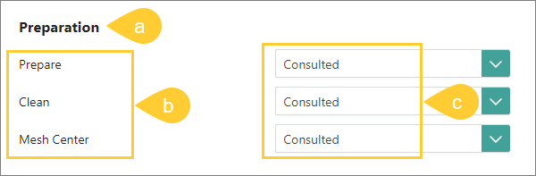

## On this page
{: .no_toc .text-delta }
1. TOC
{:toc}

In this article, you will learn about claims and access levels, which are the main concepts that define roles.

_**This article is intended for CluedIn administrators.**_

The roles are used for granting permissions to users. These permissions are only granted to the modules within the platform, not to the data. For information on how to restrict access to data, see Permissions.

All roles are listed in **Administration** > **Roles**.

A role is a set of claims and access levels. A claim is the name of a specific feature or operation that can be performed in CluedIn. Most of the time, the name of the claim is the same as the name of the module in CluedIn. An access level indicates the type of activity that can be performed with the claim. 

To view the role's claims and access levels, select the role. In the first column, you can find the name of the section in CluedIn (a) and claims within that section (b). In the second column, you can find access levels (c) to each claim.

In CluedIn, there are the following access levels:

- **None** – no access to the claim.

- **Informed** – read-only access to the claim. The user will be able to view all information within the claim, but will not be able to add, edit, or delete items within the claim.

- **Consulted** – read and write access to the claim. The user will be able to add, edit, or delete items within the claim.

- **Responsible** – this is a placeholder claim level and it gives permission to approve changes within the claim.

- **Accountable** – administrator access to the claim.

**Note:** We are working on making the access levels consistent within the platform. Currently, for some modules, the activity represented by the **Responsible** and **Accountable** access levels is the same.