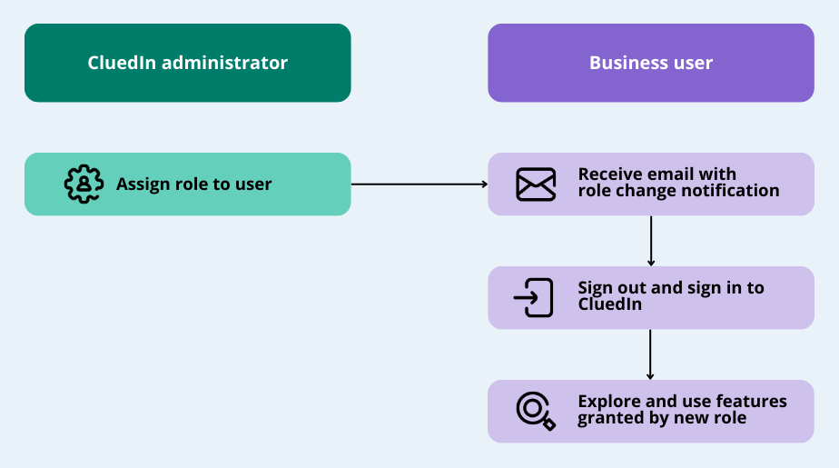
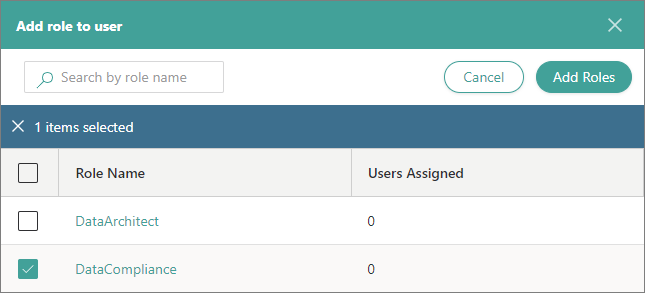
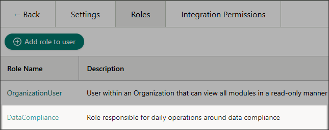
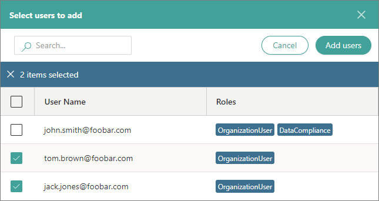
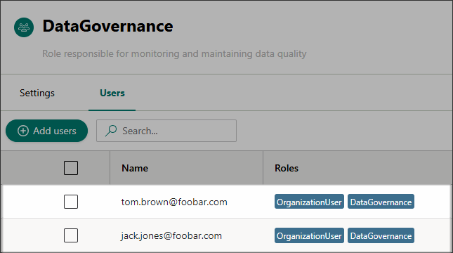

## On this page
{: .no_toc .text-delta }
1. TOC
{:toc}

In this article, you will learn how to assign roles to users so that they are authorized to perform operations in CluedIn.

**_This article is intended for users with the OrganizationAdmin role or users with the following claim access levels._**

| Section | Claim | Access level |
|--|--|--|
| Admin | Users | At least Consulted |
| Admin | Roles | At least Consulted |

After you [add a user to CluedIn](/administration/user-management), you can give the user access to more features within the platform by adding other roles to the user.

You can assign roles to the users in two places within the platform:

- [Administration > User Management > Users](#assign-roles-in-users) – this option is useful when you want to assign multiple roles to one user.
- [Administration > Roles](#assign-roles-in-roles) – this option is useful when you want to assign one role to multiple users.

The following diagram shows the flow of assigning roles to users.

## Assign roles in Users

You can review the roles that are already assigned to the user and assign other roles in the **Users** section.

**To assign roles to a user in the Users section**

1. On the navigation pane, go to **Administration** > **User Management**. Then, select **Users**.

1. On the **All users** page, select the user to whom you want to assign the role. Then, go to the **Roles** tab.

1. Select **Add role to user**.

1. On the **Add role to user** pane, select the roles that you want to assign to the user. In the upper-right corner, select **Add Roles**, and then confirm that you want to assign the role to the user.

    

    A new role is assigned to the user and it is displayed on the **Roles** tab of the **User Details** page.

    

    The user will receive an email about the role changes. For the changes to take effect, the user has to sign out and sign in again.

## Assign roles in Roles

You can review the users who have been already added to the role and add other users in the **Roles** section.

**To assign roles to a user in the Roles section**

1. On the navigation pane, go to **Administration** > **Roles**.

1. Select the role that you want to assign to the user. Then, go to the **Users** tab. Here, you can view the users who have been added to the role.

1. Select **Add users**.

1. On the **Select users to add** pane, find and select the users that you want to add to the role. In the upper-right corner, select **Add users**, and then confirm that you want to add the users to the role.

    

    The users are added to the role and they are displayed on the **Users** tab of the role.

    

    The users will receive an email about the role changes. For the changes to take effect, the users have to sign out and sign in again.