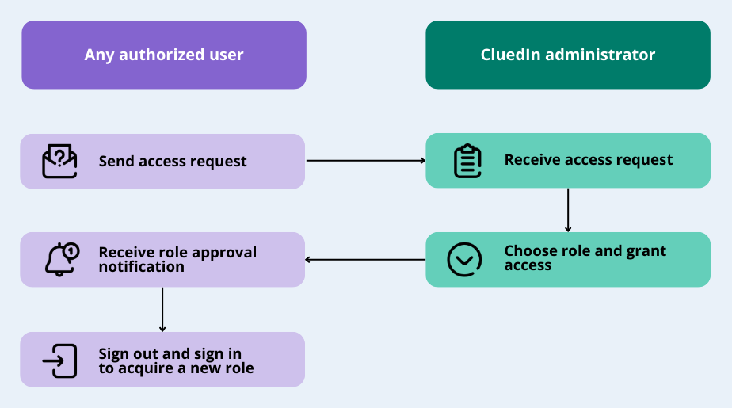

## On this page
{: .no_toc .text-delta }
1. TOC
{:toc}

In this article, you will learn how to assign roles to users so that they are authorized to perform operations in CluedIn.

**_This article is intended for users with the OrganizationAdmin role or users with the following claim access levels._**

| Section | Claim | Access level |
|--|--|--|
| Admin | Users | at least Consulted |
| Admin | Roles | at least Consulted |

You can assign roles to users in the following cases:

- If you know which role is needed for the user.

    By default, when you add a user to CluedIn, that user is assigned the OrganizationUser role. This means that the user can view all sections and modules in a read-only mode. To give the user access to more features within the platform, [assign another role to the user](#assign-roles-to-user).

- If the user contacts you and asks for a specific permission.

- If you receive role requests from the users.

    When users are browsing CluedIn and find that they do not have access to certain sections or modules, they can send a request to get access. You need to [process the role request](#process-role-requests) to grant the needed access.

## Assign roles to user

After you [add the user to CluedIn](/administration/user-management), you can give the user access to more features within the platform by adding another roles to the user.

You can assign roles to the users in two places within the platform:

- [Administration > User Management > Users](#assign-roles-in-users) – this option is useful when you want to assign multiple roles to a user.

- [Administration > Roles](#assign-roles-in-roles) – this option is useful when you want to assign a role to multiple users.

The following diagram shows the flow of assigning roles to the user.

### Assign roles in Users

If you want to review the roles that are already assigned to the user and assign another roles, perform the following procedure.

**To assign roles to the user in the Users section**

1. On the navigation pane, go to **Administration** > **User Management**. Then, select **Users**.

1. On the **All users** page, select the user to whom you want to assign the role. Then, go to the **Roles** tab.

1. Select **Add role to user**.

1. On the **Add role to user** pane, select the roles that you want to assign to the user. In the upper-right corner, select **Add Roles**, and then confirm that you want to assign the role to the user.

    

    A new role is assigned to the user and it is displayed on the **Roles** tab of the **User Details** page.

    

    The user will receive an email about the role changes. For the changes to take the effect, the user has to sign out and sign in again.

### Assign roles in Roles

If you want to review the users who have been already added to the role and add another users, perform the following procedure.

**To assign roles to the user in the Roles section**

1. On the navigation pane, go to **Administration** > **Roles**.

1. Select the role that you want to assign to the user. Then, go to the **Users** tab. Here, you can view the users who have been added to the role.

1. Select **Add users**.

1. On the **Select users to add** pane, find and select the users that you want to add to the role. In the upper-right corner, select **Add users**, and then confirm that you want to add the users to the role.

    

    The users are added to the role and they are displayed on the **Users** tab of the role.

    

    The users will receive an email about the role changes. For the changes to take the effect, the users have to sign out and sign in again.

## Process role requests

When the user requests access to a specific section or module, you'll receive a new role request notification.

**Note:** You will receive a role request notification from the user only if you added that user to CluedIn. If someone else added the user, then that person will receive the role request notification.

The following diagram shows the flow of processing role requests.

**To process a role request**

1. In the upper-right corner, select the ellipsis button, and then select **My Tasks**.

1. Select **Role Requests**, and then find the needed request.

1. In the **Actions** column, select **Grant Access**.

    The dialog box opens where you can view the details of the access request.

1. In the **Granting Access To** dialog box, do the following:

    1. Review the access level and select another level if necessary.

        The information message below helps you understand the permissions that will be granted to the user.

    1. Select a role to assign to the user.

        

    1. In the lower-right corner, select **Grant Access**.

    The user will receive a notification about the role changes. For the changes to take the effect, the user has to sign out and sign in again.