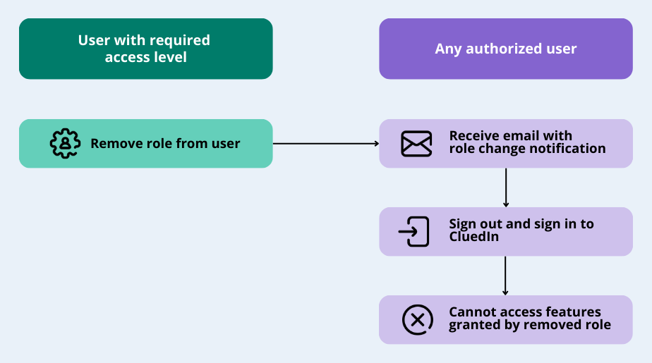
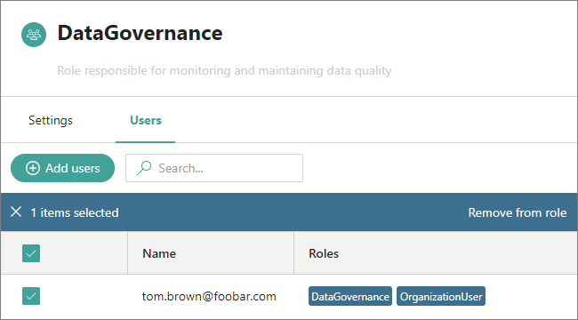

In this article, you will learn how to remove roles from users so that they are restricted from performing operations in CluedIn.

_**This article is intended for CluedIn administrators.**_

The following diagram shows the flow of removing roles from the user.

**To remove roles from the user**

1. On the navigation pane, go to **Administration** > **Roles**. Then, select the needed role.

    Alternatively, you can go to **Administration** > **User Management** > **Users**. Select the user, go to the **Roles** tab, and then select the role that you want to remove from the user.

1. Go to the **Users** tab.

1. Select the checkbox next to the user whom you want to remove from the role.

1. Select **Remove from role**, and then confirm your choice.

    

    The role is removed from the user. The user will receive an email about the role changes. For the changes to take the effect, the users have to sign out and sign in again.